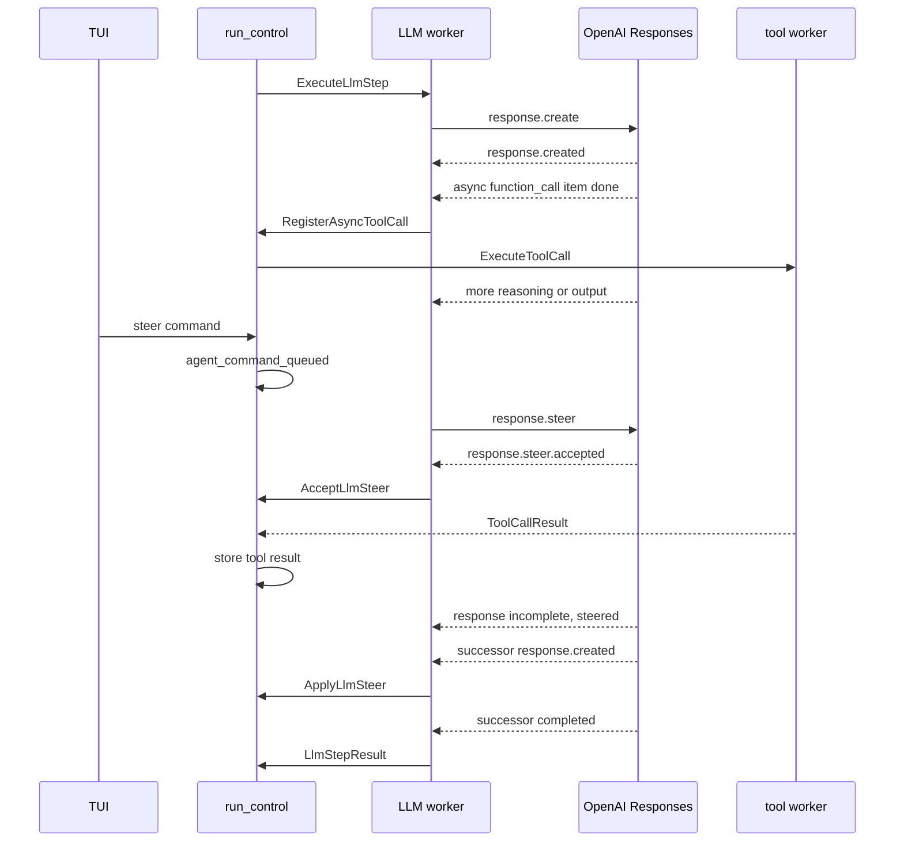

# Implement GPT-6 Astra interaction features in Hatfield

Status: implementation plan. This document does not authorize production changes.

Date: 2026-09-07.

Hatfield baseline: `635873fa6` on `main`.

Reference baselines:

- OpenAI Codex: `/home/ineersa/claw/codex` at `9f70e348e0227980de97e361cce830236fb18317`.
- earendil-works/pi: `/tmp/earendil-works-pi` at `c1d4c801114545f47c440921d8b3e04aeb1e565d`.
- OpenAI model guide and linked feature guides, read on 2026-09-07.

## Recommendation

Implement the three Astra features as one provider-interaction program with three ordered releases:

1. Durable `configuration_update` reasoning changes.
2. Early async tool dispatch and delayed result delivery.
3. WebSocket mid-turn steering.

The releases share one requirement: Hatfield must represent a Responses conversation as more than a sequence of completed request and tool batches. The current loop assumes one model request finishes, all tool calls finish, and only then another model request starts. Astra can continue a response after an async tool call, and steering can create a successor response on the same WebSocket connection. Patching either feature into `LlmStepResultHandler` as another stop reason would leave invalid history and fragile recovery.

Keep `run_control` as the only owner of durable run state. Keep provider sockets in the LLM worker. Connect them through typed, idempotent progress messages and the existing cross-process command store. Do not move provider execution into the controller, let a provider bridge mutate `RunState`, or create a second conversation log.

The first live gate must verify that Hatfield's actual OAuth endpoint, `chatgpt.com/backend-api/codex/responses`, accepts these public Responses API features. OpenAI documents the features for the Responses API, but the current Codex reference implementation proves only `configuration_update`. If the OAuth endpoint does not expose async calls or steering, stop that release. Do not claim support through a silent HTTP fallback or add a new API-key provider without a separate requirement.

## What OpenAI added

### Async tool calling

A function or custom tool definition can contain `async: true`. The corresponding `function_call` or `custom_tool_call` output item also contains `async: true`. The model may continue reasoning, emit other output, or answer an independent part of the request while Hatfield runs the tool.

Hatfield still executes the tool. When the result is ready, a later Responses request sends `function_call_output` or `custom_tool_call_output` with the original API `call_id` and the latest `previous_response_id`. With streaming, the application can start the job as soon as the complete call item arrives. Async mode does not apply to hosted tools or programmatic tool calling.

The documented `wait_for_tasks` pattern is application-defined. It is not a built-in Responses tool. Hatfield does not need a wait tool for the first release because the API permits results to arrive as they become available.

### Mid-turn steering

Astra accepts `response.steer` after the client receives `response.created`. The frame contains only `type`, the active response ID as `previous_response_id`, and user input. The server replies with `response.steer.accepted`, then finishes the current output item and automatically creates a successor response.

The original response can end as `response.incomplete` with reason `steered`. Already-sent output remains valid. Started tools are not cancelled. If a client tool result or approval is required, the server sends `response.steer.pending`; Hatfield must send the required input with `response.create` on the same connection and must not repeat the accepted steer.

Accepted steering is connection-local. Hatfield must record what it sent and reconcile local history after a disconnect. Acceptance means queued, not applied.

### Reasoning changes that preserve cache

Astra accepts an input item shaped as:

```json
{
  "type": "configuration_update",
  "reasoning": { "effort": "high" }
}
```

The request-level `reasoning.effort` stays at the conversation baseline. The update changes effective effort for the next and later responses until another update overrides it. This keeps the original request prefix stable for prompt caching.

The API rejects adjacent configuration updates. The feature is limited to Astra in standard, single-agent mode. It cannot be combined with automatic API compaction or automatic truncation. The response object's reported reasoning effort remains the request-level value, not the effective update.

Hatfield child agents are separate Responses conversations. They are not OpenAI Responses multi-agent mode, so the single-agent limitation does not exclude child sessions.

## Reference implementation findings

### OpenAI Codex

The updated Codex checkout implements only the reasoning feature.

- `codex-rs/protocol/src/models/configuration_update.rs` defines the typed reasoning payload.
- `codex-rs/protocol/src/models.rs` includes `ResponseItem::ConfigurationUpdate`.
- `codex-rs/core/src/session/reasoning_effort.rs` appends a harness-authored update, deduplicates the latest effective effort, and gates the behavior by provider and feature capability.
- `codex-rs/core/src/context_manager/history.rs` retains only configuration updates with trusted harness provenance.
- Rollback and injection tests prove that updates survive history reconstruction and leave with their owning turn.

Codex does not set `async: true` on tools and has no pending async-call lifecycle. Its WebSocket request enum sends only `response.create`; its internal input queue is turn-boundary steering, not `response.steer`.

The useful lesson is provenance and durability. Hatfield should generate configuration updates itself, deduplicate them, and never trust a model-produced item as a configuration command.

### earendil-works/pi

The inspected Pi revision does not implement any of the three protocol features completely.

- `packages/ai/src/api/openai-responses.ts` and `openai-responses-shared.ts` implement ordinary Responses calls and later `function_call_output` items.
- `packages/agent/src/agent-loop.ts` waits for completed tool calls before the next model request.
- `packages/coding-agent/src/core/agent-session.ts` queues steering until the current assistant turn and its tools finish.
- `packages/ai/src/api/openai-codex-responses.ts` sends one `response.create` per WebSocket request. Changing request-level reasoning invalidates its cached continuation comparison.

Pi provides useful comparison code for Responses normalization and WebSocket reuse, but it is not an implementation source for these Astra features.

## Current Hatfield constraints

### The run loop has one blocking sequence

`AdvanceRunHandler` refuses to start a model step while any `pendingToolCalls` entry is unresolved. `LlmStepResultHandler` extracts calls only after `LlmPlatformAdapter` has consumed the provider stream to completion. It then dispatches every `ExecuteToolCall`. `ToolCallResultHandler` waits for the batch, appends tool messages, and schedules another `AdvanceRun`.

The canonical order is:

```text
llm_step_completed
→ tool_execution_start
→ tool_execution_end
→ tool_batch_committed
→ next turn_advanced
```

That order cannot express an async call that starts while the same provider response continues.

### Existing deferred tools solve a different problem

`ExecuteToolCallWorker`, `DeferredToolCompletion`, and `CompleteDeferredToolCallHandler` preserve a tool call while a child run or other deferred operation finishes. They retain the original Hatfield tool-call identity. The parent still treats the call as blocking and does not advance until completion.

This is valuable storage and completion machinery. It must gain an async/nonblocking classification rather than be replaced.

### Current steering is already accepted by the TUI

`SubmitListener` sends `UserCommand(type: 'steer')` while a run is active. `UserMessageHandler` maps it to the existing AgentCore command path. `ApplyCommandHandler` persists it in `CommandStoreInterface` and emits `agent_command_queued`.

`CommandMailboxPolicy` applies that command only at a safe turn or stop boundary. The UI path and the durable command record can remain. The missing part is an active LLM worker that claims a pending steer for `response.steer` and reports what the server did.

### The Codex bridge is receive-oriented

`CodexWebSocketModelClient` sends one `response.create`. `RawWebSocketResult` reads until `response.completed` and treats `response.incomplete` as failure. `CodexWebSocketContinuationState` can send a delta request with `previous_response_id`, but only after a completed response and only when the request body is unchanged except for input.

`ResultConverter` sees `response.output_item.done`, but stores function calls until `response.completed`. `LlmPlatformAdapter` consumes the whole converted stream before the LLM worker can dispatch anything.

### Reasoning is request configuration

`ModelSelectionService` persists the selected reasoning level. `ReasoningOptionsResolver` converts the current selection into request-level `reasoning.effort`. A changed effort changes the WebSocket compatibility fingerprint, discards continuation state, and sends full context.

No canonical run event records a reasoning selection change. No provider input item represents it.

## Target architecture

### Keep two owners

The implementation has two owners with a narrow connection between them:

1. `run_control` owns canonical messages, command status, pending tool calls, reasoning state, and every decision to advance or finish a run.
2. The LLM worker owns one active provider interaction, including the leased WebSocket, active and successor response IDs, inbound events, outbound `response.steer` and `response.create` frames, and temporary deduplication of frames sent on that connection.

The LLM worker reports provider progress with typed messages on `agent.command.bus`. `run_control` validates the original operation identity before committing events or dispatching tools.



### Add an interaction object per LLM delivery

Create one request-scoped interaction object inside `ExecuteLlmStepWorker`. It holds the immutable `ExecuteLlmStep` identity and exposes two small interfaces to `LlmPlatformAdapter`:

- An inbox that returns unsent steering commands and completed tool inputs for this operation.
- A sink that dispatches typed async-call, steering, response-segment, and required-input messages to `run_control`.

Do not serialize this object onto Messenger. `ExecuteLlmStepWorker` constructs it after Messenger delivers the execution message. The object uses `CommandStoreInterface`, the existing durable tool-result store, and `MessageBusInterface`.

The provider bridge receives callbacks or a provider-neutral interaction interface through internal invocation options. It must not import AgentCore messages, repositories, or run state.

### Add an operation kind

Extend `CurrentOperationDTO` with a typed operation kind, at least `llm`, `tool`, `shell`, and `compaction`. Current handlers infer too much from `activeStepId` and pending arrays. Async tool results can arrive while the current operation is still an LLM response, so handlers need an explicit distinction.

Do not replace `currentOperation` with an unbounded operation ledger. It remains the identity of the active run-control operation. Pending async tools have their own bounded DTO collection keyed by original `call_id`.

## Release 1: preserve cache across reasoning changes

### Represent the reasoning timeline

Add canonical state for:

- The request-level reasoning baseline for the current model epoch.
- The selected effective reasoning effort.
- The most recent effort successfully submitted to the provider.
- The model reference that owns the baseline.

Add `reasoning_configuration_changed` to `RunEventTypeEnum`. Add a core command for a validated reasoning selection change. `ModelControlListener` keeps its immediate footer update, then sends the runtime command for an existing session. Draft sessions continue carrying reasoning in `StartRunRequest`.

The controller-side handler uses `ModelSelectionService` for catalog validation and metadata persistence before dispatching the AgentCore command. `ApplyCommandHandler` coalesces repeated changes before the next provider request, commits only the latest selected effort, and never creates adjacent provider updates.

When the resolved model changes, start a new reasoning epoch. The first request for that model uses the selected effort as request-level `reasoning.effort`. Later changes keep that request-level value fixed and use `configuration_update`.

### Build provider input without inventing a fake chat message

Do not store `configuration_update` as a user or system `AgentMessage`. It is a Responses control item, not conversation prose.

Extend `ModelInvocationInput` with typed reasoning configuration data and the index at which the current request's new input begins. `AdvanceRunHandler` already owns the turn boundary and can provide that index. The Codex contract inserts one harness-authored `configuration_update` immediately before the new user or tool-result input when the effective effort differs from the most recently submitted effort.

For a full-context request after restart or lost WebSocket cache, `CodexRequestBodyFactory` uses the epoch baseline at request level and inserts the current effective update before the current input group. For a cached delta request, it sends only a changed update plus the delta input. An unchanged effort sends no item.

Record the submitted baseline, effective effort, and whether an update was sent in `llm_step_completed`. `RunStateReducer` rebuilds the same timeline. Do not derive effective effort from `response.reasoning.effort`, because OpenAI documents that field as the request-level value.

### Handle compaction

Hatfield performs application-side compaction, not Responses automatic compaction. Keep provider automatic truncation and automatic compaction disabled for Astra requests.

After Hatfield compaction:

1. Discard old generated configuration items from provider request reconstruction.
2. Keep the canonical selected effort in `RunState`.
3. Reset WebSocket continuation because the message prefix changed.
4. Send one fresh configuration update immediately before the next new input when the selected effort differs from the epoch baseline.

If manual compaction finishes with no pending user or tool input, hold the update until the next model-visible input. Do not send a request that contains only a configuration update.

### Files expected to change

- `src/AgentCore/Domain/Event/RunEventTypeEnum.php`
- `src/AgentCore/Domain/Run/RunState.php`
- `src/AgentCore/Application/Replay/RunStateReducer.php`
- `src/AgentCore/Domain/Message/ExecuteLlmStep.php`
- `src/AgentCore/Domain/Model/ModelInvocationInput.php`
- `src/AgentCore/Application/Pipeline/AdvanceRunHandler.php`
- `src/AgentCore/Application/Pipeline/ApplyCommandHandler.php`
- `src/CodingAgent/Runtime/Contract/UserCommand.php`
- `src/CodingAgent/Runtime/Process/JsonlProcessAgentSessionClient.php`
- `src/CodingAgent/Runtime/Controller/CommandHandler/`
- `src/Tui/Listener/ModelControlListener.php`
- `src/Platform/Bridge/OpenAICodex/Contract/Message/CodexMessageBagNormalizer.php`
- `src/Platform/Bridge/OpenAICodex/CodexRequestBodyFactory.php`
- `src/Platform/Bridge/OpenAICodex/CodexWebSocketContinuationState.php`

Use the actual symbols found at implementation time. Do not create parallel model-selection services.

## Release 2: async tool calling

### Make async an explicit tool capability

Add `providerAsync` with a default of `false` to `ToolDefinitionDTO`. Copy it into Symfony AI `Tool` metadata in `RegistryBackedToolbox`. Preserve metadata when `DynamicToolDescriptionProcessor` replaces a description.

Add the same optional flag to the public extension `ToolRegistrationDTO`, appended as a defaulted constructor argument. Update the Extension API docs and package version according to its published compatibility policy. MCP tools and existing extensions remain synchronous unless they opt in.

`CodexToolNormalizer` emits `async: true` only when both conditions hold:

- The resolved model capability says Astra async tools are supported.
- The tool metadata explicitly opts in.

Do not infer provider async behavior from `ToolExecutionMode::Parallel`. Parallel mode controls Hatfield execution of calls from one completed batch. It does not permit the model to continue without a result.

The first built-in opt-ins are `fork`, `subagent`, and `agent_resume`. They already return `DeferredToolCompletionOutcome` and preserve durable completion correlation. Keep `bash`, `write`, `edit`, and MCP tools synchronous in the first release. Their ordering or external effects make implicit opt-in unsafe.

### Dispatch when the call item finishes

Add a provider-neutral stream delta or callback for a complete async tool call. `ResultConverter` emits it on `response.output_item.done` when the item is a function call with `async: true`. Preserve the original API `call_id`; do not substitute the output item ID.

`LlmPlatformAdapter` forwards the discovery to the request-scoped interaction sink while it continues consuming the response. The sink dispatches `RegisterAsyncToolCall` to `run_control` with the current LLM operation identity, tool name, arguments, order, `toolsRef`, and `call_id`.

The handler:

1. Rejects stale or duplicate discovery by operation identity and `call_id`.
2. Resolves the existing tool allowlist, mode, timeout, and routing policy.
3. Appends `async_tool_call_registered` before execution starts.
4. Adds a `PendingAsyncToolCallDTO` to `RunState`.
5. Dispatches the existing `ExecuteToolCall` effect with async correlation metadata.

Reuse `ExecuteToolCallWorker`, transport routing, approval hooks, tool cancellation, output caps, and `DeferredToolCompletion`. Do not add a second executor for async tools.

### Commit results without blocking unrelated input

`ToolCallResultHandler` checks `pendingAsyncToolCalls` before the ordinary batch path. For an async result it appends `tool_execution_end` and the tool `AgentMessage` immediately, marks that call ready for provider delivery, and leaves any active LLM operation running.

Scheduling rules are:

- If a provider response is active, store the result and wait for its terminal boundary.
- If no provider response is active, schedule one idempotent `AdvanceRun` with every ready, undelivered async result in registration order.
- If a user message arrives while only async tools are pending, apply the message and start a response immediately. Do not wait for the tools.
- If more results arrive during that response, deliver them in the next request.
- Do not emit `agent_end` while an async call remains unresolved or has an undelivered result.

On successful provider completion, mark included async results delivered in the canonical event payload. On retry, send the same output items with the same original `call_id`. On cancellation, synthesize a cancelled output for each unresolved async call before allowing a later session continuation, matching the existing balanced tool-history rule.

### Relax history validation only for declared async calls

`AgentMessageToolCallSequenceValidator` currently requires every assistant tool call to be followed immediately by its result. Keep that rule for synchronous calls.

For a call recorded as async, allow later assistant and user items before its output. Require exactly one eventual output with the same `call_id`. Reject duplicate outputs, unknown IDs, and a synchronous call crossed by unrelated conversation.

Update the Codex assistant-message normalizer so replayed async function-call items retain `async: true`. Generic providers must not receive unresolved async histories. A model or provider switch with unresolved async calls must wait for completion or cancel them before the switch becomes active.

### Do not ship a wait tool yet

The OpenAI guide's wait tool is developer-defined. Hatfield already has durable pending-call state and can deliver results when ready. Do not add `wait_for_tasks`, task-handle prompt rules, or another public tool until a concrete workflow requires model-directed waiting.

## Release 3: WebSocket mid-turn steering

### Reuse the existing command mailbox

Keep `agent_command_queued` as the durable receipt of user steering. While an Astra WebSocket response is active, the request-scoped interaction inbox reads pending `CoreCommandKind::Steer` entries from `CommandStoreInterface` in FIFO order.

The bridge sends:

```json
{
  "type": "response.steer",
  "previous_response_id": "<active response id>",
  "input": "<user text>"
}
```

Send only after `response.created`. Track the command idempotency key locally so polling cannot send the same frame twice on one connection. Submit one queued steer at a time unless protocol tests prove that several pending submissions preserve Hatfield command order.

Unsupported models and non-WebSocket transports keep the current safe-boundary command behavior. That is existing Hatfield semantics, not a claim of mid-turn support. Astra over a configured WebSocket must not silently downgrade after Hatfield reports the steer as accepted.

### Treat steering as a response chain

Change `RawWebSocketResult` from one-terminal-response iteration to one interaction chain:

- Capture every `response.created` ID.
- Treat `response.incomplete` with reason `steered` as a successful segment boundary, not a provider failure.
- Continue reading the automatic successor response.
- Update the active response ID when the successor emits `response.created`.
- Finish only when the chain reaches an ordinary terminal response with no accepted steer awaiting application or required input.

Add typed handling for `response.steer.accepted`, `response.steer.pending`, and `response.steer.failed`. Unknown steering events fail closed with a bounded, privacy-safe diagnostic.

`ResultConverter` and `LlmPlatformAdapter` must reset text, reasoning, and tool-call accumulation at response-segment boundaries. Persist the completed original assistant segment before the steered user message, then persist the successor segment. Do not concatenate both assistant responses around the user message.

Use typed progress messages such as `CommitLlmResponseSegment`, `AcceptLlmSteer`, `ApplyLlmSteer`, and `RejectLlmSteer`. Exact names may change during implementation, but each transition needs its own idempotency key derived from the parent operation, response ID, steer ID, and segment index.

`AcceptLlmSteer` records the remote acknowledgement but leaves the command pending. `ApplyLlmSteer` runs when the successor response starts or when Hatfield sends required input that the server will combine with the accepted steer. That handler marks the command applied and appends the original user message through the existing `agent_command_applied` shape.

### Return required tool results on the same connection

When the API sends `response.steer.pending`, validate every `required_input` item against a registered tool call or approval. Continue the normal Hatfield tool and HITL flow. The LLM worker retains the WebSocket lease while it waits.

Once required input exists, send `response.create` on the same connection with:

- `previous_response_id` set to the response named by the pending steer.
- The required function outputs or approval items.
- Current tools, instructions, and request settings.
- No copy of the already accepted steering message.

An explicit waiting-for-required-input state disables the ordinary provider idle timeout because a human approval can take longer than a network idle interval. Cancellation, controller shutdown, and socket closure remain active. If the socket closes, recover through the recorded command and canonical tool results rather than pretending the server still holds the steer.

### Disconnect and retry rules

Use local canonical history as authority:

- If Hatfield sent a steer but never recorded `response.steer.accepted`, leave the command pending. Apply it at the next safe request boundary.
- If acceptance was recorded but no successor response became canonical, keep the user message once and replay it as ordinary next-request input after reconnect. The remote continuation may have done work, but Hatfield did not commit it.
- If the successor segment and `agent_command_applied` committed, do not resend the steer.
- If `response.steer.failed` reports invalid input or unsupported steering, reject the steering command and show the existing command-rejection path.
- If the server reports too many pending steers, keep unsent commands pending and apply them in FIFO order after the current continuation. Do not drop or duplicate them.

A retryable transport exception must never reopen a connection and automatically resend a steer whose acceptance is uncertain without consulting canonical events.

## Capability gating

Extend `AiCompatibility` with explicit model-level booleans:

- `supports_async_tool_calling`
- `supports_mid_turn_steering`
- `supports_reasoning_configuration_updates`

Set them to `true` only for `openai-codex/gpt-6-astra` after the live endpoint probe passes. Defaults remain `false`. Do not infer support from a model-name prefix or enable it provider-wide.

If OpenAI later exposes the features on another model, update catalog data after a focused compatibility check. Do not add permanent feature flags in user settings beyond the existing catalog overlay mechanism.

## Canonical events and replay

Add only events needed to rebuild decisions:

| Event | Durable purpose |
| --- | --- |
| `reasoning_configuration_changed` | Selected effective effort and model epoch. |
| `async_tool_call_registered` | Original `call_id`, tool identity, arguments hash or existing safe payload, order, and async classification. |
| `llm_response_segment_completed` | One assistant segment and provider response identity within a steered chain. |
| Existing `agent_command_queued` | User steer accepted by Hatfield. |
| Existing `agent_command_applied` | User steer became model-visible. |
| Existing `agent_command_rejected` | Steer could not become model-visible. |
| Existing tool events | Execution start, updates, terminal result, and balanced history. |
| Existing `llm_step_completed` | Final interaction result, usage, reasoning baseline/effective effort, delivered async outputs, and operation completion. |

Do not persist WebSocket objects, connection leases, polling cursors, or raw provider frames. Provider response and steer IDs are correlation metadata, not a second state authority.

Update `RunStateReducer`, `SessionRunStateReplayService`, history selection, tail discard, and compaction replay together. Selecting history before an async registration or applied steer must remove all later derived state. Selecting history after registration but before result must rebuild a pending call.

## TUI and runtime behavior

The existing submit behavior already labels input during an active run as steering. Keep the keybindings and editor flow.

Add runtime events only for user-visible state that cannot be derived from canonical events:

- Steering queued.
- Steering accepted and waiting for the current output item.
- Waiting for tool input before applying steering.
- Async tool still running while the model continues.

Use the current progress/status abstractions. Do not add a second steering panel. Assistant segments and tool activity remain transcript blocks through the existing projector.

Reasoning cycling keeps the current footer and border update. The runtime command makes the next-response effect durable. If the user changes reasoning during an automatic steering continuation, show that the selection applies to the next explicit response; do not attempt to mutate the running response.

## Implementation slices

### Slice 0: endpoint proof and protocol fixtures

1. Record the exact Codex OAuth endpoint, model, transport, and response event names without logging prompts or credentials.
2. Prove `configuration_update`, an async function definition/output item, and `response.steer` against `gpt-6-astra` in separate minimal conversations.
3. Record whether the ChatGPT Codex endpoint differs from the public API docs.
4. Add no production behavior if a feature is rejected by the endpoint.

Use an owned interactive Hatfield session or an isolated developer probe. Do not turn production credentials into an automated test dependency.

### Slice 1: capability and reasoning update

1. Add capability metadata and Astra catalog values.
2. Add canonical reasoning selection and epoch state.
3. Route reasoning changes through runtime and run control.
4. Insert and deduplicate `configuration_update` input items.
5. Preserve request-level effort and cached continuation compatibility.
6. Handle restart, model switch, history selection, and compaction.
7. Remove the old behavior that changes request-level effort on every Astra follow-up.

### Slice 2: early async call registration

1. Add explicit tool async metadata through internal and Extension API definitions.
2. Emit async call discovery at `response.output_item.done`.
3. Add pending async call state and idempotent registration.
4. Reuse existing tool routing, deferred completion, cancellation, and result storage.
5. Deliver ready outputs with the latest response ID and original `call_id`.
6. Relax sequence validation only for declared async calls.
7. Opt in only the three deferred agent tools.

### Slice 3: bidirectional WebSocket interaction

1. Add a request-scoped interaction inbox and sink.
2. Make `RawWebSocketResult` process response chains and steering events.
3. Send pending commands as `response.steer` after `response.created`.
4. Commit response segments and apply accepted commands in conversation order.
5. Keep the connection while required tool or approval input is pending.
6. Reconcile disconnect, cancellation, retry, and shutdown.
7. Preserve ordinary non-Astra and SSE behavior without dual Astra histories.

### Slice 4: integration and cleanup

1. Exercise reasoning updates, async tools, and steering in one mixed scenario.
2. Update runtime, session, compaction, settings-model, and Extension API docs.
3. Update the nearest `AGENTS.md` architecture maps when messages, handlers, or protocol ownership changes.
4. Delete superseded stop-boundary-only branches for Astra rather than keeping unreachable compatibility paths.
5. Obtain independent review of provider protocol, run-state ordering, and recovery.

Do not combine these slices into one task. Each slice changes durable semantics and needs a reviewable migration point.

## Test strategy

All tests must follow `.agents/skills/testing/SKILL.md` and `tests/AGENTS.md`. Every case must finish within 10 seconds, use deterministic barriers, and own its processes and resources.

### Provider bridge tests

Use scripted WebSocket frames and the existing connector doubles.

Prove:

- Tool normalization adds `async: true` only for an opted-in tool on a capable model.
- `response.output_item.done` dispatches one async discovery before later text and terminal events.
- The output uses the original `call_id` after unrelated responses update `previous_response_id`.
- `response.steer` targets the ID from `response.created`.
- Accepted, pending, failed, incomplete-steered, successor-created, and successor-completed events form the expected chain.
- A connection close at each steering state yields the specified recovery classification.
- Request-level reasoning remains fixed while delta input contains one changed `configuration_update`.
- Full-context reconstruction inserts one effective update and never adjacent updates.

Do not assert generated prose.

### AgentCore tests

Extend the owning handler and reducer test classes rather than creating one class per scenario.

Prove:

- Stale and duplicate async discovery is ignored.
- An async tool result can commit while the LLM operation remains active.
- A user command advances while only async tools are pending.
- A ready result schedules one continuation, even when several results race through run control.
- Synchronous tool calls still require immediate balanced results.
- Cancellation balances unresolved async calls.
- Reasoning changes coalesce and replay with the right model epoch.
- Segment, steer, tool, and final-step events rebuild the same `RunState`.
- History tail discard removes later pending calls and steering state.

### Runtime and TUI tests

Use virtual TUI tests for the existing active-submit path and the new reasoning runtime command. Use controller replay for command/event order. Add a test-only WebSocket connector through `services_test.yaml` only if the provider chain cannot be proven through the current replay client. Do not add a production replay switch.

One controller scenario must prove this order:

```text
user steer queued
→ original assistant segment
→ steer applied user message
→ successor assistant segment
```

Another must prove that async tool execution starts before the original model response completes. Use explicit fixture barriers, not response delays or sleeps.

No new broad tmux journey is needed. The existing `castor test:tui` lane remains the terminal integration smoke.

### Validation commands

During each implementation slice, run focused Castor commands from its task worktree:

```bash
castor test --filter=<owning-test-class-or-method>
castor test:controller-replay
castor deptrac
castor phpstan <changed-path>
castor docs:validate
```

Provider-visible changes require focused `castor test:llm-real` where the configured test model can prove the generic contract. The local llama model cannot prove Astra-only server behavior, so keep the OAuth Astra check manual and explicit.

For tracked work, `move_task(to="CODE-REVIEW")` owns the full `castor check` gate. Do not run a duplicate full gate immediately before that transition.

## Acceptance criteria

The program is complete only when all of these statements are true:

- A reasoning-level change on Astra produces `configuration_update` while request-level effort and the prompt prefix remain stable.
- Restart and local compaction reconstruct the effective effort without adjacent updates.
- An opted-in async tool begins after its complete call item, before the response terminal event.
- The model can emit independent output while that tool remains pending.
- Hatfield later sends the result with the original `call_id` and the latest response ID.
- A user submission during an Astra WebSocket response produces `response.steer` on the same connection.
- The transcript orders the original assistant segment, steered user input, and successor segment correctly.
- Required tools and approvals complete on the same steering connection when it remains available.
- Disconnect recovery neither drops the user input nor duplicates a canonical user message.
- Non-Astra models, synchronous tools, SSE requests, cancellation, compaction, history selection, and deferred child tools retain their documented behavior.
- No provider bridge mutates `RunState`, and no LLM worker writes canonical events directly.
- `castor check` passes on the submitted revision.

## Risks and stop conditions

Stop and return evidence if any of these conditions occurs:

- The ChatGPT Codex endpoint rejects one of the public Astra features.
- Symfony AI normalization cannot carry required control items without duplicating the Codex contract.
- Mid-turn steering requires moving the active socket out of the LLM worker.
- Required-input waiting cannot preserve Messenger ownership and controller shutdown behavior.
- Async result ordering cannot be rebuilt from canonical events after a crash.
- Supporting model switches with unresolved async calls would require sending invalid history to another provider.
- The implementation needs a custom queue, raw transport SQL, or a second conversation store instead of existing Messenger, cache, and event facilities.

Do not hide a failed gate behind a feature setting or compatibility fallback. Report the unsupported endpoint or architecture constraint and keep the prior behavior.

## Source map

OpenAI documentation:

- `https://developers.openai.com/api/docs/guides/latest-model`
- `https://developers.openai.com/api/docs/guides/async-tool-calling`
- `https://developers.openai.com/api/docs/guides/steering`
- `https://developers.openai.com/api/docs/guides/reasoning#change-reasoning-mid-conversation`

Hatfield entry points:

- `src/AgentCore/Application/Pipeline/AdvanceRunHandler.php`
- `src/AgentCore/Application/Pipeline/LlmStepResultHandler.php`
- `src/AgentCore/Application/Pipeline/ToolCallResultHandler.php`
- `src/AgentCore/Application/Pipeline/ApplyCommandHandler.php`
- `src/AgentCore/Application/Pipeline/CommandMailboxPolicy.php`
- `src/AgentCore/Application/Handler/ExecuteLlmStepWorker.php`
- `src/AgentCore/Application/Handler/ExecuteToolCallWorker.php`
- `src/AgentCore/Application/Handler/CompleteDeferredToolCallHandler.php`
- `src/AgentCore/Infrastructure/SymfonyAi/LlmPlatformAdapter.php`
- `src/AgentCore/Infrastructure/SymfonyAi/AgentMessageToolCallSequenceValidator.php`
- `src/CodingAgent/Runtime/Controller/HeadlessController.php`
- `src/CodingAgent/Runtime/Controller/CommandHandler/UserMessageHandler.php`
- `src/CodingAgent/Runtime/Process/JsonlProcessAgentSessionClient.php`
- `src/CodingAgent/Config/ModelSelectionService.php`
- `src/CodingAgent/Config/ReasoningOptionsResolver.php`
- `src/Platform/Bridge/OpenAICodex/CodexWebSocketModelClient.php`
- `src/Platform/Bridge/OpenAICodex/RawWebSocketResult.php`
- `src/Platform/Bridge/OpenAICodex/ResultConverter.php`
- `src/Platform/Bridge/OpenAICodex/CodexWebSocketContinuationState.php`
- `src/Platform/Bridge/OpenAICodex/Contract/Message/CodexMessageBagNormalizer.php`
- `src/Platform/Bridge/OpenAICodex/Contract/CodexToolNormalizer.php`
- `docs/async-runtime-architecture.md`
- `docs/session-storage.md`
- `docs/compaction.md`
