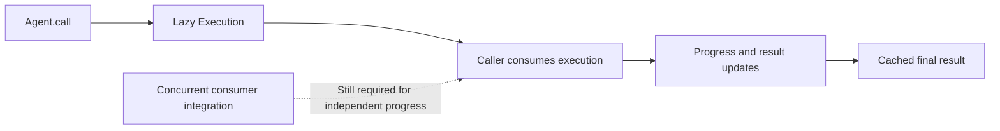
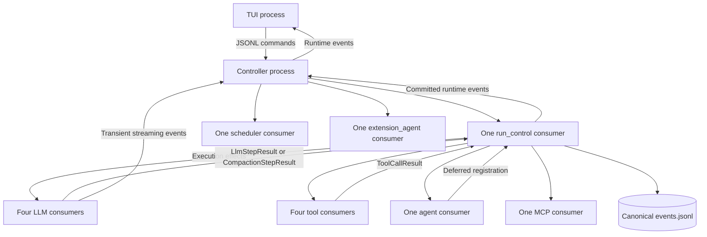
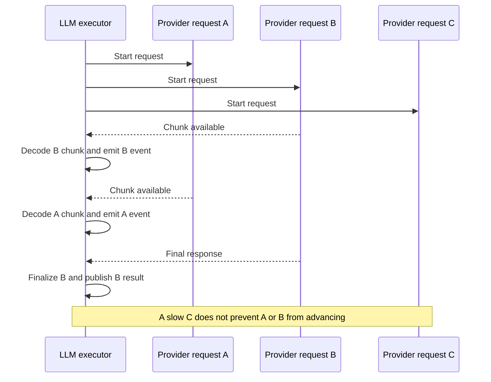
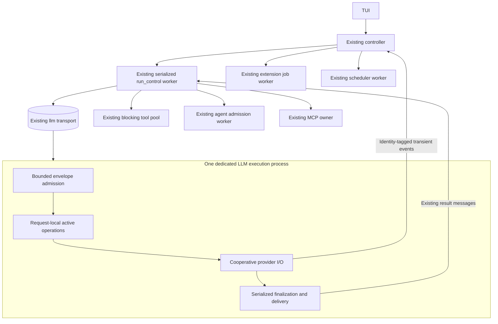
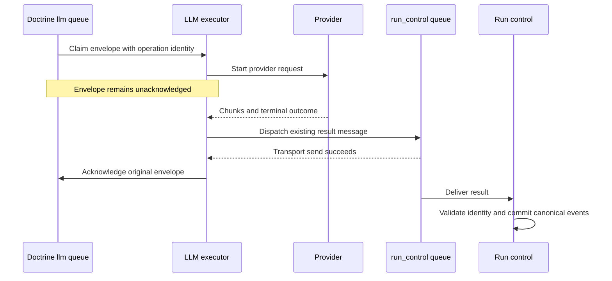
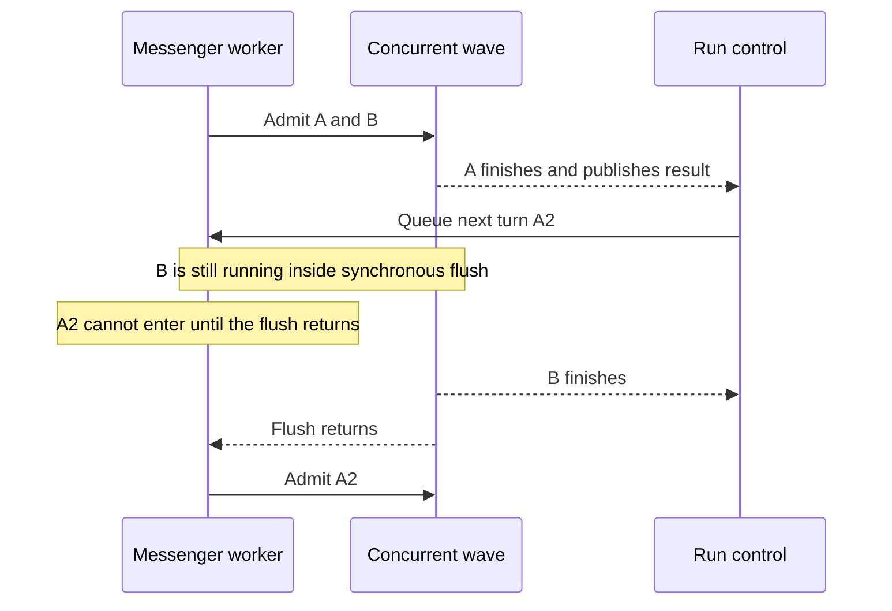
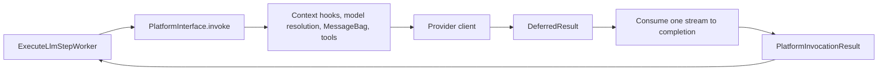
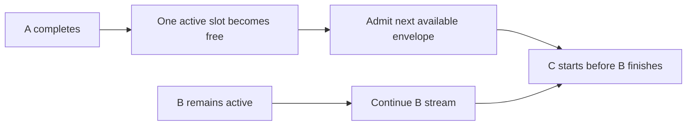
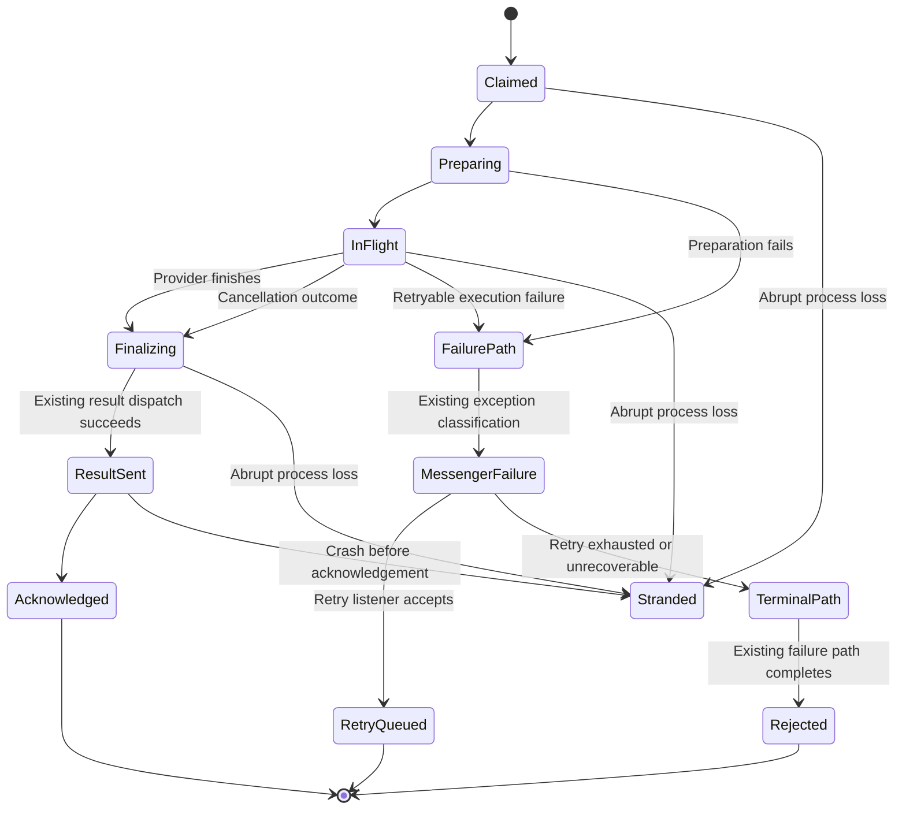

# A hybrid async LLM runtime for Hatfield

Status: proposed architecture and investigation plan, not an implementation authorization.

Date: 2026-09-07.

Source baseline: `a290b9679`. Main also advanced during this investigation with unrelated session and TUI work. Source links identify the implementation inspected, not a promise that line numbers remain stable. Installed dependencies were inspected directly: Symfony Messenger 8.1.5, Doctrine Messenger 8.1.4, HttpClient 8.1.5, and Symfony AI 0.12-family packages. A future implementation must recheck the actual installed behavior.

## Recommendation

Hatfield can reduce process duplication without converting the entire application to async PHP. The recommended target is one eagerly started LLM execution process with bounded concurrent provider requests. Run control, blocking tools, subagent admission, MCP, extension jobs, and maintenance keep their existing process boundaries in the first migration.

The important change is from **one PHP process per active model request** to **one PHP process that advances several independent model requests**. Messenger remains the durable delivery mechanism. Run control remains the canonical state owner.

This target is credible, but not available through one Messenger setting. There are two unresolved integration problems:

1. Existing provider converters consume one response to completion. Concurrent HTTP underneath them does not make their application code cooperative.
2. The installed Messenger command and worker do not provide a ready-to-configure continuously concurrent execution loop. Native batch acknowledgement provides a useful experiment, but bounded batches have different scheduling behavior.

The proposed work starts by proving these seams, not by replacing the controller or introducing a general-purpose scheduler. A failed feasibility gate leaves the current architecture intact. Smaller fixed worker pools remain a separate, low-risk option, not a prerequisite for this design.

The companion [implementation investigation procedure](hybrid-async-llm-runtime-work-plan.md) specifies the sequence, deliverables, validation, and stop conditions.

## Upstream findings and the Symfony AI 0.13 baseline

Follow-up verification on 2026-09-07 used GitHub's REST API through `gh`, the release notes, tagged source, and local source inspection. These findings narrow the work: concurrent HTTP already exists, but continuously concurrent Messenger consumption still needs an LLM-specific integration.

### Parallel Platform calls already exist

Symfony documents [parallel Platform calls](https://symfony.com/doc/current/ai/components/platform.html#parallel-platform-calls). The caller starts several invocations before consuming their deferred results:

```php
foreach ($inputs as $input) {
	$results[] = $platform->invoke($model, $input);
}

foreach ($results as $result) {
	echo $result->asText();
}
```

This overlaps underlying HTTP requests. It does not provide readiness-based consumption, continuous queue admission, or independent Messenger completion. Reading results in submission order can still wait on a slow result while another is ready.

Hatfield's ordinary LLM path immediately drains each invocation through `LlmPlatformAdapter`. The task is to expose cooperative request progress without duplicating the existing Platform functionality. Do not describe the project as needing to invent parallel HTTP.

### PR 2436 is released, not just proposed

[PR 2436, Agent to return a lazy Execution instance](https://github.com/symfony/ai/pull/2436), merged on 2026-08-29. It is included in [Symfony AI 0.13.0](https://github.com/symfony/ai/releases/tag/v0.13.0), published on 2026-08-30. The release notes list the PR, and the merge commit is an ancestor of the release tag.

`AgentInterface::call()` now returns an `Execution` that implements `ResultInterface` and `IteratorAggregate`. The tagged [Execution source](https://github.com/symfony/ai/blob/v0.13.0/src/agent/src/Execution/Execution.php) establishes these contracts:

- Consumption drives execution, including side effects.
- Iteration exposes progress and result updates.
- `onProgress()` and `onResult()` register callbacks invoked during consumption. Registration does not schedule background execution.
- `getResult()` drives execution to the final result and caches that result.
- For streamed execution, `getContent()` returns a stream iterable. Calling it without consuming the iterable does not finish the operation.
- Execution iteration is one-shot. Re-iteration throws rather than rerunning side effects.
- Reading a cached final result differs from iterating the execution again.

This provides a useful observable execution lifecycle. It does not establish nonblocking I/O or make the consumer concurrent. The release's [SequentialToolExecutor](https://github.com/symfony/ai/blob/v0.13.0/src/agent/src/Toolbox/SequentialToolExecutor.php) still calls tools one after another.



Hatfield uses the Symfony Platform directly for its main durable run loop. It uses Symfony Agent in `ConfiguredModelAgentRunner` for extension jobs. The new Agent execution object must not become a second run-state authority or replace Hatfield's orchestration merely to obtain progress callbacks.

There is a concrete upgrade hazard in [ConfiguredModelAgentRunner](../../src/CodingAgent/Extension/Agent/ConfiguredModelAgentRunner.php). Its `drainResult()` fully consumes results only when they are `StreamResult`. Otherwise, it calls `getContent()` and discards the return value. A streamed 0.13 `Execution` is not `StreamResult`, so this branch can discard the iterable without driving execution. The runner could log completion without completing the extension job. The upgrade must prove consumption through the supported typed or execution API, including deferred exceptions and side effects.

The same runner constructs `AgentProcessor` and registers it as both an input and output processor. The 0.13 release also includes [PR 2373](https://github.com/symfony/ai/pull/2373), which moves tool calling into Agent, and [PR 2425](https://github.com/symfony/ai/pull/2425), which fixes shared tool-call budgets across concurrent streaming calls. Audit the complete upgrade, not only the new return type. Preserve isolated tools, tool budgets, fault-tolerant results, and message history semantics.

The plan now places an independently approved 0.13 upgrade before final async integration design. Keep the worker topology unchanged during that upgrade. This separates upstream API migration failures from concurrency failures. The upgrade itself is not authorized or performed by this documentation update.

### The Fiber tool strategy remains a separate proposal

[PR 1829](https://github.com/symfony/ai/pull/1829) remains open, with no merge date at verification time. It proposes a Fiber tool strategy and cooperative suspension. The installed 0.12 package does not contain those proposed strategy classes. Do not treat that PR as a released 0.13 concurrency implementation or design against its proposed names as stable APIs.

### PHP 8.6 polling is not a prerequisite

The [Io\\Poll RFC](https://wiki.php.net/rfc/poll_api) is marked implemented for PHP 8.6. The inspected CLI is PHP 8.5.5. Existing Symfony HttpClient, Amp, and Revolt facilities already support the relevant I/O mechanisms. A core poll API does not supply Messenger lifecycle integration or turn blocking handlers into cooperative code. No PHP 8.6 requirement is proposed.

### Reproduce the upstream verification

These read-only commands distinguish a merged PR from a reference to another merged PR and verify release inclusion:

```bash
gh api repos/symfony/ai/pulls/2436 --jq '{state,merged_at,merge_commit_sha}'
gh api repos/symfony/ai/releases/tags/v0.13.0 --jq '{tag_name,published_at,body}'
gh api repos/symfony/ai/compare/a8c41f830b8f03b68d6ba1f41eda25884a740a29...v0.13.0 --jq '{status,ahead_by,behind_by}'
gh api repos/symfony/ai/pulls/1829 --jq '{state,merged_at}'
```

At verification, the comparison reported `ahead`, with 36 commits ahead and zero behind. Together with the release notes, this confirms PR 2436's inclusion in 0.13.0.

## Scope and boundaries

The user asked for a detailed exploration of a hybrid architecture, explanations suitable for a PHP developer, diagrams, and a committed plan. This document does not change settings, runtime behavior, dependencies, or public APIs.

The first target includes ordinary LLM turns and compaction on the existing `llm` transport. It preserves parallel child-agent model work. It does not promise every provider can use a common HTTP implementation.

The following changes are outside the first migration:

- Lazy consumer startup, idle retirement, and autoscaling.
- A shared daemon or cross-project worker pools.
- Concurrent tool execution inside one PHP process.
- Combining `run_control` with provider calls or subagent launch.
- Combining extension jobs with foreground model work.
- Moving scheduler tasks into the controller.
- Replacing Doctrine, Messenger, Symfony AI, or the TUI protocol.
- Automatic repair, short redelivery leases, or exactly-once execution claims.
- New public extension capabilities, provider fallbacks, or runtime profiles.

These exclusions keep the change about LLM execution. They are not claims that other designs are impossible.

## Why the current design is expensive, and what it buys

### Current process topology



The default inventory is 13 consumers, one controller, and one TUI: 15 PHP application processes. MCP servers, provider helpers, and shell subprocesses can add more. Child runs share these pools rather than launching a controller per child.

Sources: [consumer inventory](../../architecture/processes-and-queues.md#exact-yaml-route-inventory), [controller launch](../../src/CodingAgent/Runtime/Controller/HeadlessController.php), and [child execution](../../architecture/extensions-and-agents.md#durable-supervision-not-one-controller-per-child).

Each worker buys concrete properties:

- A blocking handler cannot block another worker's PHP execution.
- The handler's return or exception determines Messenger completion.
- Request-local variables remain local to one synchronous call stack.
- A process failure interrupts fewer active model operations.
- Services reset between messages without another request using those services concurrently.

The trade-off is repeated bootstrap, registrations, loaded code, allocator state, connections, polling, and service instances. An idle worker still costs memory.

### Observed memory, not a benchmark

A read-only Linux process snapshot during the planning conversation observed one controller and its 13 consumers. The snapshot followed scout activity. It is neither an idle baseline nor a controlled comparison.

| Role | Count | Combined RSS, MiB | Combined PSS, MiB |
|---|---:|---:|---:|
| LLM | 4 | 452 | 306 |
| Tools | 4 | 427 | 259 |
| Run control | 1 | 108 | 73 |
| Subagent admission | 1 | 98 | 64 |
| MCP | 1 | 90 | 54 |
| Scheduler | 1 | 85 | 52 |
| Extension jobs | 1 | 81 | 48 |
| Controller | 1 | 93 | 59 |
| Total, before TUI and external children | 14 | 1,434 | 914 |

Rows and totals are rounded independently from the underlying readings, so displayed rows need not sum to the displayed total.

RSS includes shared resident pages in each process. PSS divides shared pages between their users. Summed PSS is the more useful aggregate for this comparison. PHP heap measurements are different again and can miss native allocations.

The observations came from `/proc/<pid>/status`, `/proc/<pid>/smaps_rollup`, and parent PID relationships. No workers were signalled. A repeat measurement needs the same role classification and exclusions, not a sum of every PHP process on the machine.

Removing three LLM processes suggests a gross saving near 230 MiB PSS at this snapshot's per-worker sizes. This is not a projected final footprint. One concurrent process still holds several prompts, payloads, parsers, response buffers, and results. Its additional live memory reduces the saving.

The first target has ten consumers rather than thirteen, or twelve application processes including controller and TUI. It does not claim to reduce Hatfield to two or three processes.

## Async PHP without the terminology trap

### Blocking and waiting are different

A blocking provider read means this PHP call stack cannot do other work until the read advances. Most model latency is outside PHP: connection setup, provider scheduling, generation, and network delivery. Separate processes let those waits overlap.

An event-driven implementation also overlaps waits, but shares a process. The operating system reports which connection can advance. The application handles available data and returns control to the scheduler.



### The mechanisms have different jobs

- An event loop schedules I/O readiness, timers, and callbacks.
- Async HTTP keeps multiple requests active without waiting for one entire response first.
- A Fiber preserves a call stack across explicit suspension. It does not make arbitrary PHP code nonblocking.
- A generator yields values. Calling its next iteration can still block on I/O.
- Polling checks for changes periodically. Some queue and SQLite coordination still needs bounded polling even in an event-driven process.
- A process supplies independent memory and execution. Async code does not replace failure isolation.

Symfony AI's `DeferredResult` is lazy conversion and stream consumption. It is not a scheduled task or proof of concurrent application execution. Existing `foreach ($deferredResult->asStream() as $delta)` can occupy the worker until the response ends.

Likewise, starting four Fibers that each call the current blocking platform method can remain effectively serial. Cooperative suspension must occur at the actual I/O boundary.

### Hatfield already uses part of this model

The controller uses Revolt for command input, timers, signals, and supervision. The child-agent launch path returns a durable deferred outcome. These are already async coordination mechanisms.

The missing piece is concurrent provider execution behind the LLM worker boundary. There is no need to make agents into another kind of Fiber task. Their model turns become concurrent when the LLM lane becomes concurrent. Their tools can keep using the existing blocking pool.

Sources: [HeadlessController](../../src/CodingAgent/Runtime/Controller/HeadlessController.php), [SubagentExecutionService](../../src/CodingAgent/Agent/Execution/SubagentExecutionService.php), and [extension and agent architecture](../../architecture/extensions-and-agents.md).

## The proposed first production topology



The boxes inside the executor describe responsibilities, not finalized class names or new public interfaces. One module can own these responsibilities behind a narrow internal interface. A separate class for every box is not required.

The active-request cap bounds model concurrency independently of process count. The current `runtime.llm_worker_count` literally configures process count, so silently reinterpreting it as request concurrency would be misleading. The final setting name and replacement of the old key require an explicit product decision before implementation. This plan does not introduce both keys or a compatibility alias.

The initial production target retains current queue names, message identities, result types, and state ownership. It does not add another authoritative task table or duplicate the event log with a promise store.

## Messenger integration is a design gate

### The current acknowledgement contract

The synchronous handler performs the operation, dispatches its result, and returns. Messenger then acknowledges the input envelope. Returning after merely starting a request would acknowledge too early.

The new executor must retain ownership until the outcome has followed the existing completion or failure path. A delivered result is not yet a canonical commit. Run control commits later.



The result dispatch and input acknowledgement are not a new atomic transaction. A crash between them remains a duplicate-delivery window. Existing operation validation remains essential.

### What the installed framework actually does

Direct inspection of installed vendor code found:

- `ConsumeMessagesCommand` accepts multiple receivers, but constructs `Worker` without a configurable custom execution strategy.
- `Worker` invokes the execution strategy's `execute()` and `flush()` methods.
- The installed loop does not call the interface's `shouldPauseConsumption()`, `wait()`, or `shutdown()` methods.
- `--fetch-size` controls receive batch size. It is not an active-request cap.
- The worker sleeps synchronously when idle. Registering Revolt timers alone does not ensure progress.
- `BatchHandlerInterface` and `Acknowledger` support delayed per-message completion.
- `ResetServicesListener` resets services on non-idle worker-running events by default, not according to the lifetime of arbitrary in-process tasks.

Therefore, “implement an execution strategy and set concurrency to four” is not a supported configuration change in this checkout. An interface method is not a usable scheduling hook unless the caller invokes it.

Inspection anchors, relative to the repository: `vendor/symfony/messenger/Worker.php`, `Command/ConsumeMessagesCommand.php`, `Execution/MessageExecutionStrategyInterface.php`, `Execution/SyncMessageExecutionStrategy.php`, `Handler/BatchHandlerTrait.php`, `Handler/Acknowledger.php`, `Execution/DeferredBatchMessageQueue.php`, and `EventListener/ResetServicesListener.php`. Vendor files are local inspection evidence, not repository-hosted documentation links.

### Candidate A: native batch handler with concurrent waves

A native batch handler can collect a bounded group of messages and process their HTTP requests concurrently inside one synchronous flush callback. Each job has an acknowledger. The callback finishes only after its admitted requests settle.

This is a good low-level experiment because it retains stock Messenger delivery and failure events. It is not automatically the desired interactive scheduler.



A fast child can become coupled to the slowest child in its wave. That matters in agent workloads, where a completed request often immediately produces more work.

Acknowledgement has another subtlety. Calling a job's `ack()` can enqueue the transport acknowledgement in the worker. It does not prove the database row disappears immediately while the synchronous flush is still running. The worker's drain points must be tested. Result publication can still occur before the wave ends.

Partial-batch latency also needs proof. The installed worker invokes `flush(false)` when idle and age-based flushes during activity. The trait has its own flush conditions. The nominal idle timeout is not a scheduling SLA. Trait methods can be overridden by the consuming class under PHP's normal trait precedence. A private trait method alone is not a reason to invent another batching framework.

Bounded waves are not the release recommendation unless they meet the continuation-latency requirement below. There is no proposal to fill a batch by waiting an arbitrary second before starting the user's only request.

### Candidate B: continuous bounded admission through a framework-supported integration

The desired scheduler can admit a new queued request as soon as an active request finishes. It does not wait for unrelated streams to end.

The first investigation examines whether a narrow composition of the installed Messenger worker, execution hook, batch acknowledgement facilities, and application wiring can preserve that behavior. The proof must include the actual worker command, admission cap, acknowledgement draining, resets, stop events, and failure subscribers. A standalone HTTP demonstration is insufficient.

If that integration requires framework work, the next choice is an upstream-supported change or a narrowly scoped adapter approved under the project's existing-facilities rule. A replacement Worker loop is not preapproved by this plan. Copying Messenger's private acknowledgement and retry implementation into Hatfield is specifically disfavoured.

A proposal for a custom consumer must name the framework facilities it reuses and every behavior it would otherwise replace. It must explain why supported composition cannot meet the requirements. Until that decision is resolved, production retains the current worker topology.

### Why the plan does not choose an async framework first

Symfony HttpClient can multiplex HTTP responses. Amp and Revolt already exist for Codex WebSocket and controller work. Installing another event-loop framework would not solve envelope lifetime, converters, mutable services, or crash recovery.

The design chooses one owner of scheduling in the LLM process. HTTP and WebSocket adapters must cooperate with that owner. Nesting independent blocking pumps is not a solution: an HTTP `stream()` call that monopolizes execution can prevent Amp's WebSocket work from advancing, and the inverse can also happen.

The integration mechanism is an evidence gate, not a preference question delegated to the user. The implementation investigation determines whether existing facilities suffice. Only a required framework exception or a change in product behavior needs a human decision.

## Provider execution needs a real cooperative boundary

### The current call chain



The useful internal separation is preparation, active transport, and finalization. Preparation and finalization can remain ordinary synchronous PHP when their work is bounded. Only network waiting needs to yield for the first implementation.

The design must not build a second prompt pipeline. It reuses model resolution, hook ordering, tool schemas, result conversion, sanitization, and retry classification. Framework integration belongs in the owning infrastructure module, not in AgentCore domain types.

`depfile.yaml` remains authoritative. This plan does not authorize AgentCore to depend on CodingAgent or TUI. The exact internal interface is selected after identifying two real execution implementations or request types that need it, not before.

### Provider capability matrix

| Path | Existing mechanism | Consequence for concurrency |
|---|---|---|
| Generic Symfony AI HTTP | HttpClient and EventSource wrappers, lazy result conversion | Best first HTTP investigation. Converter iteration still needs cooperative progress. |
| Grok HTTP | Custom model client over Symfony HttpClient | Header, payload, error, and SSE behavior must remain intact. |
| Codex HTTP | `CodexSseStream` reads `getContent(false)` and parses the full body | Current path is deliberately buffered. It cannot be treated as an incremental stream. |
| Codex WebSocket | Amp connection, send, receive, and process-local connection leases | Needs a cooperative WebSocket path under the same scheduling owner. Not an HTTP-response multiplexer. |
| Compaction | Same platform invocation with tools and stream observer disabled | Useful smaller proof. Disabling the observer does not mean the underlying provider request is non-streaming. |
| Extension agent jobs | Separate blocking agent runner | Outside the first LLM-lane migration even when those jobs also call models. |

Sources: [LlmPlatformAdapter](../../src/AgentCore/Infrastructure/SymfonyAi/LlmPlatformAdapter.php), [provider factory](../../src/CodingAgent/Infrastructure/SymfonyAi/SymfonyAiProviderFactory.php), [Codex SSE](../../src/Platform/Bridge/OpenAICodex/CodexSseStream.php), [Codex WebSocket client](../../src/Platform/Bridge/OpenAICodex/CodexWebSocketModelClient.php), [Grok client](../../src/Platform/Bridge/Grok/GrokModelClient.php), and [compaction worker](../../src/AgentCore/Application/Handler/ExecuteCompactionStepWorker.php).

### The converter problem

A multi-response call to `HttpClientInterface::stream()` can identify ready chunks. Symfony AI's existing converter may expect to pull from a complete response-specific iterable itself. Calling `next()` on that converter can still block waiting for its next event.

The investigation must establish where to feed only available data while retaining the vendor converter's protocol semantics. A new parser for every provider is not an acceptable shortcut. Neither is consuming one `DeferredResult` twice.

The preferred proof uses the existing provider result converters with an explicitly cooperative transport or stream adapter. If that requires an upstream extension, the report must name it. The plan does not assert that the installed Symfony AI API already provides a push-based converter.

### Codex requires an explicit decision, not a hidden fallback

Codex HTTP intentionally buffers the body because of its content-type behavior. Its size check occurs after `getContent(false)`, so the configured parser limit is not an early network-memory bound. A concurrent implementation must account for simultaneous response buffering.

Codex WebSocket has a cache keyed by session correlation identity and a busy-connection lease rule. A busy cached connection is not reused for another active stream. One process changes how often those leases interact, even when run IDs remain distinct.

The production cutover requires every supported provider path in its scope to pass. There is no silent switch from WebSocket to HTTP, no serialization fallback that blocks all other requests, and no new permanent provider-specific worker pool without approval. Partial implementations can exist on an implementation branch until the complete cutover is ready.

## Request ownership and isolation

### One request record per active delivery

An active request needs to own the existing operation identity, its transport delivery, request preparation, response resources, cancellation token, stream accumulator, and completion state. These are in-memory execution records, not new canonical state.

The conceptual key includes run ID, turn, step, attempt, and idempotency key. Run ID alone is insufficient for retries or subsequent steps. The transport delivery identity remains distinct from the logical operation identity.

The executor must define what happens if duplicate envelopes describe an already-active operation. It must not overwrite one request record, start a duplicate provider call accidentally, or acknowledge a duplicate before the original outcome is known. A bounded in-process association is possible, but it is not durable deduplication and does not establish exactly-once execution.

The first implementation must preserve existing retry and repair behavior. Any new coalescing policy requires a separate decision rather than an incidental map-key choice.

### Isolation audit

| Shared facility | Current evidence | Required treatment |
|---|---|---|
| `RunLogContext` | Already uses a Fiber-keyed WeakMap and a separate default stack | Preserve it. Callback-based scheduling outside Fibers must enter and leave the correct context for each callback. |
| Tracing | Worker wraps invocation with `RunTracer` spans | Prove overlapping spans have correct parentage and closure. Logging isolation does not prove tracing isolation. |
| Tool execution context | `StackToolExecutionContextAccessor` documents synchronous stack semantics | Do not run tool handlers concurrently in this process. |
| Provider clients and connection caches | Process-scoped instances and Codex leases | Audit mutable request options, auth refresh, connection reuse, and cancellation ownership. |
| Context hooks | Synchronous application and extension code | Keep preparation non-interleaved initially. Audit for blocking and shared mutation before claiming responsiveness. |
| Doctrine services | Shared connections, manager state, and reset listeners | No suspension across an open transaction. Serialize DB sections and reset only at safe boundaries. |
| Stream observers | Events need run and step identity | Separate accumulators and output attribution. Finalization of one stream must not clear another. |
| Container reset | Normally happens between worker messages | A completion must not reset services still used by another active operation. |

Sources: [RunLogContext](../../src/AgentCore/Infrastructure/RunLogContext.php), [StackToolExecutionContextAccessor](../../src/AgentCore/Application/Tool/StackToolExecutionContextAccessor.php), and installed `ResetServicesListener`.

Request-local state does not imply copying the entire container per request. The goal is a small explicit request record and carefully scoped mutable execution state.

### Reset policy

A continuously concurrent process cannot blindly reset all services after each admitted or completed envelope. It also cannot disable resets permanently and call that isolation.

A candidate policy is serialized preparation and completion, request-local cleanup after each operation, and global service reset only when no active operation retains those services. Under continuous load, the worker needs a bounded admission pause so it can reach a safe reset or recycle boundary.

This policy must be proven against the actual configured resetters. It is a release gate, not an optional cleanup. The policy must not close another request's HTTP client, clear its provider cache, change its active model state, or invalidate a transaction used for result delivery.

## Fairness and backpressure

### Admission and progress are separate

Bounded concurrency answers how many operations may be active. It does not guarantee fair treatment.

Within the active set, every ready response must get progress. Large streams cannot monopolize parsing, logging, or stdout writes. A request with no network data must still receive bounded cancellation and deadline checks.

Outside the active set, work stays in the durable transport. The executor must not claim thousands of messages into a private queue just to sort them. Receive batch size and active capacity must agree, including any transient slot required by framework admission.

### Required continuation behavior

With capacity two, A and B can run together. When A completes, a queued A2 or C can start while B remains active. A slow B must not force every other child to wait for B's complete turn.



This behavior distinguishes the target from batch waves. A deterministic barrier experiment can establish the distinction without timing races.

The first migration keeps current queue ordering rather than adding parent priority, per-child quotas, or a weighted scheduler. Those are product behaviors, not implied by an event loop. Continuous admission prevents a specific wave barrier but does not guarantee fair queue allocation between independent sessions.

### Shared daemon remains separate

Run IDs identify work, but they do not partition CPU, request slots, credentials, extension registrations, configuration, database transactions, or mutable caches. A shared daemon needs explicit project and session isolation plus an admission policy. A global active-request cap alone allows one session to occupy all slots.

The proposed executor remains controller-owned and session-scoped. It leaves room for a later shared service, but adds no daemon settings, quotas, or routing abstractions now.

## Completion, failures, cancellation, and shutdown

### The operation state machine



`Stranded` means a claim may remain. It does not mean the provider had no effect or that no result was delivered. This diagram summarizes paths, not new persistent status fields.

### Existing failure semantics are not interchangeable

| Outcome | Required behavior |
|---|---|
| Successful provider response | Build and dispatch the existing result, then complete the original delivery. |
| Provider result classified as terminal | Preserve the existing terminal result conversion and delivery. |
| Retryable LLM failure | Preserve `RetryableLlmStepFailureException`, transport retry policy, and attempt identity. |
| Thinking-only response | Preserve the existing bounded one-shot retry and empty-content classification. |
| Result dispatch failure | Preserve the current unrecoverable classification. Do not turn delivery failure into another billable model invocation. |
| Exhausted LLM failure | Preserve `LlmWorkerFailedEventSubscriber`, receiver name `llm`, sanitized result, and its delivery-failure behavior. |
| Compaction failure | Preserve its own result semantics. Do not assume the ordinary LLM failure subscriber handles compaction. |
| One request throws | Settle that request through its existing path. Unrelated requests continue unless shared infrastructure has become unsafe. |

Sources: [ExecuteLlmStepWorker](../../src/AgentCore/Application/Handler/ExecuteLlmStepWorker.php), [ExecuteCompactionStepWorker](../../src/AgentCore/Application/Handler/ExecuteCompactionStepWorker.php), and [LlmWorkerFailedEventSubscriber](../../src/CodingAgent/Runtime/Messenger/LlmWorkerFailedEventSubscriber.php).

### Cancellation

Cancellation remains a run-control command followed by the worker's observation of cancellation state. It is not rollback.

The concurrent executor needs to check cancellation even when the provider sends no chunks. It must close or cancel only the matching response or WebSocket operation, release its resources, and preserve the existing terminal outcome. A transport cancel and a completed provider response can race. The operation must settle once without an extra success after cancellation has already settled.

This does not require a new general cancellation protocol. It requires cooperative use of the current token and provider cancellation facilities. Database status checks remain serialized and bounded, not busy-spinning.

### Graceful stop and memory recycle

The controller keeps process ownership and its existing bounded shutdown policy. The LLM process stops admitting work when shutdown or recycle begins. It drains or cancels owned operations through the established policy while it is alive.

No operation may be acknowledged merely because shutdown began. No broad requeue may turn uncertain provider delivery into automatic duplicate execution. If finalization cannot finish before the supervisor's grace expires, the existing crash and repair limitations remain.

Hatfield configures Messenger's memory recycle threshold at 256M. This is not a promise that concurrent requests fit under 256 MiB or a hard limit on PSS. Multiple active contexts can exceed a single request's peak. Memory measurements must determine safe admission and recycle behavior without casually increasing limits. The plan does not increase a limit.

### Crash recovery

Current session transports use a redelivery horizon around ten years and no keepalive. Restart does not reset claims. Explicit `/repair` can redispatch reconstructable current effects under existing identities.

One LLM process increases the number of active requests affected by a process crash. This is an unavoidable trade-off, not something an event loop can hide. No shutdown callback runs reliably after SIGKILL, OOM, or host failure. The plan preserves this recovery model and requires clear diagnostics for affected operations.

Sources: [runtime supervision](../../docs/async-runtime-architecture.md#supervision-consumersupervisor), [transition validity](../../docs/session-runtime-internals.md#transition-validity), and [state and recovery](../../architecture/state-and-recovery.md).

## What happens to tools, agents, and extensions

### Tools stay blocking initially

Ordinary tools can execute arbitrary code, block on SDKs, or use synchronous ambient context. Keeping their process pool avoids turning those behaviors into freezes inside the LLM scheduler.

A later tool investigation could distinguish subprocess observation from truly blocking PHP execution. Bash already has process ownership, background decisions, durable records, output caps, and cleanup semantics. Moving its observation into an event loop is not just replacing a blocking read. It deserves a separate plan and proof.

There is no new blocking/nonblocking tool flag in this proposal. Such a capability would change the public extension contract and would need explicit design and approval.

### Agents already have asynchronous completion

The `agent` worker handles launch and resume preparation. The child then executes on shared pools. Durable batch records, child cursors, delayed interruption, and `CompleteDeferredToolCall` settle the parent later.

The first migration leaves this arrangement intact. Children benefit from concurrent model execution without converting `SubagentExecutionService` into a promise API. Launch preparation still performs real database, policy, artifact, and child-start work, so it is not assumed safe to merge into run control.

### MCP and extension jobs retain their owners

MCP owns process-local live clients and STDIO servers. Calls can block and cancellation is limited by the SDK contract. Its worker remains separate.

`extension_agent` is not a short dispatch-only lane. `ExtensionAgentJobWorker` invokes registered handlers synchronously, and the configured model agent runner can perform a complete model call. Merging it with subagent admission or foreground LLM work would introduce starvation and isolation changes.

Sources: [tools and MCP](../../architecture/tools-and-mcp.md), [backgrounding](../../architecture/backgrounding.md), and [extension jobs](../../architecture/extensions-and-agents.md#extension-agent-jobs-are-a-separate-pipeline).

## The migration roadmap and its decision gates

### Phase 0: a reproducible baseline and verified contracts

The output is a process and provider capability report, not new runtime code. It compares idle, one active turn, four child model requests, and a multi-turn child workload. The report separates process PSS from PHP peak heap and response-context memory.

The gate records the supported provider paths, resetters, acknowledgement behavior, and framework integration options. It also states whether the anticipated memory saving is worth the failure-isolation trade-off.

### Phase 1: two small feasibility experiments

One experiment proves independent provider progress and cancellation. The other proves real Messenger claim and completion behavior under concurrent execution. They use deterministic local I/O and the existing test container, not live production credentials.

A native concurrent batch can teach the acknowledgement mechanics. It is not automatically promoted to the final scheduler. The continuation-barrier proof determines whether a candidate meets the target.

If continuous admission requires a custom worker replacement or new framework dependency, the work stops with an evidence-backed decision proposal. The repository requires explicit approval for replacing existing framework facilities.

### Phase 2: a narrow internal provider seam

The result is reusable request preparation and finalization with a cooperative transport lifecycle. It preserves synchronous callers that actually remain supported. It does not retain a superseded execution path merely as a fallback.

The first provider experiment can use compaction because the stream observer is disabled, but production migration covers ordinary turns and compaction together. This prevents a blocking compaction handler from monopolizing the new process.

### Phase 3: concurrency-safe delivery and state

The approved Messenger integration owns bounded admission, individual outcomes, safe reset boundaries, cancellation, and graceful stop. The provider state audit closes every shared-state item before the process handles unrelated runs concurrently.

The output includes deterministic evidence for one failed request beside a successful request, result-dispatch failure, idle-stream cancellation, out-of-order completion, and safe resource release.

### Phase 4: complete provider coverage and controlled cutover

All supported provider paths pass before the controller switches from a pool to one concurrent LLM process. Mixed HTTP and WebSocket progress is a mandatory case where both paths are supported.

The cutover changes only LLM process ownership and the explicitly approved concurrency configuration. It updates runtime docs and removes dead pool-specific behavior. It does not migrate queue data or change recovery semantics.

### Phase 5: measured acceptance

The acceptance report compares equal concurrency, equal fixture inputs, equivalent provider paths, and the same build mode. It reports memory, CPU, queue wait, first visible delta, continuation admission, cancellation, and post-work retention.

The proposal is accepted only if it materially reduces whole-tree memory without losing independent request progress or required provider behavior. A target saving is a measured result, not the original 230 MiB arithmetic estimate.

## Risks that can reasonably stop the project

- Provider conversion requires maintaining a parallel protocol stack instead of using existing Symfony AI facilities.
- Messenger integration requires copying its worker internals rather than a narrow supported composition.
- Extension hooks can block the shared LLM process in ways that cannot be bounded without an extension contract change.
- Mixed Amp and HttpClient execution cannot progress cooperatively through a small integration.
- Safe service resets require per-request containers that erase the expected memory saving.
- Concurrent request memory erases most of the removed process footprint.
- Interactive child continuations regress because the only practical implementation uses whole-wave barriers.
- The wider crash impact is unacceptable under the current explicit-repair model.

Stopping at a gate is a valid result. It is better than hiding one of these costs behind an “async” label.

## Source map

The main navigation points are:

- [Architecture overview](../../architecture/README.md).
- [Process and queue ownership](../../architecture/processes-and-queues.md).
- [Runtime architecture](../../docs/async-runtime-architecture.md).
- [Request lifecycle](../../architecture/request-lifecycle.md).
- [Context and projection](../../architecture/context-and-projection.md).
- [Session internals and recovery](../../docs/session-runtime-internals.md).
- [Controller](../../src/CodingAgent/Runtime/Controller/HeadlessController.php).
- [Consumer supervisor](../../src/CodingAgent/Runtime/Controller/ConsumerSupervisor.php).
- [Platform adapter](../../src/AgentCore/Infrastructure/SymfonyAi/LlmPlatformAdapter.php).
- [Prepared invocation](../../src/AgentCore/Infrastructure/SymfonyAi/PreparedInvocationPlatform.php).
- [Provider factory](../../src/CodingAgent/Infrastructure/SymfonyAi/SymfonyAiProviderFactory.php).
- [Codex connection cache](../../src/Platform/Bridge/OpenAICodex/CodexWebSocketConnectionCache.php).
- [Messenger configuration](../../config/packages/messenger.yaml).
- [Layer authority](../../depfile.yaml).

This plan records a source investigation and one process snapshot. No concurrent executor, provider experiment, or performance comparison was implemented during its preparation.
