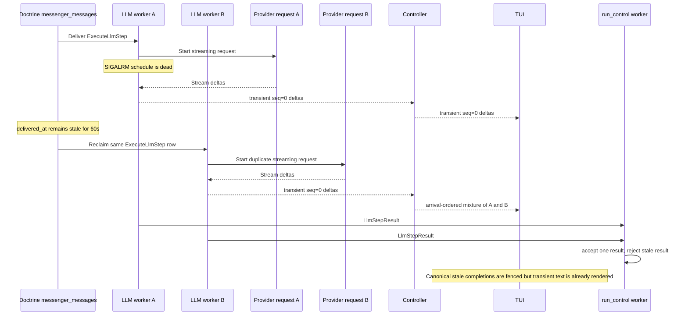

# Messenger keepalive loss and duplicate LLM streaming

## Executive summary

Hatfield's scrambled DeepSeek output is not an ordering bug in the JSONL transport. The observed corruption is an interleaving bug caused by the same `ExecuteLlmStep` Doctrine message being processed concurrently by multiple LLM workers.

The immediate failure chain is proven:

1. One LLM consumer stops receiving its periodic `SIGALRM` callback while the process remains alive.
2. The worker later receives an `ExecuteLlmStep` but never calls Doctrine keepalive for it.
3. The row's `delivered_at` remains stale.
4. After the configured 60-second `redeliver_timeout`, another LLM consumer claims the same row.
5. Both workers continue producing transient stream events for the same run and step.
6. Canonical result handling rejects stale completions, but transient deltas bypass that fence and are merged by arrival order in the TUI.

The root defect is the failure-unsafe keepalive mechanism: Symfony Console implements periodic keepalive with a **one-shot** `pcntl_alarm()`, and in the event-dispatcher path it rearms the timer only after all signal events and `ConsumeMessagesCommand::handleSignal()` return. There is no `finally` or independent watchdog. If that callback path does not reach the final rearm, the consumer remains healthy enough to receive work but has no future keepalive alarm.

The exact interruption that prevented the final rearm was not captured. SQLite contention, logging reentrancy, and callback exceptions are possible triggers, but none is proven by the available logs. This report intentionally separates the proven structural defect from the unknown initiating trigger.

Tmux tab switching is correlated with the user-visible failure but was not the direct keepalive cause in the captured reproduction. The TUI repeatedly blocked in `pipe_write`, and the controller blocked briefly, while the affected LLM worker never blocked on its stdout pipe. Tmux backpressure remains a separate rendering/delivery problem.

---

## User-visible symptoms

The issue was observed primarily on slow DeepSeek fork turns with long reasoning or handoff output:

- text fragments appeared scrambled, such as words, Markdown, and file paths spliced together;
- a fork appeared to finish or hand off, then resumed emitting old/new reasoning;
- the child live view flashed heavily after leaving and returning to its tmux tab;
- stopping the fork ended the visible corruption;
- canonical parent state later contained only one accepted handoff/result.

These symptoms initially resembled out-of-order provider deltas or a coalescing bug. The logs instead showed multiple coherent provider streams executing concurrently for one Messenger row.

---

## Relevant runtime topology



### Runtime settings involved

`src/CodingAgent/Runtime/Controller/ConsumerSupervisor.php` launches every consumer with:

```text
--keepalive=5 --sleep=0.01
```

`src/CodingAgent/Runtime/Process/JsonlProcessAgentSessionClient.php` creates the session-scoped Doctrine transports with:

```text
redeliver_timeout=60
```

The intended invariant is therefore:

```text
active handler
  → SIGALRM every 5 seconds
  → Worker::keepalive()
  → UPDATE messenger_messages.delivered_at
  → row never reaches 60 seconds old
```

The incident violates the first edge, not the Doctrine update semantics after a keepalive request is sent.

---

## Symfony alarm lifecycle

### Alarm setup

`vendor/symfony/messenger/Command/ConsumeMessagesCommand.php` detects `--keepalive` during command initialization and calls:

```php
$this->getApplication()->setAlarmInterval(...);
```

`vendor/symfony/console/Application.php` stores the interval and schedules the timer. `vendor/symfony/console/SignalRegistry/SignalRegistry.php` implements scheduling as:

```php
public function scheduleAlarm(int $seconds): void
{
    pcntl_alarm($seconds);
}
```

`pcntl_alarm()` is one-shot. Every call replaces the prior alarm; after delivery there is no next alarm unless code schedules another one.

### Rearm ordering

In Symfony Console's event-dispatcher branch, a `SIGALRM` executes this order:

```text
dispatch ConsoleSignalEvent
  → dispatch ConsoleAlarmEvent
  → ConsumeMessagesCommand::handleSignal(SIGALRM)
      → Worker::keepalive()
          → Doctrine receiver keepalive
  → scheduleAlarm()
```

The rearm occurs at `vendor/symfony/console/Application.php:1090`, after all event listeners and command signal handling. It is not protected by `finally`.

The neighboring no-dispatcher branch rearms before invoking the command's signal handler (`Application.php:1109`). Hatfield runs with Symfony's event dispatcher, so it uses the failure-unsafe ordering.

### Why this creates a live but unsafe worker

A consumer does not need its alarm to poll Doctrine or process messages. Once the one-shot timer is lost:

- its signal handler remains installed;
- the process remains alive;
- its main Messenger loop continues polling;
- short messages can complete normally;
- long messages exceed `redeliver_timeout` because no callback updates their lease.

This precisely matches the captured worker behavior.

---

## First reproduction: message 95707

The first confirmed incident used session 45 and a child `ExecuteLlmStep`:

| Event | UTC time | Worker |
|---|---|---:|
| First receive of message 95707 | 20:17:14.515 | PID 323 |
| Same row reclaimed | 20:18:15.012 | PID 325 |
| Same row reclaimed again | 20:19:16.006 | PID 322 |
| Reclaimed worker completed | 20:19:40.659 | PID 322 |
| Older duplicate completed | 20:22:24 | PID 323 |
| Other duplicate completed | 20:22:41 | PID 325 |

The receive spacing was approximately 60.5 and 61.0 seconds. No new `ExecuteLlmStep` dispatch occurred between those receives.

Canonical handling behaved correctly:

- stale `LlmStepResult` messages were accepted/acknowledged as stale without continuation effects;
- the legitimate final child step generated one deferred tool completion;
- the parent canonical suffix contained one completed progress event, one tool result, and one handoff.

The corrupted transcript therefore came from transient events emitted before canonical stale-result handling.

---

## Instrumented reproduction: message 95905

A disposable diagnostic commit (`063603778`, not part of merged PR #427) added a `ConsoleAlarmEvent` subscriber that logged one structured record for each LLM-consumer alarm callback.

The second reproduction provided a cleaner chronology.

### Worker alarm history

Inner PID 29 emitted its final alarm tick at:

```text
2026-08-25T00:05:25.275984Z
```

It then remained alive and handled two short LLM messages:

| Event | UTC time |
|---|---|
| PID 29 received short message | 00:08:08.912 |
| Request completed | 00:08:13.488 |
| PID 29 received short message | 00:08:24.407 |
| Request completed | 00:08:36.251 |

No PID 29 alarm tick occurred during or between those requests.

PID 29 then received child message 95905:

| Event | UTC time | Worker |
|---|---|---:|
| Message dispatched | 00:08:38.701 | run_control PID 26 |
| First receive | 00:08:38.711 | PID 29 |
| Duplicate receive | 00:09:39.014 | PID 30 |
| First healthy keepalive after reclaim | 00:09:40.330 | PID 30 |
| Next healthy keepalive | 00:09:45.338 | PID 30 |

The duplicate arrived **60.303 seconds** after the original receive. PID 29 emitted no alarm tick and no keepalive for the row. Once PID 30 claimed it, keepalives resumed and `delivered_at` advanced normally.

### Process-level proof

A 50 Hz `/proc` sampler monitored the original delivery for the full first lease window.

Affected host PID 566535 / inner PID 29:

- changed between `do_poll.constprop.0` and running 985 times;
- never entered `pipe_write`;
- remained alive;
- retained a caught-signal disposition for `SIGALRM`;
- did not have `SIGALRM` blocked;
- had no pending process/thread `SIGALRM` when inspected.

This is consistent with an unarmed one-shot timer. It is inconsistent with a permanently blocked write, missing signal handler, masked signal, or signal waiting to be dispatched.

The monitors used for the live investigation were:

```text
/tmp/session45-wchan-monitor-20260824-200233.jsonl
/tmp/session45-wchan-fast-20260824-200750.jsonl
```

They are ephemeral investigation artifacts, not repository fixtures.

---

## Backpressure findings

The 50 Hz monitor did capture output backpressure:

- the TUI process repeatedly entered `pipe_write`, sometimes in dense bursts;
- the controller entered `pipe_write` briefly near dispatch;
- the affected LLM worker did not enter `pipe_write` during the decisive 60-second window.

The observed chain was therefore not:

```text
tmux hidden
  → TUI blocks forever
  → controller blocks forever
  → LLM worker blocks forever
  → SIGALRM cannot run
```

The controller recovered and continued draining. PID 29 continued alternating through HTTP polling/running states.

Backpressure still matters independently:

- it explains heavy flicker and partial-frame behavior when returning to a tmux tab;
- blocking JSONL writes can delay event draining;
- sufficiently long worker stdout blockage could delay a healthy signal callback;
- it increases the damage after duplicate workers begin streaming.

It does not explain why PID 29's alarm had already been absent for more than three minutes before message 95905 started.

---

## Evidence classification

### Proven

- The same Doctrine Messenger row was received by different workers at approximately 60-second intervals.
- No new application dispatch occurred between duplicate receives.
- The original worker emitted no keepalive for the affected row.
- Individual consumers stopped producing alarm callbacks while remaining alive.
- A worker with a dead alarm later accepted and completed other messages.
- Doctrine keepalive worked once a healthy worker claimed the row.
- Multiple duplicate workers emitted transient stream output.
- Canonical stale-result handling rejected late duplicate completions.
- The active original worker was not blocked in `pipe_write` during the measured lease window.
- Symfony's alarm is one-shot and its dispatcher path rearms only after fallible callback work, without `finally`.

### Strong conclusion

The product-level root cause is reliance on a failure-unsafe one-shot alarm with no independent liveness repair. Once that rearm chain is lost, a live worker can silently violate the 60-second lease contract.

### Not proven

The exact operation that prevented a specific final callback from reaching `scheduleAlarm()` was not captured. Candidate triggers include:

- a Throwable during signal-event dispatch;
- a Doctrine keepalive/transaction failure while a message is active;
- logging or other reentrant work inside the async signal callback;
- a PHP/Symfony signal lifecycle race.

The final visible PID 29 tick happened while that worker had no known in-flight message, so the evidence does **not** justify naming Doctrine keepalive SQL as the trigger for that occurrence.

---

## Rejected and separate hypotheses

### Provider emitted deltas out of order

Rejected as the explanation for the 60-second incidents. The visible text was a mixture of coherent fragments from multiple requests. Provider ordering within each request was not shown to be wrong.

### Controller frame coalescing reordered bytes

Rejected for the captured incidents. Duplicate receives existed before presentation, and canonical state later showed stale completion rejection. Coalescing can affect batching but cannot create three workers processing one DB row.

### The stock HTTP stream continuously blocked PHP signal dispatch

Not sufficient. The affected worker's alarm was already dead before the long request. `/proc` showed frequent poll/running transitions rather than one permanent blocking call.

### Tmux backpressure directly killed the alarm

Rejected for message 95905. Backpressure was real in the TUI and briefly in the controller, but the original LLM worker never blocked on its output pipe during the lease window.

### HTTP retry or EventSource reconnect created the three workers

Rejected for cross-worker duplicate delivery. HTTP retries and SSE reconnects are separate same-worker replay hazards; they cannot cause three distinct Messenger consumers to receive the same Doctrine message ID.

A disposable `EventSourceHttpClient::stream($response, 1.0)` experiment did trigger unsafe SSE reconnection/replay and was fully rolled back. It must not be reintroduced as a keepalive fix.

### Raising the HTTP timeout alone

Insufficient. The failure is the Messenger lease heartbeat, not merely request duration. A longer provider request makes the missing heartbeat more damaging.

---

## Corrective direction

### 1. Make alarm rearming failure-safe

The smallest root fix is to ensure the next alarm is armed before any fallible signal callback work, or unconditionally in `finally`.

Preferred behavior:

```text
SIGALRM received
  → immediately arm the next SIGALRM
  → dispatch diagnostics / perform Worker keepalive
  → callback failure is logged or propagated without killing future alarms
```

This should ideally be fixed upstream in Symfony Console because the unsafe ordering is in the generic alarm lifecycle. If a local correction is required before an upstream release, use an existing Console/Messenger extension seam and keep it narrowly scoped to consumer alarm safety. Do not add a new scheduler, timer abstraction, setting, or provider-specific path.

A 60-second or larger lease increase is only mitigation. It widens the failure window but does not restore a dead heartbeat.

### 2. Keep TUI backpressure as a separate fix

The repeated TUI `pipe_write` stalls and brief controller stall should remain attached to the persistent-frame/flicker investigation. They should not be conflated with the alarm root fix.

### 3. Remove disposable diagnostics after proof

The temporary alarm-tick subscriber was useful to identify the failed boundary, but per-worker five-second informational logging is not intended permanent product behavior. Permanent observability should report heartbeat loss or duplicate receipt rather than log every healthy tick.

---

## Validation plan

Tests must follow `.agents/skills/testing/SKILL.md` and `tests/AGENTS.md`: deterministic barriers, no arbitrary sleeps, each case under ten seconds, and Castor-only QA.

### Lowest-layer alarm proof

Use an isolated subprocess because process-global signals cannot be safely tested in the PHPUnit parent. The child should:

1. install the same Console signal path;
2. force a controlled failure after alarm entry but before the old rearm location;
3. report callback entry and subsequent alarm state through a pipe;
4. prove the corrected implementation retains/rearms the timer;
5. exit deterministically with owned-process teardown.

Prefer explicit `posix_kill(SIGALRM)` and pipe barriers over waiting for wall-clock timer races. If the actual correction only changes callback ordering, test that ordering directly at the smallest Symfony/application seam.

### Duplicate-delivery proof

Use an isolated test transport DB with a short test-only lease and deterministic handler barrier:

- worker A claims one message and blocks on a controlled pipe;
- keepalive is exercised through the real receiver;
- worker B must not claim the row while A's heartbeat is healthy;
- a deliberately disabled heartbeat variant demonstrates the fixture can reproduce reclaim;
- all subprocesses and DB files are owned and cleaned by the test.

Do not use a production setting solely for this test.

### Required gates

Because the eventual fix touches Messenger, runtime streaming, and TUI-visible flow:

```text
castor test
castor test:controller-replay
castor test:tui
castor test:llm-real   # if provider/stream conversion changes
castor deptrac
castor phpstan
castor cs-check
castor check
```

A final manual session-45 run should cross the old 60-second threshold and verify:

- one receive per message ID;
- alarm/lease continuity for the active worker;
- no duplicate provider request;
- no interleaved transient text;
- stable child view after leaving and returning to the tmux tab.

---

## Related work

- Task: `TODO/2026-08-24-fix-out-of-order-deepseek-stream-deltas.md`
- Performance report: `.pi/reports/runtime-events-performance.md`
- Runtime architecture: `.pi/reports/architecture.md`
- Persistent-frame task: `TODO/2026-08-22-fix-tui-persistent-partial-frame-until-keypress.md`
- Merged runtime performance PR: `#427`
- Disposable diagnostic commit: `063603778` on the retained performance-task worktree

## Final conclusion

The TUI did not randomly reorder one stream. It faithfully rendered arrival order from multiple workers that should never have been executing the same LLM step concurrently.

The duplicate execution occurred because a live Messenger consumer permanently lost its process-local one-shot keepalive alarm. Symfony's dispatcher signal path has no failure-safe rearm, so one missed rearm silently converts a healthy consumer into a future lease violator. Fix that alarm lifecycle; treat tmux output backpressure as a related but separate presentation problem.
