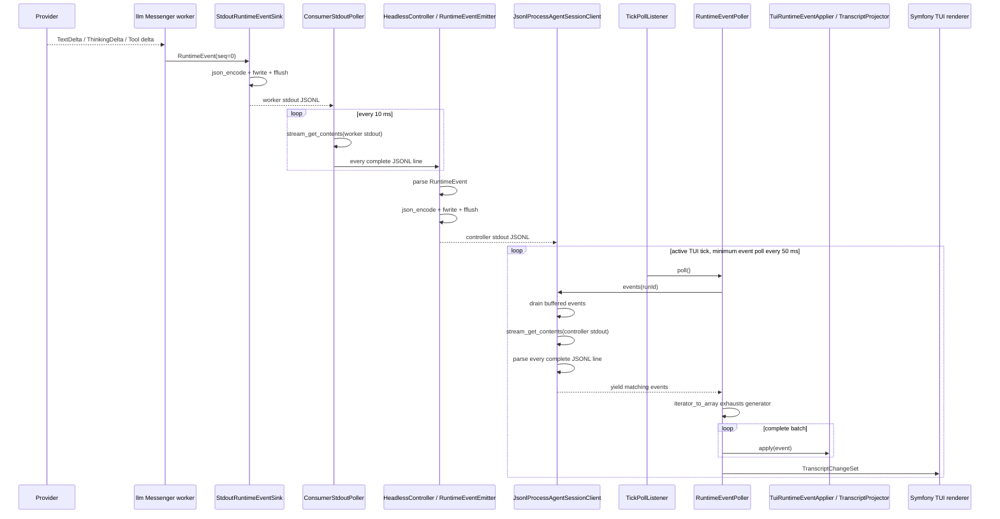
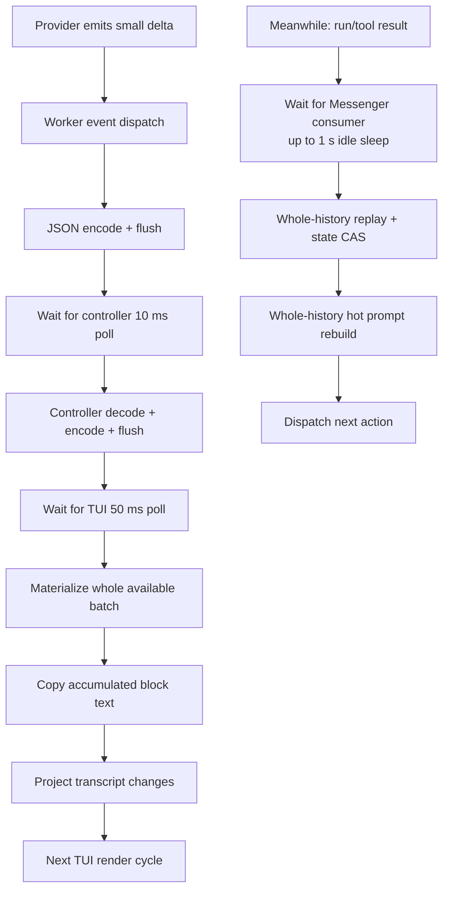

# Runtime events and performance report

## Executive summary

Hatfield is slow, but the nested `yield` calls are not the primary cause.

`RuntimeEventCallbacks::eventList()` immediately exhausts `AgentSessionClient::events()` with `iterator_to_array()`. In the normal process path, one TUI poll therefore consumes every complete JSONL event currently available from the controller pipe. The generators make the flow harder to read, but they do not normally leave one event waiting per tick.

The measured bottlenecks are elsewhere:

1. **High — Messenger workers inherit Symfony's 1-second idle sleep.** `ConsumerSupervisor` does not pass `--sleep`, so commands routinely wait hundreds of milliseconds before execution. This delays starts and queue transitions, not token cadence during an active stream.
2. **Critical — canonical history is repeatedly rebuilt from the whole `events.jsonl`.** The run-control path performs a full stale-state replay and then another full hot-prompt replay after an eventful commit.
3. **High — state persistence rewrites the whole `state.json`.** CAS reads it, rereads it under a lock, normalizes it, pretty-prints it, and atomically rewrites it.
4. **Critical — subagent progress is persisted as thousands of large canonical events.** Every progress append also synchronizes the parent run's `lastSeq` through another full state read/CAS/write.
5. **Critical — worker processes retain too much data.** A live snapshot showed 13 controller consumers using about **2.84 GiB RSS**. Four LLM workers each used roughly 227–252 MiB; several run-control, tool, and MCP workers exceeded 300 MiB RSS.
6. **High — every stream delta crosses two synchronously flushed JSONL pipes.** The LLM worker encodes/writes/flushes to the controller; the controller parses, re-encodes, writes, and flushes to the TUI. This is on the active streaming path.
7. **Medium — no provider continuation/cache reuse was observed.** The sampled run repeatedly sent a growing prompt and the same 36 tool schemas.
8. **High — the TUI copies the accumulated assistant string for each small delta.** Long responses can become quadratic in copied text.

There are also real event-loss holes, but no matching warnings were found in the sampled August 23–24 logs. They are code-supported risks, not the demonstrated cause of the general slowness.

---

## What actually happens to one runtime event



### Scheduling floors

| Stage | Interval | Effect |
|---|---:|---|
| Controller worker-stdout poll | 10 ms | Lower bound before a worker event reaches the controller |
| TUI runtime-event poll | 50 ms | Events can wait for the next TUI poll |
| Active Symfony TUI ticker | 10 ms | Normal active render cadence |
| Idle Symfony TUI ticker | 250 ms | Idle callbacks and terminal transitions can wait longer |
| Tool-question DB poll | 500 ms | Approval/question presentation latency |
| Background-process completion poll | 2 s | Background completion notification latency |
| Messenger consumer idle sleep | **1 s default** | Dominant command scheduling latency after a queue becomes idle |
| Consumer supervision | 5 s | Dead/recycled worker discovery can take several seconds |

The 10 ms controller poll plus 50 ms TUI poll is noticeable but not enough to explain multi-second tool turns. The 1-second Messenger sleep, persistence/replay work, provider time, and worker recycling are much larger.

---

## The `yield` chain

The current call chain is:

```text
RuntimeEventPoller::poll()
  → RuntimeEventCallbacks::eventList()
      → iterator_to_array($client->events($runId), false)
          → JsonlProcessAgentSessionClient::events()
              → yield buffered events for run
              → readEventBatch()
                  → iterator_to_array(readEvents(), false)
                      → stream_get_contents(controller stdout)
                      → split every complete JSONL line
                      → yield decoded RuntimeEvent
              → yield matching run events
              → re-buffer events for other runs
```

### Verdict

**Proven:** the outer `iterator_to_array()` exhausts the generator. A normal poll does not process only one yielded event.

**Proven:** `readEvents()` performs one non-blocking `stream_get_contents()` and parses all complete lines in that chunk. It retains the final incomplete line for the next call.

**Proven:** there is no maximum event count or processing-time budget. A large burst is fully materialized and then synchronously applied on the TUI tick thread.

**Conclusion:** the generator layers are needless complexity for the primary TUI caller because that caller immediately creates a list. They can be simplified later, but deleting them first will not fix the dominant latency.

---

## Where task latency is introduced

```mermaid
flowchart LR
    A[Command enqueued] --> B{Consumer awake?}
    B -- no --> C[Up to 1 s Messenger idle sleep]
    B -- yes --> D[Receive immediately]
    C --> D

    D --> E[RunMessageProcessor]
    E --> F[Read state.json]
    F --> G[Load and replay all events.jsonl]
    G --> H[Handler computes transition]
    H --> I[CAS: reread + rewrite state.json]
    I --> J[Append canonical events]
    J --> K[Load and replay all events again<br/>for hot prompt state]
    K --> L[Dispatch ExecuteLlmStep or ExecuteToolCall]

    L --> M{Next worker awake?}
    M -- no --> N[Another queue sleep]
    M -- yes --> O[Execute]
    N --> O
```



A tool loop crosses queues repeatedly:

```text
run_control → tool → run_control → llm → run_control
```

A one-second idle polling default can therefore be paid several times during one assistant turn.

---

## Measurements

All values below are observational snapshots from local Hatfield logs/session files. They are not Pi benchmark results.

### Queue wait — run 45

Correlated Messenger send/receive records by trace ID:

| Message | Median queue wait | p95 | Samples |
|---|---:|---:|---:|
| `ExecuteLlmStep` | 424 ms | 919 ms | 91 |
| `LlmStepResult` | 517 ms | 938 ms | 91 |
| `ExecuteToolCall` | 596 ms | 773 ms | 119 |
| `ToolCallResult` | 872 ms | 3,702 ms | 119 |
| `ExtensionAgentJobMessage` | 573 ms | 41,999 ms | 27 |
| `StartRun` | 679 ms | 895 ms | 8 |
| `DeliverDeferredSubagentBatchLifecycleMessage` | 764 ms | 1,048 ms | 8 |

These values match Symfony Messenger's inherited 1-second idle sleep much more closely than they match the 10/50 ms runtime-event polls.

### Persistence and orchestration growth — run 45

Median durations degraded as the session grew:

| Trace span | August 23 | August 24 |
|---|---:|---:|
| `persistence.commit` | 600 ms | 743 ms |
| `replay.rebuild_hot_prompt_state` | 268 ms | 386 ms |
| `turn.orchestrator.advance` | 831 ms | 1,063 ms |
| `turn.orchestrator.llm_result` | 1,101 ms | 1,360 ms |
| `turn.orchestrator.tool_result` | 1,728 ms | 2,586 ms |

This is the expected shape of whole-history work: latency rises with the session log rather than staying approximately constant per turn.

### Session growth — run 45 snapshot

| Artifact | Approximate value |
|---|---:|
| `events.jsonl` | 40.4 MiB |
| Canonical events | 9,477 |
| `state.json` | 483 KiB |
| Messages in state | 37 |
| Message payload characters | ~216,000 |
| `tool_execution_update` events | ~5,900 |
| Space used by `tool_execution_update` | ~28.6 MiB |

The log size is not mainly conversation history. It is dominated by repeated serialized subagent-progress snapshots.

### Worker memory snapshot

Read-only process snapshot at **2026-08-24 15:50 UTC**:

| Process group | RSS observation |
|---|---:|
| 13 controller consumer children | **~2.84 GiB total** |
| Four LLM workers | ~227–252 MiB each |
| Long-lived run-control worker | ~307 MiB |
| Two long-lived tool workers | ~311–325 MiB |
| MCP worker | ~308 MiB |

The configured Messenger command uses `--memory-limit=256M`, but that limit is checked at message boundaries and PHP's tracked memory is not identical to RSS.

August 24 logs contained five memory-limit recycles:

- four `tool` workers;
- one `extension_agent` worker.

The four observed tool-worker recycle detections/relaunches followed the memory-limit exit by roughly 2.0–4.3 seconds, consistent with the 5-second supervision interval.

**Observed:** memory pressure and worker recycling are real.

**Hypothesis:** whole-event-log caches, duplicated service containers, undrained transient event queues, and large tool/subagent payloads contribute. A heap/profile measurement is still required to assign exact percentages.

### Provider/request cost — run 45

| Measurement | Value |
|---|---:|
| Prepared LLM requests sampled | 92 |
| `cache_reused=true` | 0 |
| `has_previous_response_id=true` | 0 |
| Input message count | 30–271 |
| Tool schemas per request | 36 |
| `llm.call` median | ~12.4 s |
| `llm.call` p95 | ~46.1 s |

Provider time is the largest single wall-clock component, but Hatfield adds substantial queue and persistence time around it. No `codex.websocket.*` activity was found for the sampled run, so the available WebSocket continuation cache was not active there.

---

## Prioritized findings

Severity is user impact, not implementation order: **Critical** means data loss, runaway resource growth, or an observed path toward runtime failure; **High** means major latency on a bounded path; **Medium** means an important optimization without current failure evidence.

## High. Messenger consumers sleep for one second

`ConsumerSupervisor` launches commands equivalent to:

```text
messenger:consume <transport> --no-interaction --memory-limit=256M --keepalive=5
```

It does not pass `--sleep`. Symfony Messenger defaults to `1,000,000` microseconds.

This is directly reflected in the measured queue-wait medians. The event renderer cannot display work that has not started yet, so tuning the TUI poller before fixing worker scheduling attacks the wrong layer.

### Minimal correction

Pass an explicit interactive sleep, initially **10,000–50,000 microseconds**, then measure SQLite/Doctrine contention. This is one argument, not a scheduler rewrite.

---

## Critical. Every run-control message performs whole-history work

`RunMessageProcessor` calls `SessionRunStateReplayService::rebuildIfStale()` for each processed run-control message.

`rebuildIfStale()` calls `EventStoreInterface::allFor()`, sorts the complete history, filters it, and reduces it into `RunState` before it can decide what to do.

After an eventful commit, `RunCommit` calls `SessionHotPromptReplayService::rebuildHotPromptState()`. That service calls `allFor()` again, filters the complete history again, replays prompt messages, estimates tokens, and stores an in-memory prompt state.

`SessionRunEventStore` has a process-local cache, but append invalidates it. A run-control commit appends events immediately before the hot-prompt rebuild, so the second replay cannot reuse the pre-commit snapshot.

### Consequence

```text
more canonical events
  → larger JSONL read/decode/object graph
  → slower stale check
  → slower commit
  → slower result handling
  → slower next tool/LLM dispatch
```

### Minimal correction

1. Check staleness from an O(1) or tail-read last sequence, not `allFor()`.
2. Build/update hot prompt state from the committed `RunState` or newly committed events.
3. Reserve a complete replay for resume, explicit history selection, recovery, and integrity checks.

---

## High. State CAS rewrites the complete state

`SessionRunStore` stores `.hatfield/sessions/<runId>/state.json`.

A normal mutation performs:

1. `get()` — read, decode, denormalize the whole state;
2. acquire the per-run file lock;
3. reread/decode/denormalize for CAS;
4. normalize the new state;
5. pretty-print the whole document;
6. atomically rewrite it.

At roughly 483 KiB and thousands of transitions, this is no longer cheap. Large message arrays are copied and serialized for metadata-only changes such as sequence/version advancement.

### Minimal correction

First remove needless state writes caused by progress events. Only then measure whether the remaining state representation itself needs changing. A new database or event-store architecture is premature.

---

## Critical. Subagent progress floods canonical storage

`SubagentProgressEventAppender` persists a full normalized `subagent_progress` snapshot as `tool_execution_update`.

`CommittedRunEventAppender` then synchronizes the parent `RunState.lastSeq` through `get()` plus CAS. This means one progress update can cause:

```text
serialize progress snapshot
  → append events.jsonl
  → invalidate event cache
  → read state.json
  → reread state.json under lock
  → rewrite state.json
```

Run 45 contained about 5,900 progress events occupying about 28.6 MiB. That one event type was the majority of the canonical log.

### Minimal correction

- Keep live high-frequency progress transient.
- Persist only meaningful milestones and the final snapshot.
- At minimum, discard unchanged snapshots and coalesce repeated updates before canonical append.
- Do not rewrite parent state for every visual progress update.

The exact cadence should be chosen from UX/recovery requirements; do not add a general event-stream framework.

---

## Critical. Long-lived workers retain large per-process state

`SessionRunEventStore::allFor()` decodes a complete JSONL file into `RunEvent` objects and keeps a process-local snapshot cache.

`SubagentRunMetadataReader` needs only the immutable `run_started` metadata but calls `allFor()` on its first lookup in each worker. On a 40 MiB log this can construct a large object graph merely to find the first event.

The LLM stream subscribers are also wired with both:

- `InMemoryRuntimeEventSink`;
- `StdoutRuntimeEventSink`.

In worker-process mode, stdout is the actual delivery path. If the in-memory sink is not drained in that worker, its `SplQueue` retains transient events for the worker lifetime.

### Minimal correction

1. Read immutable run-start metadata directly; do not load complete history.
2. Use exactly one transient sink for the active runtime mode.
3. Bound any queue that can outlive one request.
4. Profile memory after these deletions before changing worker limits.

Raising `--memory-limit` would hide the leak/caching cost and increase host pressure; it is not the first fix.

---

## High. Streaming performs synchronous encode/write/flush twice

For each provider delta:

```text
LLM worker
  → normalize RuntimeEvent
  → JSON encode
  → fwrite(worker stdout)
  → fflush

Controller
  → read worker stdout
  → JSON decode
  → JSON encode
  → fwrite(controller stdout)
  → fflush

TUI
  → read controller stdout
  → JSON decode
  → project
```

There is no provider-side frame coalescing. Tiny token deltas therefore pay repeated event dispatch, allocation, JSON, syscall, and flush cost.

Backpressure is synchronous: if either pipe is slow, provider stream consumption pauses.

### Minimal correction

Coalesce adjacent text/thinking deltas once per short frame, for example at the existing 10–50 ms presentation cadence, while immediately forwarding control events and completion boundaries.

Do not persist transient token deltas.

---

## High. TUI text append is quadratic for many small deltas

`TranscriptBlock` is immutable. `appendText()` creates a new block containing the full accumulated text.

For token-sized deltas, copied characters approach:

```text
1 + 2 + 3 + ... + N = O(N²)
```

The mounted transcript widget has efficient keyed/content-only patch paths, so the main cost is constructing repeated accumulated strings before rendering, not rebuilding the entire finalized transcript on every ordinary delta.

### Minimal correction

Frame coalescing reduces this cost without redesigning transcript blocks. Only replace the immutable accumulator if profiling still shows it matters afterward.

---

## Medium. Provider continuation/cache reuse is inactive

The sampled run sent increasingly large context and 36 tool schemas on every request. Every prepared-request record reported:

```text
cache_reused = false
has_previous_response_id = false
```

This does not prove every provider behaves this way. It proves the sampled Codex path did not use the existing continuation/cache mechanism.

### Minimal correction

Verify the configured transport and enable the already-existing WebSocket/continuation path when supported. Do not build another cache before proving why the installed one is inactive.

---

## Critical correctness risks if triggered

These have critical impact, but none had a matching warning in the sampled August 23–24 logs. They are code-supported risks, not observed incidents.

### 1. A projection exception can discard the rest of a consumed batch

`RuntimeEventPoller` first materializes all events. It then applies them inside one outer `try/catch`.

For canonical events it updates `lastSeq` before calling the applier. If application or a callback throws:

1. the current event may already have advanced `lastSeq`;
2. all remaining events are already removed from the process pipe;
3. the outer catch exits the loop;
4. the current and remaining live events are not requeued;
5. the normal live process path does not automatically replay that consumed batch.

This can produce a stale-looking UI until a later canonical completion, history rebuild, session resume, or repaint repairs it.

### Minimal correction

Handle failure per event, advance sequence only after successful application, and continue or explicitly retain the unprocessed suffix. Control callbacks should not be able to discard unrelated transcript events.

### 2. Partial writes are not fully handled

The stdout writers check failure but do not loop until the full encoded line length is written. `fwrite()` may legally return a positive partial length. The remainder would be silently lost and could corrupt the next JSONL frame.

### 3. Malformed worker JSONL is skipped

`ConsumerStdoutPoller` logs/protocol-errors malformed lines and continues. After ten consecutive bad lines it invokes the runtime exception boundary. A skipped transient event has no replay source.

### 4. Oversized incomplete JSONL is truncated

Partial-line buffering is capped at 65,536 bytes. When exceeded, older bytes are discarded. The eventually completed line is then malformed and skipped.

This matters because progress snapshots and tool payloads can be several kilobytes and continue growing.

### 5. Sequence ordering across worker pipes is not globally serialized

Canonical events are persisted with sequence numbers, but multiple consumer stdout pipes are polled independently. The TUI keeps one `lastSeq` per run and skips canonical events at or below it. If a higher-sequence event arrives before a delayed lower-sequence event from another pipe, the lower event can be dropped from live projection.

Canonical replay remains authoritative, but the live UI can temporarily diverge.

### 6. Observer failures are swallowed

`LlmPlatformAdapter::notifyObserver()` logs and swallows stream observer exceptions so the model invocation can finish. This protects the run, but transient frames can disappear while the canonical completion arrives later as repair.

### 7. Large synchronous batches can freeze the TUI tick

There is no batch count or time budget. A burst is fully decoded, materialized, projected, callback-dispatched, and converted into one change set on the TUI thread. Child live view is polled first on the same shared process pipe and can add more work.

---

## Why the UI can feel slower than the model stream



During one uninterrupted provider response, the stream path mainly determines smoothness. Between LLM/tool steps, queue scheduling and persistence dominate. This explains the combination of:

- slower-looking token streaming;
- long pauses before tools start;
- long pauses after tools finish;
- degradation as a session grows;
- intermittent multi-second stalls when workers recycle.

---

## Recommended order of work

### Phase 1 — remove proven fixed latency

1. Pass explicit `--sleep=10000` to `50000` microseconds to interactive Messenger consumers.
2. Record queue wait by transport before/after.
3. Keep the value that provides low latency without creating unacceptable Doctrine/SQLite polling contention.

Expected effect: remove hundreds of milliseconds from every queue hop with a one-line launch change.

### Phase 2 — stop whole-history work in the hot path

1. Replace stale detection's `allFor()` with a cheap tail/last-sequence check.
2. Rebuild hot prompt state from the committed state or event delta.
3. Keep full replay only at actual recovery/history boundaries.
4. Read `run_started` metadata without decoding the complete event log.

Expected effect: orchestration latency stops growing linearly with session history.

### Phase 3 — stop progress write amplification

1. Make frequent progress transient.
2. Persist milestones/final state only.
3. Remove parent `state.json` CAS for each visual update.
4. Confirm canonical resume still reconstructs final subagent/tool state.

Expected effect: much smaller logs, fewer locks and rewrites, lower memory, faster replay.

### Phase 4 — make streaming frame-based

1. Select only one transient sink per runtime mode.
2. Coalesce adjacent deltas once per short frame.
3. retain immediate delivery for control/completion/HITL events;
4. handle complete pipe writes;
5. bound partial and cross-run buffers.

Expected effect: smoother streaming with far fewer JSON encodes, flushes, allocations, and string copies.

### Phase 5 — close correctness holes

1. Apply events with per-event failure isolation.
2. Advance `lastSeq` only after successful canonical application.
3. Preserve/retry the unprocessed batch suffix.
4. Define one globally ordered canonical delivery path or reorder by sequence before projection.
5. Add explicit metrics for malformed, truncated, partial-write, skipped-sequence, and observer-failure cases.

### Phase 6 — activate existing provider continuation

Verify why the existing Codex WebSocket continuation cache was inactive. Enable the installed path if compatible; only design something new if that path measurably cannot serve the configured provider.

---

## What not to do first

- Do not rewrite the agent architecture.
- Do not replace Messenger before fixing its sleep argument.
- Do not replace JSONL before stopping huge progress snapshots and repeated whole-file replay.
- Do not add more event buses, handlers, or buffering abstractions.
- Do not raise worker memory limits as the first response.
- Do not tune the 50 ms TUI poll before measuring after the 1-second worker sleep is fixed.
- Do not delete generators expecting a performance breakthrough; simplify them only after the hot-path fixes.

The first useful fixes are small deletions or local changes in existing paths.

---

## Validation plan

Use the same deterministic scripted run before and after each phase.

### Metrics to capture

- **Messenger:** enqueue-to-receive latency by message/transport.
- **Run control:** stale replay, handler, CAS, event append, and hot replay durations.
- **Storage:** bytes read/written and `allFor()` calls per turn.
- **Progress:** transient/canonical update counts and bytes.
- **Streaming:** provider deltas versus worker frames versus TUI frames.
- **Pipes:** bytes, writes, flushes, partial writes, and malformed/truncated lines.
- **TUI:** events per poll, poll processing time, projection time, and render time.
- **Memory:** RSS and PHP memory per worker after each turn.
- **Provider:** request messages/tokens/tools, continuation/cache status, first-token latency, and total latency.

### Acceptance targets

1. Idle queue p95 is below 100 ms for interactive transports.
2. No full `events.jsonl` replay occurs during an ordinary steady-state tool/LLM result commit.
3. Persistence latency does not increase materially between early and late turns in the same scripted session.
4. Canonical progress bytes are bounded by milestones, not polling frequency.
5. Worker RSS reaches a stable plateau across repeated turns.
6. One provider response produces bounded presentation frames rather than one flushed JSONL frame per tiny token delta.
7. An injected projection failure does not discard subsequent events or advance canonical sequence past the failed event.
8. Resume/replay yields the same final transcript and run state.

Runtime/TUI/Messenger changes require the project's full Castor validation path, including `castor check`, after reading the testing skill and `tests/AGENTS.md`.

---

## Source map

### TUI polling and projection

```text
src/Tui/Listener/TickPollListener.php
src/Tui/Runtime/RuntimeEventPoller.php
src/Tui/Runtime/RuntimeEventCallbacks.php
src/Tui/Runtime/SubagentLiveChildViewPoller.php
src/Tui/Runtime/TuiRuntimeEventApplier.php
src/Tui/Transcript/TranscriptMountedWidget.php
src/CodingAgent/Runtime/ProjectionPipeline/TranscriptProjector.php
src/CodingAgent/Runtime/Projection/TranscriptBlock.php
vendor/symfony/tui/Loop/AdaptativeTicker.php
vendor/symfony/tui/Tui.php
```

### Process transport and event pipes

```text
src/CodingAgent/Runtime/Process/JsonlProcessAgentSessionClient.php
src/CodingAgent/Runtime/Controller/HeadlessController.php
src/CodingAgent/Runtime/Controller/ConsumerSupervisor.php
src/CodingAgent/Runtime/Controller/ConsumerStdoutPoller.php
src/CodingAgent/Runtime/Controller/RuntimeEventEmitter.php
src/CodingAgent/Runtime/Stream/StdoutRuntimeEventSink.php
src/CodingAgent/Runtime/InProcess/InMemoryRuntimeEventSink.php
src/CodingAgent/Runtime/Stream/AssistantTextStreamSubscriber.php
src/CodingAgent/Runtime/Stream/AssistantThinkingStreamSubscriber.php
src/CodingAgent/Runtime/Stream/ToolCallStreamSubscriber.php
src/CodingAgent/Runtime/Controller/ToolQuestionPoller.php
src/CodingAgent/Runtime/Controller/BackgroundProcessCompletionPoller.php
```

### Agent pipeline and persistence

```text
src/AgentCore/Application/Pipeline/RunMessageProcessor.php
src/AgentCore/Application/Pipeline/RunCommit.php
src/CodingAgent/Session/Replay/SessionRunStateReplayService.php
src/CodingAgent/Session/SessionRunStore.php
src/CodingAgent/Session/SessionRunEventStore.php
src/CodingAgent/Session/Replay/SessionHotPromptReplayService.php
src/CodingAgent/Agent/Execution/SubagentRunMetadataReader.php
src/CodingAgent/Agent/Execution/Subagent/ChildRun/Progress/SubagentProgressEventAppender.php
src/CodingAgent/Session/CommittedRunEventAppender.php
```

### Provider stream

```text
src/AgentCore/Infrastructure/SymfonyAi/LlmPlatformAdapter.php
src/AgentCore/Application/Handler/ExecuteLlmStepWorker.php
src/CodingAgent/Runtime/Stream/LlmStreamDispatchObserver.php
src/Platform/Bridge/OpenAICodex/CodexWebSocketModelClient.php
src/Platform/Bridge/OpenAICodex/CodexWebSocketConnectionCache.php
src/Platform/Bridge/OpenAICodex/CodexWebSocketContinuationState.php
```

### Existing follow-up tasks

```text
/home/ineersa/projects/agent-core-tasks/TODO/2026-08-21-audit-session-storage-file-io.md
/home/ineersa/projects/agent-core-tasks/TODO/2026-08-22-fix-tui-persistent-partial-frame-until-keypress.md
```

---

## Final diagnosis

The system's event-driven architecture is not the main problem. The implementation repeatedly pays global costs for local work:

- a one-second queue sleep for interactive commands;
- a whole event-history replay to process one result;
- another whole replay to rebuild prompt state;
- a whole state rewrite for one progress/sequence change;
- one flushed JSONL frame per tiny stream delta;
- large per-process caches and queues duplicated across many workers.

The `yield` chain is confusing, and one outer batch catch creates a correctness hole, but generators are not why normal events arrive slowly. Fix worker wake-up, eliminate whole-history hot-path replay, and stop canonical progress flooding first. Those changes are smaller than a runtime rewrite and directly match the measurements.
