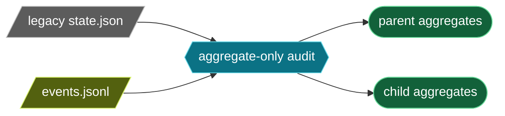

# Canonical session-storage measurement: final event schema

**Scope:** parent and child `events.jsonl` files use the same canonical `RunEvent` schema. This report measures only aggregate structure. It contains no session paths, IDs, prompts, tool output, filenames, hashes, or payload examples.

## Privacy-safe measurement tool

`tools/session-storage-audit.py` is the sole reusable measurement tool:

```bash
python3 tools/session-storage-audit.py /absolute/path/to/.hatfield
python3 tools/session-storage-audit.py --project-final /absolute/path/to/.hatfield
```

Its output is fixed labels, approved schema field paths, and numeric aggregates only. It never prints the supplied root, file names, run/tool identifiers, type strings outside the fixed current/removed vocabulary (other types are labelled `unsupported`), payload values, or malformed input. It is read-only and requires an existing directory named `.hatfield`.

### Accounting semantics

- `line_bytes` is the exact raw byte length of each nonblank JSONL line, including its trailing LF. It is the retained-file accounting unit.
- `value_bytes` is the byte length of compact UTF-8 JSON for a selected decoded field value (`ensure_ascii=false`, separators `,` and `:`). It is an inclusive diagnostic: parents include descendants and selected paths overlap additively; it is not a partition of line bytes.
- Attribution dimensions are `scope=parent|child`, approved event type, and a fixed allow-list of schema paths: typed tool result/result, former legacy result/message paths, assistant message/content, former LLM fields, and launch-context fields. The CLI rejects arbitrary paths.
- Blank lines, malformed JSON, non-object JSON, and unreadable event files are counted numerically as `malformed` and excluded from event/field/projection byte totals. Unsupported decoded types are counted numerically and never echoed.

`--project-final` applies the deterministic schema transform below in memory; it writes nothing. It reports source aggregates plus `PROJECTED_EVENT`, `PROJECTED_FIELD`, and aggregate projected/saved bytes.

## Final ownership and replay contract

- `tool_execution_end.payload.tool_result` stores one normalized complete `ToolCallResult`. It is the only terminal tool-result record; replay buffers LLM-visible results locally and flushes ordered messages at `tool_batch_committed`. Shell results remain non-model-visible.
- `message_start`, `message_end`, `tool_call_result_received`, and `stale_result_ignored` have no canonical replacement event. Stale discards increment metrics directly and produce no user-visible status.
- `llm_step_completed.assistant_message` owns assistant text/tool calls. Runtime and HTML export derive presentation from it; top-level `text` and `tool_calls_count` are absent.
- `run_started` remains the exact portable launch context. Its large initial messages are necessary for start/resume/replay; this task makes no unproven compression claim.
- Nonterminal `tool_execution_update` is transient; terminal snapshots remain canonical for child-artifact recovery.
- The current authoritative vocabulary and detailed producer/consumer matrix are in [run-event-authority-matrix.md](run-event-authority-matrix.md).

## Deterministic historical counterfactual

The projection is schema-defined, not an informal subtraction. The historical source baseline is `66edd84640`: its `ToolCallResultHandler` wrote text-only `tool_execution_end` plus receipt/message frames, and its `LlmStepResultHandler` wrote top-level LLM text/count. The transform is:

1. Drop the ten removed wire types.
2. For retained `llm_step_completed`, remove only top-level `payload.text` and `payload.tool_calls_count`.
3. Retain already-final `tool_execution_end.payload.tool_result` unchanged.
4. For a historical text-only tool end, join only by `(run_id, turn_no, tool_call_id)` internally. It is projectable only if its associated historical `message_end.payload.message.details.tool_result` supplies a complete normalized `ToolCallResult` with the same identity. The projected end becomes exactly `payload={"tool_result": <that normalized result>}`.
5. If that complete source is absent or inconsistent, count `unprojectable_tool_ends` and omit it from projected bytes. The tool never guesses operation identity, error, details, or output content.
6. Serialize each projected envelope as compact UTF-8 JSON plus LF. `saved_line_bytes` compares projected bytes only with `comparable_source_line_bytes` (source bytes excluding unprojectable tool ends); `unprojectable_source_line_bytes` is reported separately. This provides reproducible schema bytes, not a claim about filesystem allocation blocks or runtime decode memory.

The original 2026-08-25 audited live dataset is **not available in this checkout**: the final privacy-safe tool found `parent files=0`, `child files=0`. Therefore no fabricated actual-after result is reported. The original aggregate baseline remains provenance only, and the deterministic fixture below proves the transformation.

## Baseline provenance and projected opportunity

The original read-only 2026-08-25 snapshot measured 234 event logs: parent **107,670,759 bytes** (27,291 records) and child **280,042,430 bytes** (80,450 records), total **387,713,189 bytes**. Its child composition was:

| Historical child type | Records where known | Bytes | Final treatment |
|---|---:|---:|---|
| `message_end` | — | 148,795,187 | removed; its duplicated result is consolidated into typed tool end |
| `tool_execution_end` | 11,117 tool results | 48,497,156 | retained with one typed result |
| `run_started` | 229 | 43,141,809 | retained unchanged launch context |
| `llm_step_completed` | — | 25,664,707 | retained, field-slimmed |

Across those child tool results, historical nested attribution was `tool_execution_end.payload.result=44,573,403`, `message_end.payload.message.content=44,916,502`, and `message_end.payload.message.details=96,413,545` bytes. These figures establish why the final sole-result authority matters, but they cannot yield an exact final byte count without re-reading the original data and applying the strict projection. In particular, historical text-only ends lacking complete normalized result identity are intentionally unprojectable rather than estimated.

The snapshot also measured child `run_started.payload.messages=39,947,463` bytes (92.6% of child start bytes). No savings are claimed for it. Earlier parent-only persisted nonterminal progress was a separate historical bug; final nonterminal progress is transient.

## Deterministic benign fixture result

`tests/AgentCore/Tools/SessionStorageAuditTest.php` invokes the real CLI against an isolated synthetic `.hatfield` tree. Its values and IDs are sentinels specifically to prove the output boundary does not leak them.

| Scope | Source records | Final projected records | Removed records | Required retained proof |
|---|---:|---:|---:|---|
| parent | 7 | 2 | 5 | one typed `tool_execution_end` and slim `llm_step_completed.assistant_message` remain |
| child | 6 | 1 | 5 | `run_started` remains and is attributed as child |

The test also proves: parent/child line attribution; old receipt/message/stale rows vanish from projected event output; projected LLM field attribution contains `assistant_message` but neither removed field; and output contains none of the fixture’s identifiers, prompt/tool/assistant content, or filename sentinel. It completes in well under ten seconds.

## Limitations

This tool reports encoded JSONL bytes, not filesystem block allocation, decompression, physical reads, decode peak memory, or runtime frequency. The original dataset was live and can change; only the committed aggregate baseline above is reproducible here. Re-run the tool only against the exact original root when available, after sentinel coverage is green, and record its aggregate output without copying payloads.

## Final residue audit

The final audit searches `src`, `tests`, `docs`, `.pi/reports`, `tools`, and `.hatfield/extensions` for the ten removed canonical event names, top-level LLM duplicate fields, legacy tool-result/message authority, and receipt-ledger documentation. Active source/test/tool/extension branches must be empty; historical names are allowed only in this report’s methodology/baseline or the matrix breaking-removal appendix.

## Final operational evidence



```text
SCHEMA audit=3 privacy=aggregate-only
STATE_JSON scope=parent files=6 total_bytes=3571779 p50_bytes=553984 p95_bytes=665304 max_bytes=1239421 malformed=0
STATE_JSON scope=child files=232 total_bytes=218668686 p50_bytes=807366 p95_bytes=2026729 max_bytes=2835871 malformed=0
OPERATIONAL scope=parent row=state rows=0 logical_scalar_bytes=0 unsupported_shapes=6
OPERATIONAL scope=parent row=tool rows=0 logical_scalar_bytes=0 unsupported_shapes=0
OPERATIONAL scope=parent row=human rows=0 logical_scalar_bytes=0 unsupported_shapes=0
OPERATIONAL scope=child row=state rows=0 logical_scalar_bytes=0 unsupported_shapes=232
OPERATIONAL scope=child row=tool rows=0 logical_scalar_bytes=0 unsupported_shapes=0
OPERATIONAL scope=child row=human rows=0 logical_scalar_bytes=0 unsupported_shapes=0
OPERATIONAL_BOUND row=state max_varchar_bytes=1562 timestamps_bytes=38 sqlite_utf8_length_caveat=declared_char_limits_not_file_allocation
OPERATIONAL_BOUND row=tool max_varchar_bytes=797 timestamps_bytes=38 sqlite_utf8_length_caveat=declared_char_limits_not_file_allocation
OPERATIONAL_BOUND row=human max_varchar_bytes=829 timestamps_bytes=38 sqlite_utf8_length_caveat=declared_char_limits_not_file_allocation
```

```bash
python3 tools/session-storage-audit.py --project-final /path/to/.hatfield
```
