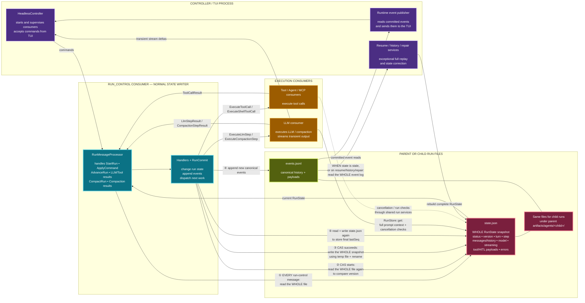
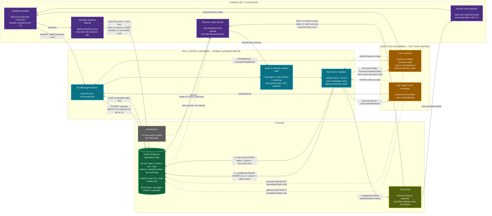

# Run state storage: current files → database

## 1. Current — who reads and writes `state.json`

```mermaid
flowchart LR
    subgraph UI["CONTROLLER / TUI PROCESS"]
        Controller["HeadlessController<br/><br/>starts and supervises consumers<br/>accepts commands from TUI"]
        Publisher["Runtime event publisher<br/><br/>reads committed events<br/>and sends them to the TUI"]
        Repair["Resume / history / repair services<br/><br/>exceptional full replay<br/>and state correction"]
    end

    subgraph RC["RUN_CONTROL CONSUMER — NORMAL STATE WRITER"]
        Processor["RunMessageProcessor<br/><br/>handles StartRun • ApplyCommand<br/>AdvanceRun • LLM/Tool results<br/>CompactRun • Compaction results"]
        Handler["Handlers + RunCommit<br/><br/>change run state<br/>append events<br/>dispatch next work"]
    end

    subgraph WORKERS["EXECUTION CONSUMERS"]
        LLM["LLM consumer<br/><br/>executes LLM / compaction<br/>streams transient output"]
        Tool["Tool / Agent / MCP consumers<br/><br/>execute tool calls"]
    end

    subgraph FILES["PARENT OR CHILD RUN FILES"]
        State["state.json<br/><br/>WHOLE RunState snapshot<br/>status • version • turn • step<br/>messages/history • model • streaming<br/>tool/HITL payloads • errors"]
        Events["events.jsonl<br/><br/>canonical history + payloads"]
        Child["Same files for child runs<br/>under parent artifacts/agents/&lt;child&gt;/"]
    end

    Controller -->|"commands"| Processor
    Processor -->|"① EVERY run-control message:<br/>read the WHOLE file"| State
    State -->|"current RunState"| Processor
    Processor --> Handler

    Handler -->|"② CAS starts:<br/>read the WHOLE file again<br/>to compare version"| State
    Handler -->|"③ CAS succeeds:<br/>write the WHOLE snapshot<br/>using temp file + rename"| State
    Handler -->|"④ append new canonical events"| Events
    Handler -->|"⑤ read + write state.json again<br/>to store final lastSeq"| State

    Handler -->|"ExecuteLlmStep / ExecuteCompactionStep"| LLM
    Handler -->|"ExecuteToolCall / ExecuteShellToolCall"| Tool
    LLM -->|"LlmStepResult / CompactionStepResult"| Processor
    Tool -->|"ToolCallResult"| Processor
    LLM -->|"transient stream deltas"| Controller

    LLM -->|"RunStore::get:<br/>full prompt context + cancellation checks"| State
    Tool -.->|"cancellation / run checks<br/>through shared run services"| State

    Events -->|"committed event reads"| Publisher
    Publisher --> Controller

    Events -->|"WHEN state is stale,<br/>or on resume/history/repair:<br/>read the WHOLE event log"| Repair
    Repair -->|"rebuild complete RunState"| State

    State --- Child
    Events --- Child

    classDef controller fill:#4b2e83,color:#fff,stroke:#c4a7ff,stroke-width:2px;
    classDef runcontrol fill:#0b7285,color:#fff,stroke:#66d9e8,stroke-width:3px;
    classDef worker fill:#9c5c00,color:#fff,stroke:#ffd166,stroke-width:2px;
    classDef state fill:#7a1f3d,color:#fff,stroke:#ff8a9b,stroke-width:3px;
    classDef events fill:#53610f,color:#fff,stroke:#d8f36a,stroke-width:3px;
    class Controller,Publisher,Repair controller;
    class Processor,Handler runcontrol;
    class LLM,Tool worker;
    class State,Child state;
    class Events events;
```

## 2. Proposed — who reads and writes database run state

```mermaid
flowchart LR
    subgraph UI["CONTROLLER / TUI PROCESS"]
        Controller["HeadlessController<br/><br/>starts and supervises consumers<br/>accepts commands from TUI"]
        Publisher["Runtime event publisher<br/><br/>reads new canonical events<br/>and sends them to the TUI"]
        Recovery["Resume / repair service<br/><br/>only component that rebuilds<br/>from full canonical history"]
        Cleanup["Controller shutdown cleanup<br/><br/>deletes temporary rows<br/>only when the session is idle"]
    end

    subgraph RC["RUN_CONTROL CONSUMER — NORMAL DATABASE WRITER"]
        Processor["RunMessageProcessor<br/><br/>receives every command/result"]
        Memory["Active in-memory working state<br/><br/>messages • model context • streaming<br/>tool inputs/results • HITL payloads"]
        Commit["RunCommit / handlers<br/><br/>validate token + version<br/>write coordination state<br/>append canonical events"]
    end

    subgraph WORKERS["EXECUTION CONSUMERS — NOT STATE WRITERS"]
        LLM["LLM consumer<br/><br/>receives complete invocation input<br/>returns LlmStepResult<br/>streams transient output"]
        Tool["Tool / Agent / MCP consumers<br/><br/>receive tool invocation<br/>return ToolCallResult"]
    end

    subgraph STORAGE["STORAGE"]
        DB[("SQLite: temporary operational state<br/><br/>run row: status • version • turn • step<br/>attempt • operation token • last event seq<br/><br/>tool/HITL rows: IDs • order • status only<br/><br/>NO prompts, messages, history, or payloads")]
        Events["events.jsonl<br/><br/>canonical history + payloads<br/>kept after database rows are deleted"]
        Legacy["old state.json<br/><br/>no new reads or writes<br/>left untouched"]
    end

    Controller -->|"StartRun / ApplyCommand / shell"| Processor
    LLM -->|"LlmStepResult / CompactionStepResult"| Processor
    Tool -->|"ToolCallResult"| Processor

    Processor -->|"① EVERY message:<br/>SELECT one indexed row by run_id"| DB
    DB -->|"small coordination state only"| Processor
    Processor --> Memory
    Memory --> Commit

    Commit -->|"② conditional UPDATE<br/>WHERE run_id + version + token match"| DB
    Commit -->|"③ append canonical payload/history events"| Events
    Commit -->|"④ final small UPDATE:<br/>status + version + last_event_seq"| DB

    Commit -->|"ExecuteLlmStep / ExecuteCompactionStep<br/>with current invocation input"| LLM
    Commit -->|"ExecuteToolCall / ExecuteShellToolCall"| Tool
    LLM -->|"transient stream deltas"| Controller

    LLM -.->|"optional small SELECT:<br/>cancellation/status only"| DB
    Tool -.->|"optional small SELECT:<br/>cancellation/status only"| DB
    LLM -.->|"NEVER writes run state"| Commit
    Tool -.->|"NEVER writes run state"| Commit

    Events -->|"new committed events"| Publisher
    Publisher --> Controller

    Events -->|"ONLY on explicit resume,<br/>repair, or crash recovery:<br/>read full history once"| Recovery
    Recovery -->|"rebuild active memory"| Memory
    Recovery -->|"create or correct small rows"| DB

    Controller -->|"shutdown"| Cleanup
    Cleanup -->|"DELETE parent + child rows<br/>when no queued, in-flight,<br/>pending, or recoverable work"| DB
    DB -.->|"later resume: row missing"| Recovery
    Legacy -.->|"ignored"| Recovery

    classDef controller fill:#4b2e83,color:#fff,stroke:#c4a7ff,stroke-width:2px;
    classDef runcontrol fill:#0b7285,color:#fff,stroke:#66d9e8,stroke-width:3px;
    classDef worker fill:#9c5c00,color:#fff,stroke:#ffd166,stroke-width:2px;
    classDef database fill:#12613a,color:#fff,stroke:#69db9b,stroke-width:3px;
    classDef events fill:#53610f,color:#fff,stroke:#d8f36a,stroke-width:3px;
    classDef legacy fill:#5c5c5c,color:#fff,stroke:#bdbdbd,stroke-width:2px;
    class Controller,Publisher,Recovery,Cleanup controller;
    class Processor,Memory,Commit runcontrol;
    class LLM,Tool worker;
    class DB database;
    class Events events;
    class Legacy legacy;
```
