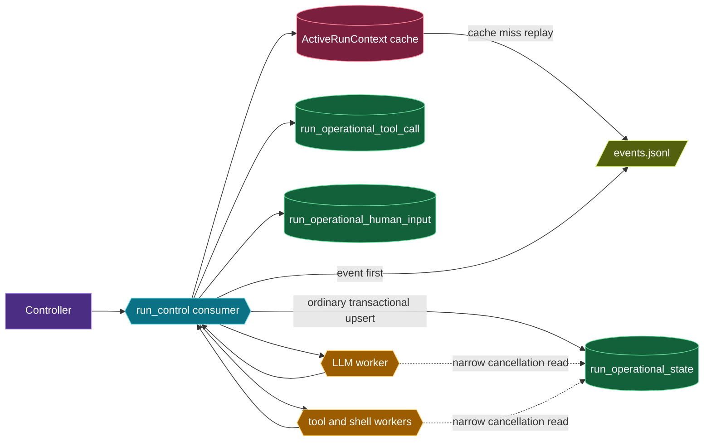
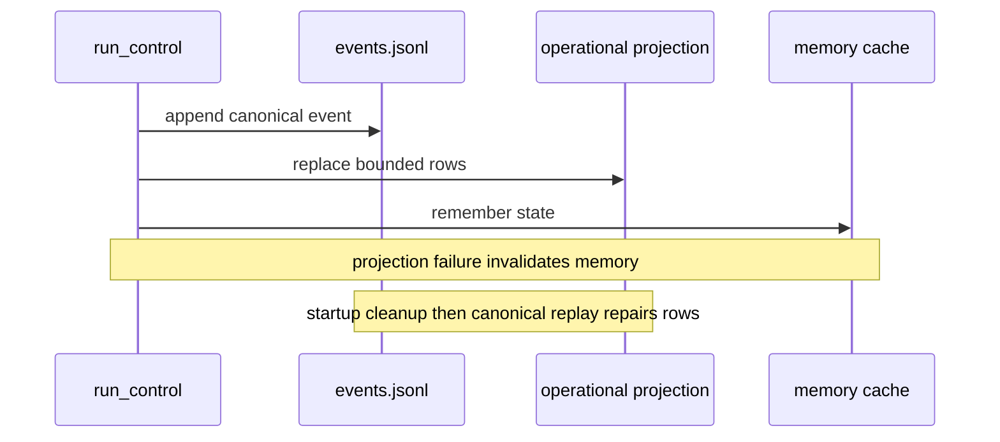
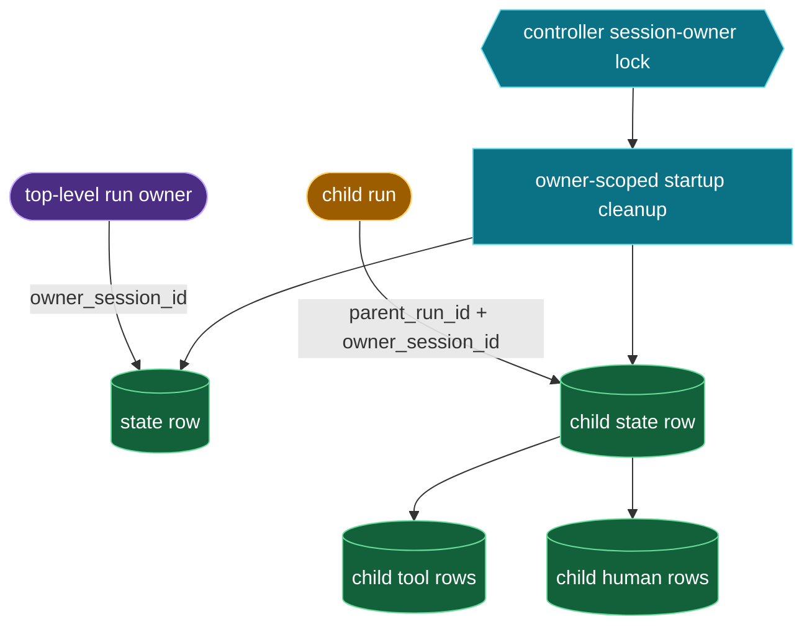

# Run operational state







```sql
CREATE TABLE run_operational_state (
    run_id VARCHAR(255) NOT NULL PRIMARY KEY,
    parent_run_id VARCHAR(255) DEFAULT NULL,
    owner_session_id VARCHAR(255) NOT NULL,
    status VARCHAR(32) NOT NULL,
    turn_no INTEGER NOT NULL,
    active_step_id VARCHAR(255) DEFAULT NULL,
    operation_turn_no INTEGER DEFAULT NULL,
    operation_step_id VARCHAR(255) DEFAULT NULL,
    operation_attempt INTEGER DEFAULT NULL,
    operation_key VARCHAR(255) DEFAULT NULL,
    last_applied_advance_key VARCHAR(255) DEFAULT NULL,
    last_applied_compaction_key VARCHAR(255) DEFAULT NULL,
    retryable_failure BOOLEAN NOT NULL,
    retry_attempts INTEGER NOT NULL,
    last_event_sequence INTEGER NOT NULL,
    transition_version INTEGER NOT NULL,
    created_at DATETIME NOT NULL,
    updated_at DATETIME NOT NULL
);
CREATE INDEX idx_run_operational_state_owner ON run_operational_state (owner_session_id);
CREATE INDEX idx_run_operational_state_status ON run_operational_state (status);

CREATE TABLE run_operational_tool_call (
    run_id VARCHAR(255) NOT NULL,
    batch_id VARCHAR(255) NOT NULL,
    tool_call_id VARCHAR(255) NOT NULL,
    order_index INTEGER NOT NULL,
    status VARCHAR(32) NOT NULL,
    attempt INTEGER NOT NULL,
    created_at DATETIME NOT NULL,
    updated_at DATETIME NOT NULL,
    PRIMARY KEY (run_id, batch_id, tool_call_id),
    FOREIGN KEY (run_id) REFERENCES run_operational_state (run_id) ON DELETE CASCADE
);
CREATE INDEX idx_run_operational_tool_current ON run_operational_tool_call (run_id, batch_id, status, order_index);

CREATE TABLE run_operational_human_input (
    run_id VARCHAR(255) NOT NULL,
    question_id VARCHAR(255) NOT NULL,
    order_index INTEGER NOT NULL,
    continuation_kind VARCHAR(32) NOT NULL,
    tool_call_id VARCHAR(255) DEFAULT NULL,
    status VARCHAR(32) NOT NULL,
    created_at DATETIME NOT NULL,
    updated_at DATETIME NOT NULL,
    PRIMARY KEY (run_id, question_id),
    FOREIGN KEY (run_id) REFERENCES run_operational_state (run_id) ON DELETE CASCADE
);
CREATE INDEX idx_run_operational_human_current ON run_operational_human_input (run_id, status, order_index);
```
