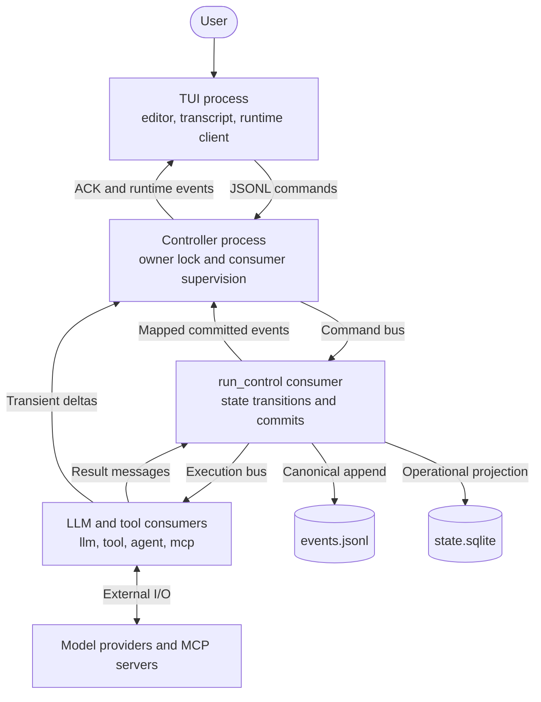
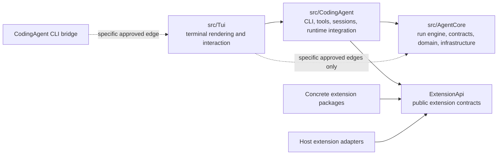

# Hatfield architecture

The default interactive path crosses process boundaries. Commands go in, workers
execute effects, and runtime events return to the terminal. The response does not
return through one synchronous call stack.

These repository-only diagrams describe the source at `9f744008c`, with documentation
corrections on this task branch. View them in a Markdown renderer with Mermaid support.

## Diagram map

| Question | Diagrams |
|---|---|
| How does a prompt become an answer? | [Request lifecycle](request-lifecycle.md): end-to-end sequence, input routing, tool loop, live projection |
| What starts and stops each process? | [Processes and queues](processes-and-queues.md): startup, ownership, routing, scheduler, shutdown |
| Who owns state and how does recovery work? | [State and recovery](state-and-recovery.md): commit order, storage, replay, repair, compaction, cancellation |
| How do tool calls, approvals, and MCP work? | [Tools and MCP](tools-and-mcp.md): registration, execution, human continuations, connection lifecycle |
| How do extensions and child agents run? | [Extensions and agents](extensions-and-agents.md): loading, child supervision, jobs, background commands |
| How does bash become background work? | [Backgrounding](backgrounding.md): user decision, process ownership, completion notification, stop, cleanup |
| What reaches the model and the screen? | [Context and projection](context-and-projection.md): prompt composition, provider request, streaming, TUI sessions |
| What goes into a release? | [Build and observability](build-and-observability.md): packaging, QA lanes, logging |
| Where do logs, traces, and metrics go? | [Logging](logging.md): record enrichment, Fiber scopes, rotation, Datadog ingestion, privacy, sink failures |

## Process topology

This map keeps only process boundaries. The linked sequences expand handlers and
messages within each boundary. Parent and child runs have separate identities but
share the controller's consumer pools.

The queue arrows summarize delivery. They are not direct calls between worker
processes. [Processes and queues](processes-and-queues.md) shows both buses and the
complete YAML route inventory, including scheduler and extension-agent consumers.
Extension jobs have their own dispatch path.

## Code boundaries

[depfile.yaml](../depfile.yaml) and `castor deptrac` define exact edges. This is not
a blanket ban on every dependency omitted from the diagram. AgentCore does not
reference CodingAgent or TUI. ExtensionApi does not reference host internals.

## Event legend

| Channel | Sequence | Durable? | Use |
|---|---|---|---|
| Canonical `RunEvent` | Positive | `events.jsonl` | History, replay, committed lifecycle |
| Mapped runtime event | Preserves canonical identity where applicable | Delivery of committed data | TUI projection |
| Streaming delta | `0` | No | Live text, reasoning, tool arguments |
| Messenger envelope | Not an event sequence | Doctrine transports in controller mode | Commands, execution, results, delayed work |

Sources: [Messenger configuration](../config/packages/messenger.yaml),
[HeadlessController](../src/CodingAgent/Runtime/Controller/HeadlessController.php),
[RunCommit](../src/AgentCore/Application/Pipeline/RunCommit.php),
[session runtime internals](../docs/session-runtime-internals.md).

The [documentation audit inventory](documentation-audit.md) records the earlier
Markdown pass and explicitly marks unfinished instruction-audit work.
