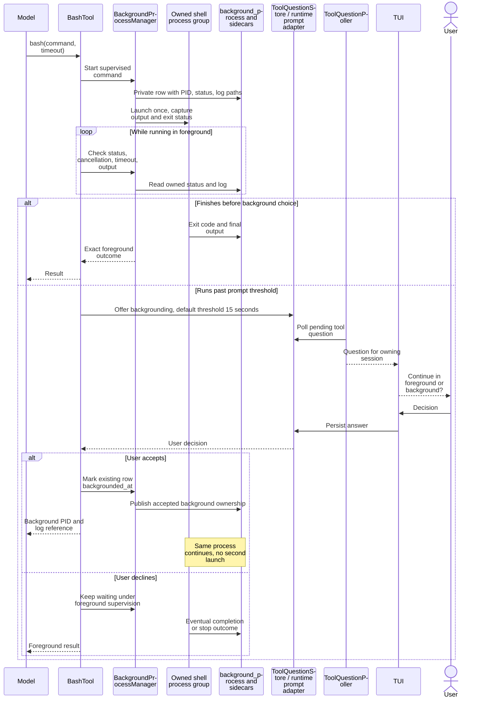
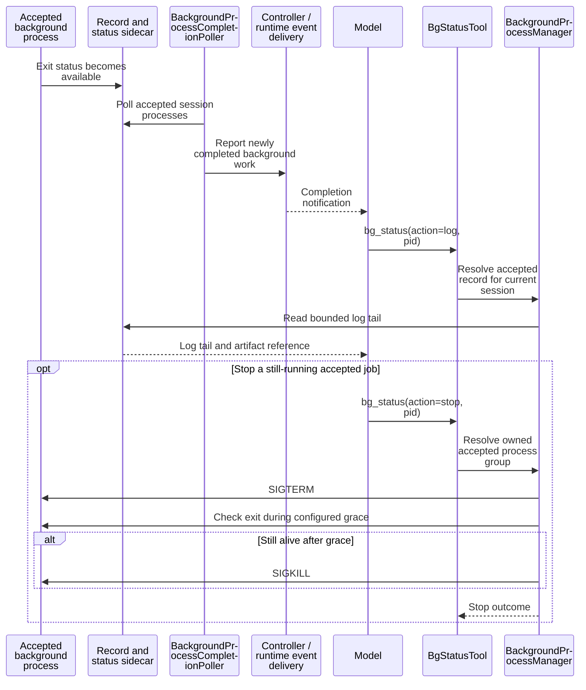
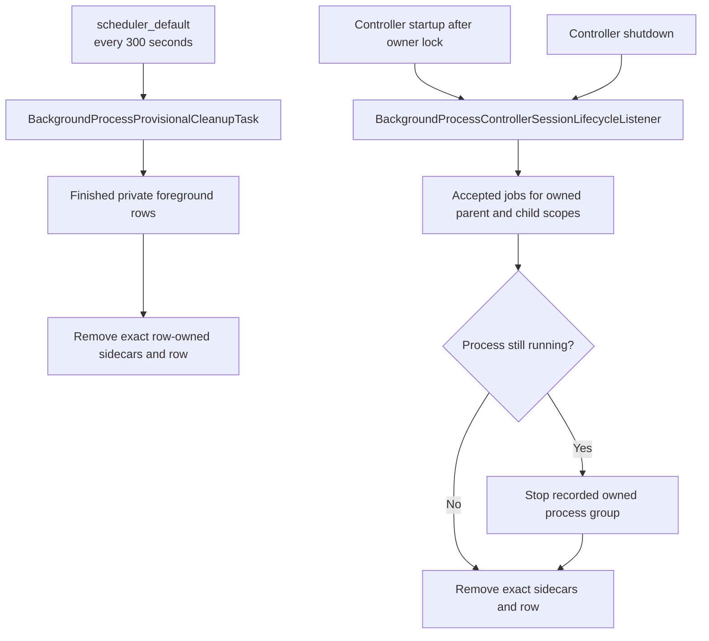

# Background command architecture

[Architecture map](README.md) · [Processes](processes-and-queues.md) · [Tools](tools-and-mcp.md)

Backgrounding changes ownership of an already running bash command. It does not
launch a second copy. Private foreground supervision and accepted background work
share record infrastructure but have different visibility and cleanup rules.

## Foreground command becomes background work

There is no `bg_start` tool or model-set background flag. The user controls the
transition. Foreground timeout/cancellation remains separate from `bg_status`.

## Record state and visibility

```mermaid
stateDiagram-v2
    [*] --> PrivateRunning: bash launches command
    PrivateRunning --> PrivateFinished: foreground process exits
    PrivateRunning --> AcceptedRunning: user accepts backgrounding
    PrivateRunning --> PrivateFinished: foreground timeout or cancellation stops process
    PrivateFinished --> Removed: provisional scheduler cleanup
    AcceptedRunning --> AcceptedFinished: process exits; completion can be notified
    AcceptedRunning --> AcceptedFinished: bg_status stop
    AcceptedRunning --> Removed: controller lifecycle stop and cleanup
    AcceptedFinished --> Removed: controller startup or shutdown cleanup
    Removed --> [*]
    note right of PrivateRunning
        Not listed by bg_status
        Private foreground owner
    end note
    note right of AcceptedRunning
        backgrounded_at is set
        Visible to owning session
    end note
```

## Completion notification and explicit stop

`bg_status` cannot list, read, or stop a private foreground row. A PID alone does not
grant authority over an arbitrary host process.

## Two cleanup owners

Startup cleans leftovers after abrupt controller loss. Shutdown cleans current
accepted jobs. Background work may outlive an LLM turn, but it is not a service
promised to survive session-controller shutdown. Never clean unrelated or root-owned
processes, and never signal active workers tagged with `HATFIELD_SESSION_ID`.

Sources: [background process behavior](../docs/background-processes.md),
[BashTool](../src/CodingAgent/Tool/BashTool.php),
[BackgroundProcessManager](../src/CodingAgent/Tool/BackgroundProcessManager.php),
[completion poller](../src/CodingAgent/Runtime/Controller/BackgroundProcessCompletionPoller.php),
[lifecycle listener](../src/CodingAgent/Runtime/Controller/BackgroundProcessControllerSessionLifecycleListener.php).
