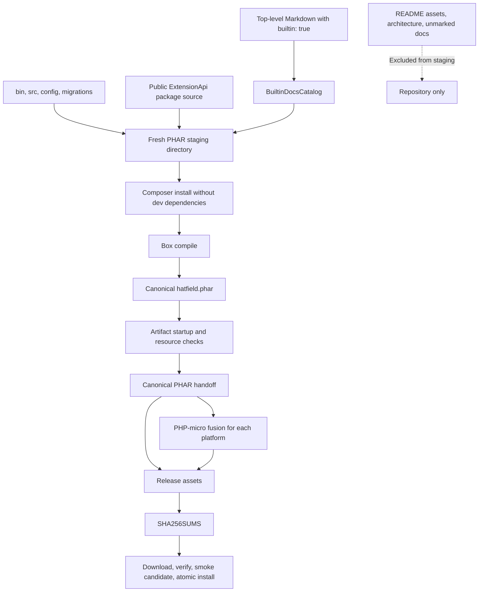
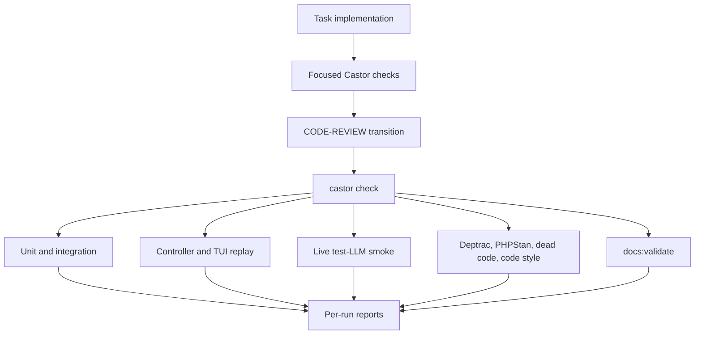
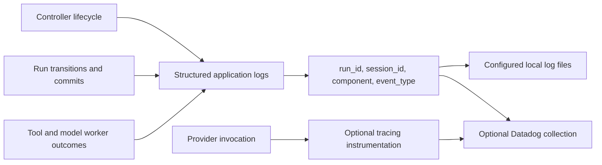

# Build and observability

[Architecture map](README.md)

## One canonical PHAR, several release assets

The GIF and VHS tape under `docs/assets/` are not catalog-selected Markdown.
Native builds reuse the PHAR rather than introducing a second documentation catalog.

## QA ownership

The testing skill and `tests/AGENTS.md` own exact prerequisites and budgets. Docs
validation checks the selected catalog and package-safe links; it is not proof that
Mermaid diagrams render or that architectural claims match source.

## Correlated logs, not transcript dumps

Do not log raw prompts, tool output, credentials, or entire sessions by default.
Operational logs help correlate a failure; `events.jsonl` remains conversation
history, not an observability export.

Sources: [distribution](../docs/distribution.md), [PHAR packaging](../docs/phar-packaging.md),
[Datadog development setup](../docs/datadog.md), [testing procedure](../.agents/skills/testing/SKILL.md).
