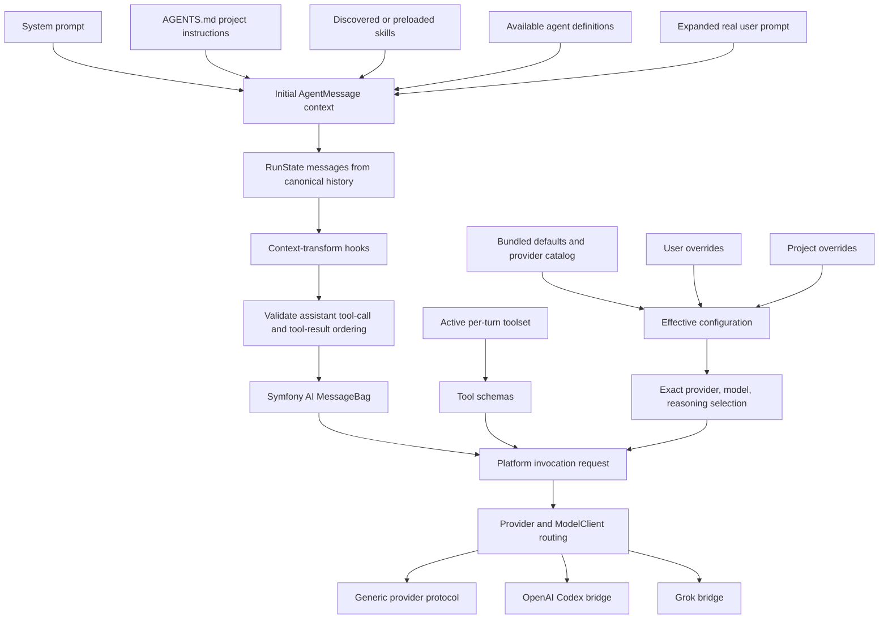
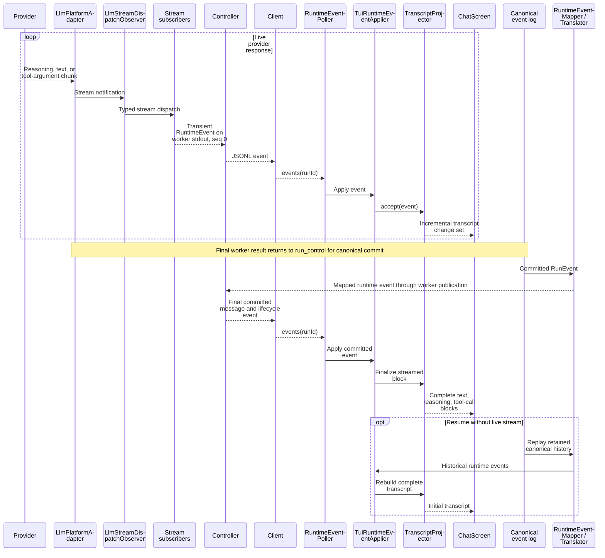
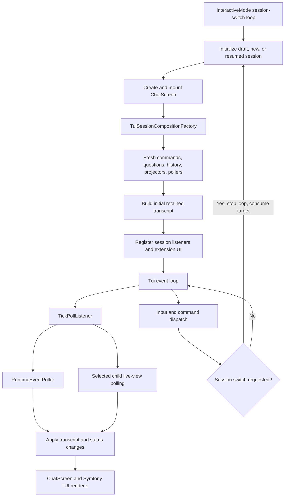

# Context, providers, and TUI projection

[Architecture map](README.md) · [Request lifecycle](request-lifecycle.md)

## Model context construction

Configuration does not automatically enable providers. `providers:setup` is manual.
Catalog refresh updates known metadata; it does not silently add arbitrary upstream
models. Context transforms and compaction are distinct operations.

## Live deltas and canonical finalization

`RuntimeEventTranslator` consumes `RunEvent`, not `RunState`. A `run.completed` event
clears activity without adding an extra conversational answer. Sequence-0 deltas do
not become the resume source.

## Per-session TUI composition

The screen owns widgets and focus, not the whole application service graph. Parent
and child polling have different recovery and ownership rules; they are not merely
two names for one interchangeable loop.

Sources: [InteractiveMode](../src/Tui/Application/InteractiveMode.php),
[LlmPlatformAdapter](../src/AgentCore/Infrastructure/SymfonyAi/LlmPlatformAdapter.php),
[RuntimeEventMapper](../src/CodingAgent/Runtime/Protocol/RuntimeEventMapper.php),
[TUI reference](../docs/tui-architecture.md), [provider catalog](../docs/ai-catalog.md).
