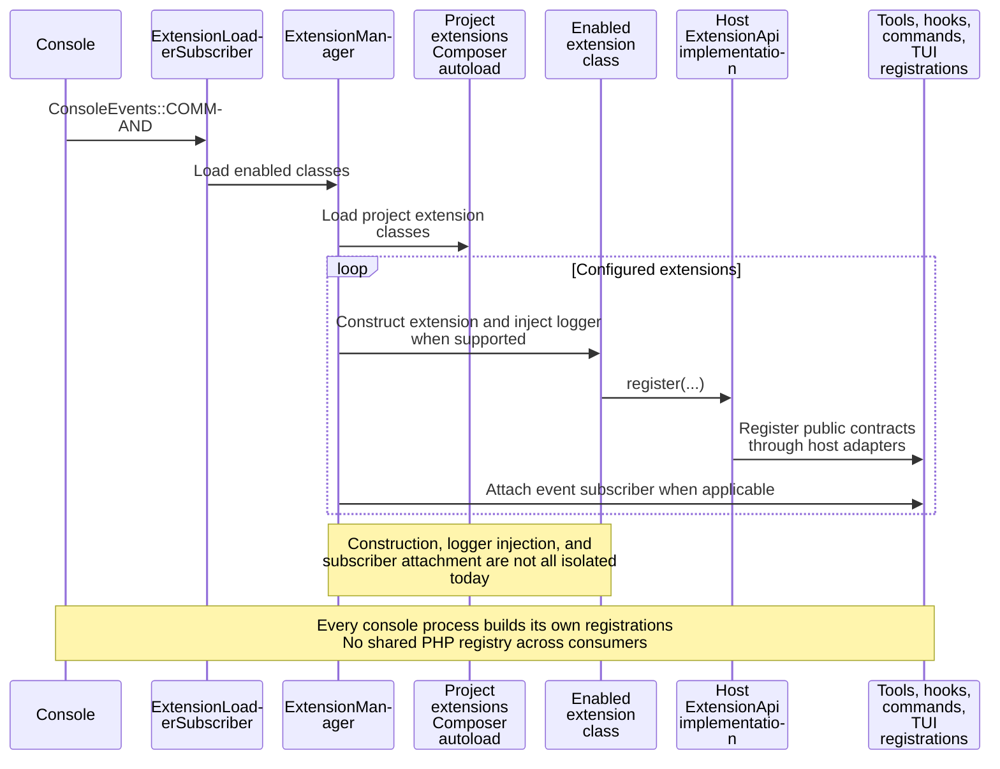
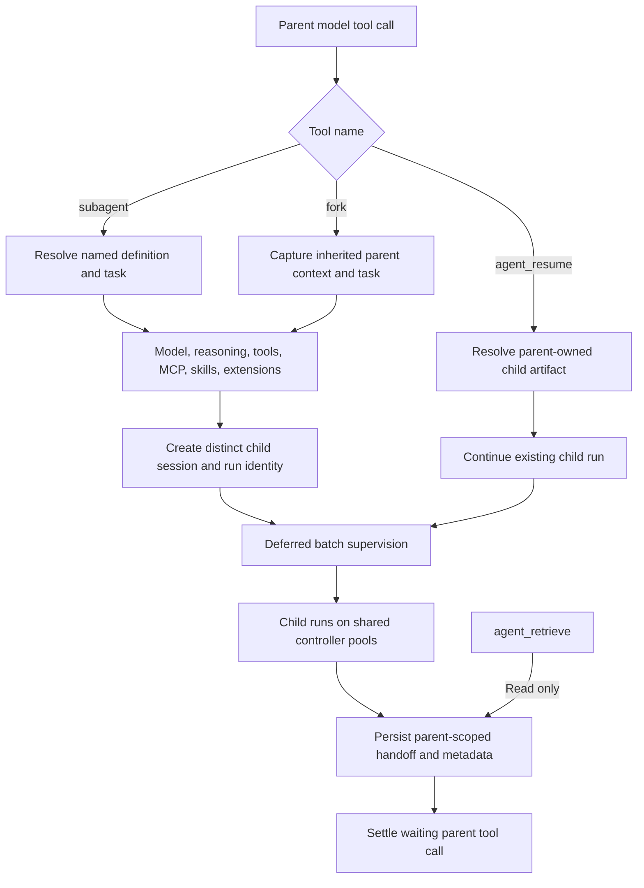
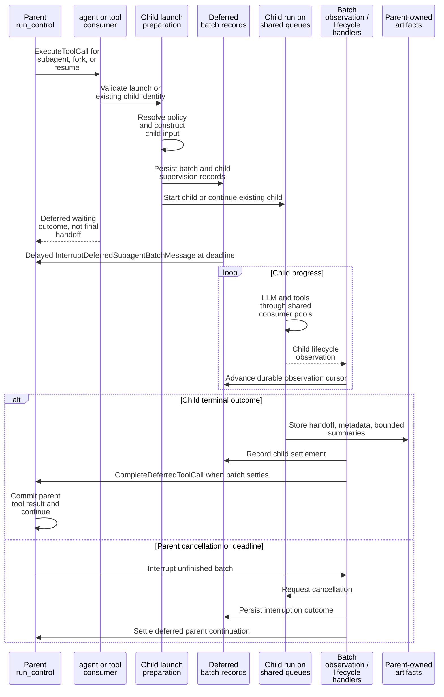
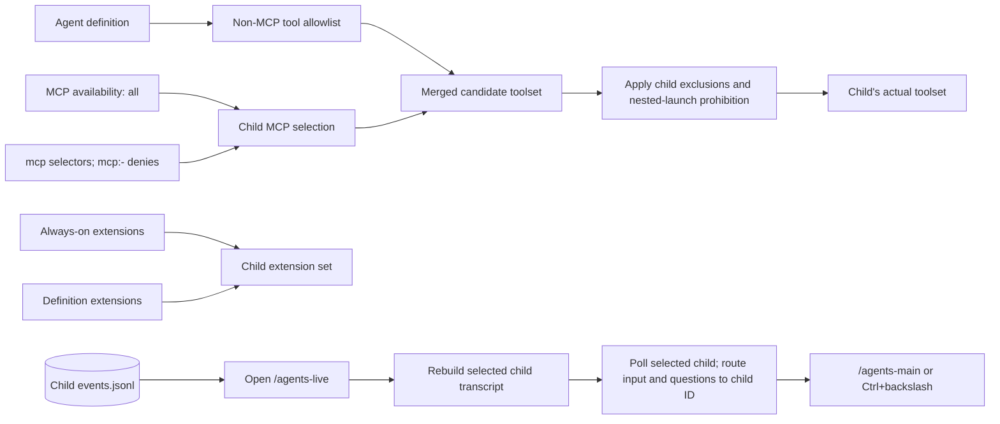
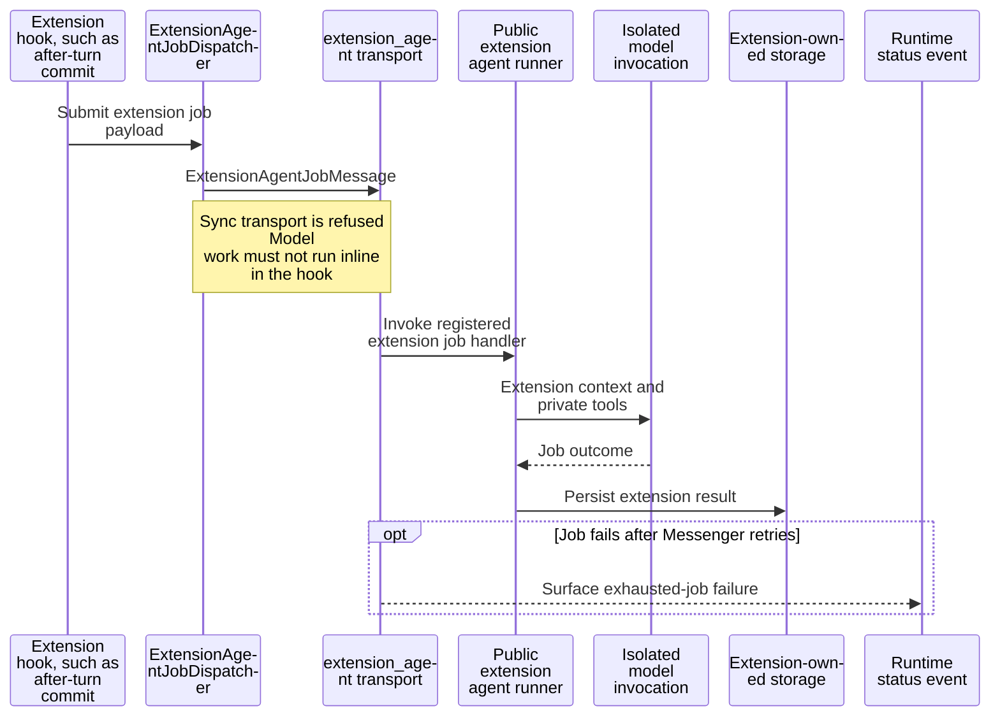

# Extensions and child agents

[Architecture map](README.md) · [Tools](tools-and-mcp.md) · [Background commands](backgrounding.md)

## Extension registration is process-local

Public ExtensionApi remains independent of AgentCore, CodingAgent, and in-repo TUI
classes. Packages use public contracts. The host owns adapters and runtime execution.
A throwing extension constructor can abort startup; the diagrams do not imply
transactional registration or rollback of partially registered extensions.

## Subagent, resume, and fork entry points

| Property | Named subagent | Fork | Resume |
|---|---|---|---|
| Starting context | Agent definition, task, configured project context | Parent conversation context plus task | Existing child's retained context plus follow-up |
| Transport for launch tool | `agent` | Default `tool` | `agent` |
| Identity | New child | New child | Existing child |
| Role configuration | Named definition | Fork configuration and explicit allowed overrides | Existing child configuration |
| Completion | Deferred handoff | Deferred handoff | New handoff for continued child |

A fork is not a Git branch or worktree operation. Filesystem isolation must be chosen
by the implementation owner. Separate child identities alone do not prevent concurrent
writers from editing the same checkout.

## Durable supervision, not one controller per child

Recovery uses durable child event cursors and reads the unseen event-log suffix.
Sequence allocation can leave holes, so `sequence.cursor` is not proof of a committed
event tail. Parallel batches wait for their required child outcomes; an initial
accepted launch is not a completed child turn.

## Child tool policy and live views

Optional parent extensions do not automatically propagate. Child answers must target
the child run, never whichever parent question happens to be latest. Artifacts cannot
be retrieved or resumed from an unrelated parent session.

## Extension agent jobs are a separate pipeline

Observational memory owns its observer and reflector data inside its package. Its
jobs are not named subagents, and their results do not universally return as
`ToolCallResult` to the parent conversation.

Sources: [agents](../docs/agents.md), [agent settings](../docs/settings-agents.md),
[ExtensionManager](../src/CodingAgent/Extension/ExtensionManager.php),
[public Extension API](../.hatfield/extensions/extension-api/docs/extension-api.md),
[Messenger configuration](../config/packages/messenger.yaml).
