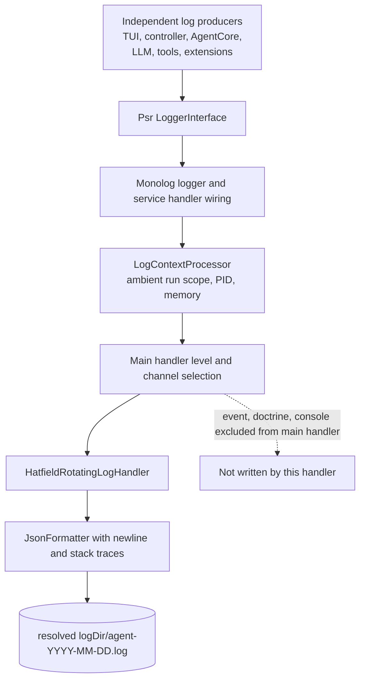
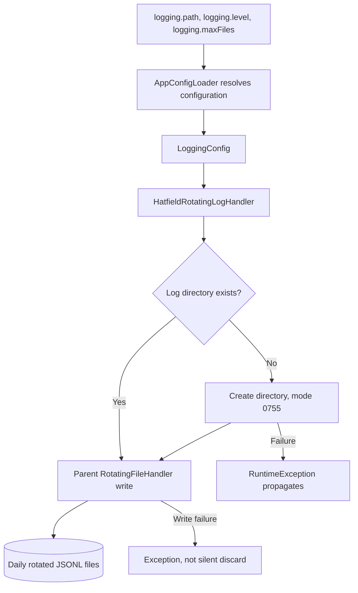
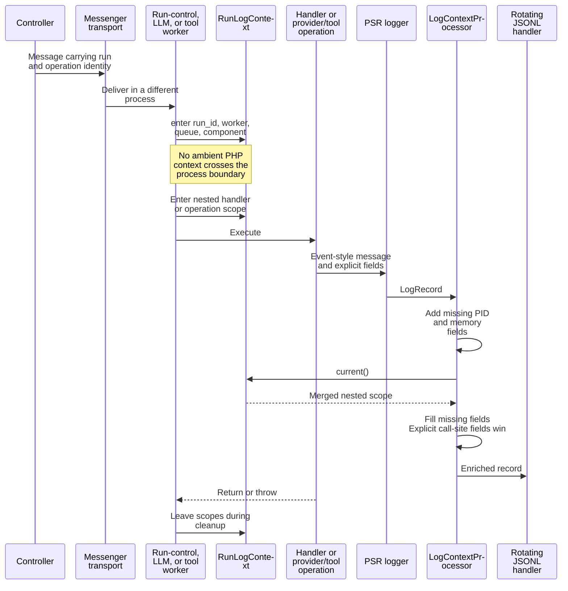
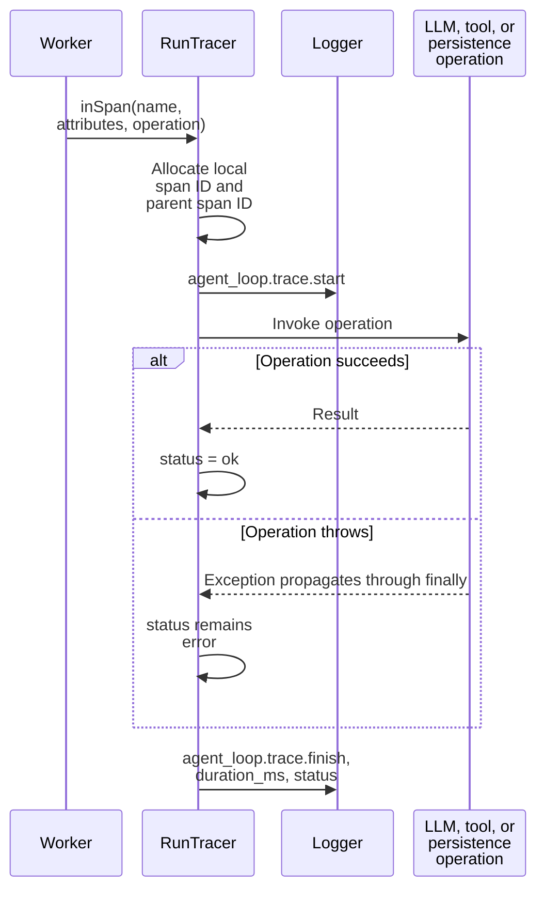
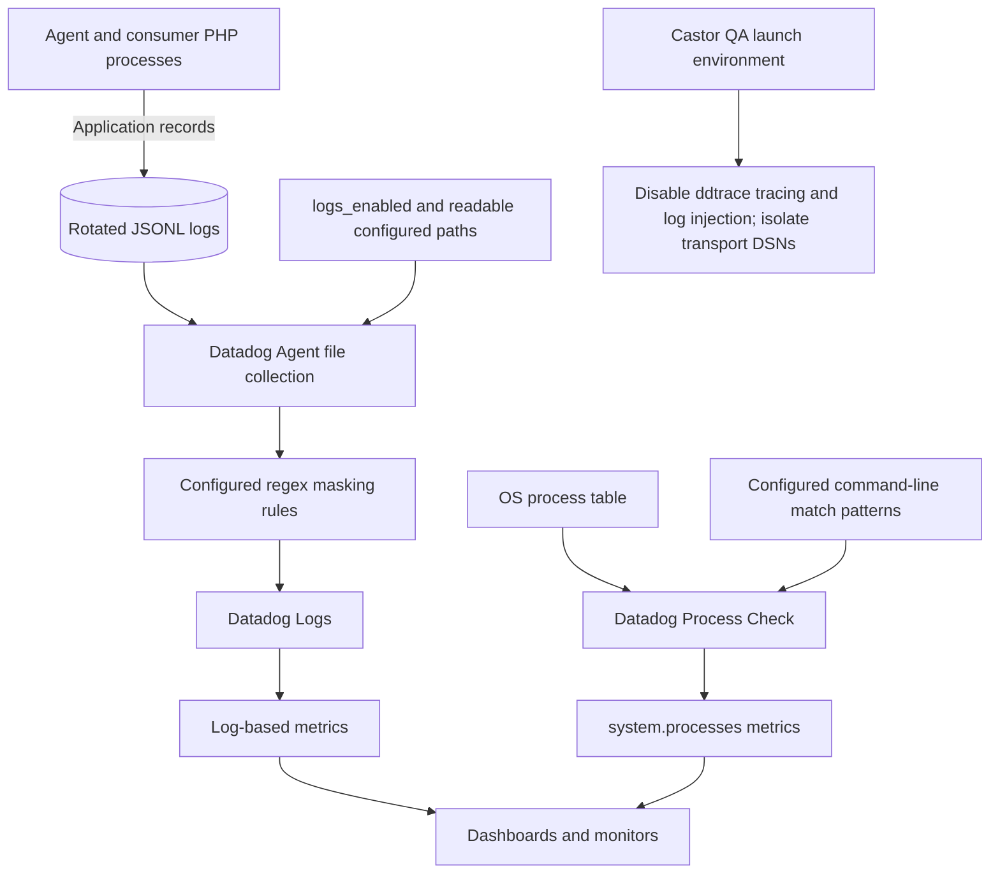
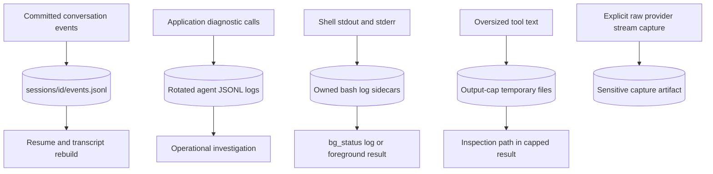

# Logs, tracing, and process metrics

[Architecture map](README.md) · [Processes](processes-and-queues.md)

Logs explain execution. Canonical session events reconstruct conversation state.
Bash output, provider capture, application logs, and Datadog-collected telemetry are
separate streams with different retention and privacy rules.

## Application log pipeline

The processor enriches records; it is not a secret scrubber. Main-handler exclusions
are channel names, not guarantees that all database or console-related information
is absent from every application log message.

## Directory, format, and retention

| Property | Current behavior |
|---|---|
| Application directory | Resolved `logging.path`, normally project `.hatfield/logs` |
| File basename | Handler starts from `agent.log`; Monolog adds the rotation date |
| Format | One JSON object per line, stack traces included |
| Default minimum level | `info` in `LoggingConfig` |
| Default retained file count | 14 in `LoggingConfig` |
| Creation permissions | Directory `0755`, log file `0644`, subject to process umask |
| File locking | Handler explicitly sets `useLocking: false` |
| Sink failure | Can propagate; this is not a best-effort discard handler |

Symfony kernel log-directory resolution through `HATFIELD_LOG_DIR` is a separate
path from the custom handler's injected `LoggingConfig`. Do not assume that setting
one automatically retargets every log or capture file. Check the owning writer.

## Correlation belongs to each execution scope

`RunLogContext` maintains a nested stack per Fiber through a `WeakMap`, with a
separate stack for non-Fiber code. Reusing a worker process does not justify leaving
a previous run's context active.

| Field | Where it comes from |
|---|---|
| `run_id`, `session_id` | Call-site or ambient worker scope; workers set session identity explicitly |
| `component`, `handler`, `worker`, `message_type`, `tool_name` | The operation that enters scope or writes the record |
| `event_type` | Explicit event fields override broader ambient values |
| `pid`, `memory_usage`, `memory_allocated` | Processor defaults when absent |
| `queue` | Scope label; some call sites record a bus name, not a transport name |

Do not equate `queue=agent.execution.bus` with a physical queue or infer process
ownership from that field alone. Correlate worker, PID, run, and message identity.

## Trace logs

Span IDs are log-local identifiers (`span-1`, `span-2`) used to correlate start and
finish records, including `parent_span_id` nesting. They are not external trace IDs.
Log-derived metrics filter on `message:agent_loop.trace.finish` and the canonical span
name; see [Datadog setup](../docs/datadog.md). This sequence assumes logging succeeds;
a failed log write can itself interrupt execution.

## Extension-free Datadog inputs

The application never talks to Datadog. It writes JSONL logs; the Agent collects the
files it is configured to read. File collection requires a separately configured
Datadog Agent: installing the application does not ship log files. Process metrics
come from the Agent's Process Check, not from Monolog or `RunTracer`. Log-based
metrics are defined in Datadog and derived from the same collected logs.

APM spans, `trace.*` metrics, profiling, and `dd.trace_id` log fields are
intentionally absent since the ddtrace extension was retired; see
[Datadog setup](../docs/datadog.md).

The supplied Agent configuration uses example checkout paths and collects the main
checkout plus worktrees. Custom log paths need matching collector configuration.
`castor datadog:smoke-log` writes the project's default `.hatfield/logs` path, not
every possible configured sink.

## Do not confuse these artifacts

## Privacy and failure boundaries

- Call sites must avoid raw prompts, tool output, credentials, and full session data.
  The application processor and handler do not enforce universal payload redaction.
- JSON exception formatting includes stack traces. Exception messages and extension
  log calls can still expose sensitive values.
- Datadog regex masking happens after local file creation. It covers known patterns,
  not arbitrary private data, and cannot sanitize an already-written local file.
- Explicit raw provider capture can contain generated text and tool arguments.
  Treat it as sensitive debugging output rather than ordinary operational logging.
- A committed effect-dispatch failure is logged without rolling back canonical events.
  Tool failure may become a model-visible tool result. These are different from a
  logging sink failure, which can propagate.

## Owning source

- [Monolog wiring](../config/packages/monolog.yaml)
- [Handler](../src/CodingAgent/Logging/HatfieldRotatingLogHandler.php)
- [Processor](../src/CodingAgent/Logging/LogContextProcessor.php)
- [Ambient context](../src/AgentCore/Infrastructure/RunLogContext.php)
- [LoggingConfig](../src/CodingAgent/Config/LoggingConfig.php)
- [RunTracer](../src/AgentCore/Application/Handler/RunTracer.php)
- [Castor launch environment](../.castor/env.php)
- [Datadog log collection](../ops/datadog/hatfield.d/conf.yaml)
- [Datadog process metrics](../ops/datadog/process.d/conf.yaml)
- [Datadog setup procedure](../docs/datadog.md)
