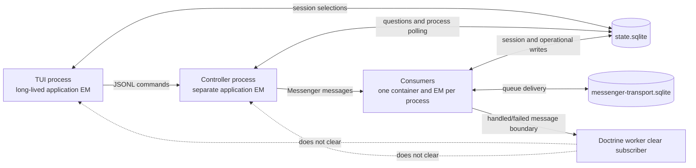

# ORM freshness and database operation map

[Architecture map](README.md) · [State and recovery](state-and-recovery.md)

## Scope and evidence

This audit explains where long-lived processes can observe stale database state and where clearing managed entities could lose work. It is an assessment, not an implemented freshness policy.

- Audited on 2026-09-16 with three read-only scouts covering session/model selection, operational stores, and process lifetimes. Main verified the findings and corrected claims about transaction middleware and extension connection lifetime.
- Baseline: `main` at `4f04978f0986d29f664b5b52d6f1d2c1eb2d0368`. Main advanced from `95934121e` during investigation. The intervening history-conversion merge did not change the store/reset boundaries described here.
- Comparison: footer task branch at `5830ecb5b`. Its additions are labeled separately below. They are not baseline behavior.
- Evidence is source inspection, including installed Doctrine ORM 3.6.8 and Symfony/DoctrineBundle wiring. No live reproduction, query-count benchmark, or compiled-container inspection was performed for this map.
- Source links name files; method names and selected line anchors locate the audited operation. Lines can move after the recorded revision.

Coverage includes the mapped application entities, their owning repositories/stores, the TUI/controller/worker lifetime differences, and relevant non-ORM persistence. It is not an exhaustive call graph of every inherited repository method or third-party extension. Risks below are possible executions supported by source, not claims that each occurred in session 48.

## The freshness layers are different

| Layer | What can remain stale | What changes its lifetime |
|---|---|---|
| TUI/application state | Footer scalars, pending draft request, AppConfig catalog, picker arrays | Explicit state updates or reconstruction. An EM refresh does not update these copies. |
| Doctrine identity map | Entity fields and loaded associations, plus original values used for dirty checking | Targeted refresh, detach/reload, or clear/reset of the owning manager. |
| Database transaction | The database view visible to a transaction | Transaction completion. Refresh still reads through the current connection and transaction. |
| Direct DBAL/cache/file state | Query results, cache items, event projections, sidecar values | The owning query/cache/projection policy, not ORM clear. |

`EntityManager::find()` can return an identity-map entity without SQL. A repository query can execute SQL yet reuse an already-managed entity without replacing its fields. Converting that entity to a DTO afterwards does not make it fresh.

`refresh($entity)` is supported, not deprecated in the installed ORM. It replaces managed state and can discard unflushed changes. `clear()` detaches **all** entities managed by that EM, not just the repository's entity class. Closing a DBAL connection does not itself clear managed objects. Replacing an EM also requires attention to references retained by services and callers.

Vendor evidence: `vendor/doctrine/orm/src/EntityManager.php`, methods `find`, `clear`, `refresh`; `vendor/doctrine/orm/src/UnitOfWork.php`, methods `computeChangeSet`, `createEntity`, `refresh`; `vendor/doctrine/doctrine-bundle/src/Registry.php`, methods `reset`, `resetOrClearManager`. These vendor paths are local inspection references, not packaged documentation dependencies.

## Process and transaction boundaries

| Process or boundary | Observed lifetime/reset behavior | Consequence |
|---|---|---|
| TUI loop and session switch | `InteractiveMode` rebuilds session UI objects inside one process. `TuiTickDispatcher` runs callbacks; `RuntimeEventPoller` consumes protocol events. These are not general EM reset boundaries. | Session changes can leave managed entities in the same application EM. Footer/request scalars have their own lifetime. |
| Controller commands and polling | `HeadlessController` dispatches command events and owns consumer processes. Pollers execute in the controller's long-lived container. | A consumer clear cannot refresh controller entities. Some pollers clear the controller EM through their stores. |
| Messenger consumers | DoctrineBundle loads its Messenger service definitions when DBAL and Messenger are present. The tagged `DoctrineClearEntityManagerWorkerSubscriber` clears registered managers after handled/failed messages. Symfony service reset also has a between-message lifecycle. | Source wiring supports bounded worker entity lifetime between messages. It does not guarantee fresh reads during a single long-running message. Final compiled wiring was not inspected. |
| Failed `run_control` message | `RunControlDoctrineFailureResetSubscriber` closes the default connection and resets the default manager on failed messages, including retryable failures, before terminal-failure handling. | Failure recovery only. This is not evidence of connection recreation after every successful message. |
| Message transaction | Neither configured bus lists `doctrine_transaction`, `doctrine_close_connection`, or `doctrine_ping_connection` middleware. Vendor service definitions alone do not enable them. | No message-wide transaction is established by the audited bus configuration. Repository transaction scopes and flushes must be examined individually. |
| SQLite transaction start | `SqliteImmediateTransactionMiddleware` is wired to the application and transport connections. | Existing transaction starts use the project's SQLite policy. The middleware does not create an outer transaction around every read or message. |

Sources: [Doctrine connections/managers](../config/packages/doctrine.yaml), [Messenger buses](../config/packages/messenger.yaml), [service wiring](../config/services.yaml), [InteractiveMode](../src/Tui/Application/InteractiveMode.php), [TuiTickDispatcher](../src/Tui/Runtime/TuiTickDispatcher.php), [RuntimeEventPoller](../src/Tui/Runtime/RuntimeEventPoller.php), [HeadlessController](../src/CodingAgent/Runtime/Controller/HeadlessController.php), [failure reset subscriber](../src/CodingAgent/Runtime/Messenger/RunControlDoctrineFailureResetSubscriber.php).

The default EM maps application entities in `state.sqlite`. The `messenger_transport` connection uses a separate SQLite file, and its ORM manager has no entity mappings. Queue delivery is not an application identity-map read.

## Session and model operation map

The existing selection service already centralizes settings/database writes. It does not centralize the pending draft request or all UI updates.

| Operation and source | Query/hydration and state retained | Processes and writers | Commit/freshness assessment |
|---|---|---|---|
| `HatfieldSessionStore::findSession`, `exists`, private `fetchEntityOrNull` | EM `find(HatfieldSession, id)`. Returns the managed entity; baseline has no refresh. | TUI, runtime start, worker model resolution, session services. TUI and runtime can both write metadata. | Mutable selection requires fresh state at the decision boundary. Missing/invalid IDs return no entity. Cached presence can outlive external deletion. |
| `HatfieldSessionStore::updateMetadata` | Fetches entity, assigns supplied fields, flushes. Missing row is a silent no-op. | Selection service, runtime start, submit prompt updates, rename and other metadata callers. | No explicit outer transaction here. Local `$dirty` only causes `flush()`; Doctrine still decides which columns changed against its snapshot. |
| `claimReasoningBaseline`, `resetReasoningBaseline` | Managed session read/update and flush. | Per-turn model resolver and runtime session lifecycle. | Needs a current baseline/model epoch. Refresh is not an atomic compare-and-set against competing writers. |
| `HatfieldSessionStore::listSessions` and `HatfieldSessionRepository::findForCatalog` | Repository object hydration followed by array construction. EM still retains entities even though the caller receives arrays. | TUI session picker, catalog callers; other processes can rename/create/update sessions. | SQL execution gives current result membership under the transaction, but does not guarantee fresh fields of already-managed entities. Point-lookup refresh does not cover this path. |
| Session creation/deletion | Persist/flush on create; managed lookup/removal on delete, alongside session filesystem work. | Entry points allocate rows; session management removes them. | Entity references must not be cleared between mutation and flush. DB and filesystem effects are not one database transaction. |
| `ModelSelectionService::persistModel`, `persistReasoning` | Writes user settings, then `updateMetadata`. `changeModel` also clamps reasoning and replaces in-process AppConfig/catalog. | TUI picker, slash command, Ctrl+P and Shift+Tab. | YAML and DB writes are sequential, not atomic together. For a draft, there is deliberately no row to update. |
| `ModelResolver::resolveInitialModel`, `resolveInitialReasoning` | Reads session entity then applies request/session/default/catalog rules. Consumes fields locally. | TUI selection queries and runtime resolution. | Mutable session state must be current when resolving a new turn or showing a selection. AppConfig is a separate in-process snapshot. |
| `InProcessAgentSessionClient::startWithContext` | Resolves request/session/default selection, writes effective model/reasoning, then starts the run. | In-process client or runtime process reached through the controller path. | Explicit pending request model can override a newer UI selection if the draft request was not updated. |
| `SessionAwareModelResolver::resolve` | Ordinary numeric sessions re-resolve selection from metadata. Child/explicit override paths differ. | LLM/provider execution; TUI can change the next turn's selection. | Between-message reset helps, but does not prove freshness within one message. Already-started requests retain their invocation selection. |
| `FooterStateInitializer::initialize` | Session fields, then request/default fallbacks; copies scalars into `TuiSessionState`. | TUI startup/session composition. | Not the same algorithm as availability-aware runtime resolution. Refreshing the entity alone does not update an existing footer. |
| Picker and `/model provider/model` | Call `changeModel`, then `applyModelSelection` with the requested reference. | TUI. | Display assumes successful persistence, but a no-op metadata write is not reported as failure. Pending draft request is not updated here. |
| Ctrl+P / Shift+Tab | Ctrl+P persists selection and carries model into draft request with `withModel`. Shift+Tab persists reasoning and updates display. | TUI. | Model intent handling differs from picker/slash command. Explicit draft reasoning likewise needs reconciliation with subsequent controls. |
| `SubmitListener` first submit | Allocates row and merges the retained draft request into the real prompt. | TUI initiates runtime start; runtime persists effective selection. | Pending intent, displayed model, and persisted model can differ before start. This is independent of ORM staleness. |

Source index:

- [HatfieldSessionStore](../src/CodingAgent/Session/HatfieldSessionStore.php), `findSession` at 118, `updateMetadata` at 134, `listSessions` at 289, `fetchEntityOrNull` at 451.
- [HatfieldSessionRepository](../src/CodingAgent/Entity/HatfieldSessionRepository.php), `findForCatalog` at 41.
- [ModelSelectionService](../src/CodingAgent/Config/ModelSelectionService.php), `changeModel` at 91, `persistModel` at 385.
- [ModelResolver](../src/CodingAgent/Config/ModelResolver.php), model and reasoning resolution.
- [InProcessAgentSessionClient](../src/CodingAgent/Runtime/InProcess/InProcessAgentSessionClient.php), `startWithContext` at 317.
- [SessionAwareModelResolver](../src/CodingAgent/Agent/Execution/SessionAwareModelResolver.php), `resolve`.
- [FooterStateInitializer](../src/Tui/Listener/FooterStateInitializer.php), `initialize` and `applyModelSelection`.
- [ModelPickerController](../src/Tui/Picker/ModelPickerController.php), `applySelectEffect` at 244.
- [ModelCommandHandler](../src/Tui/Listener/ModelCommandHandler.php), `selectModel` at 98.
- [ModelControlListener](../src/Tui/Listener/ModelControlListener.php), model/reasoning listeners at 80–153.
- [SubmitListener](../src/Tui/Listener/SubmitListener.php), draft request merge at 330.

### Two independent failure sequences

**Stale write suppression** can occur without a database error:

1. The TUI EM loads model A and records A as the original value.
2. Another process commits model B.
3. The user selects A. The TUI assigns A to its already-A entity.
4. Doctrine sees no model-field change and emits no update for that field.
5. The UI displays A while the database still contains B.

The branch's refresh-before-mutation can address this sequence. It does not prevent another writer from updating the row after that refresh. The branch's added tests cover cross-process read freshness, not this exact write-suppression sequence.

**Draft intent divergence** does not require a stale EM:

1. A pending draft request specifies A.
2. The picker or `/model` selects B, updates settings and the footer, but leaves the pending request at A.
3. There is no draft database row, so the metadata update is a no-op.
4. Submit merges the pending request and starts A. Runtime persists A.

Re-seeding the footer after start can reveal A again, but cannot restore the lost selection of B. The same ownership question applies to reasoning carried by a draft request.

## Operational store map

These stores share the application EM within each process. A global clear in one can affect retained entities from another.

| Operation family | Query/hydration and reference lifetime | Writers and transaction boundary | Current freshness policy / risk |
|---|---|---|---|
| `ToolQuestionStore::findByRequestId`, pending/unemitted reads | Clears EM, then `findOneBy` or DQL object query. Returns entities for immediate controller/worker decisions. | Tool workers create questions; controller/continuation paths answer or cancel. Each ORM mutation flushes. | Deliberately fresh reads, but clears unrelated entities too. Store documentation warns about detached references; the store does not own an isolated EM. |
| Tool question answer/cancel/emit/cleanup | Read-check-mutate-flush; cleanup also uses bulk DQL update and clear. | Controller and workers can act on the same question. | Clear fixes stale hydration, not competing status transitions. No conditional status predicate is established by the ordinary ORM read-check-write sequence. |
| `BackgroundProcessRepository` existence/count reads | Scalar COUNT SQL. No entity result. | Tools/controller share process records. | No ORM identity-map risk for the scalar result. Transaction visibility still applies. |
| `ProcessStore` record/status lists and lookup | Object queries/find; exposes entities. `BackgroundProcessManager` and completion poller retain them while updating status/notification flags. | Tool paths register/delete/stop; controller imports completion from child-process sidecar files. Persist/remove/flush and explicit batch flushes. | No general refresh on object reads. File refresh is separate from refreshing database fields. Broad clear mid-batch could detach entities before flush. |
| `RunOperationalProjectionRepository::replace` and deletion | Hydrates root and associated tool-call/human-input graph; reconciles managed graph. | Serialized run-control transitions write projection. `wrapInTransaction` owns the local write scope. | Managed graph is intentional inside the operation. Clearing it during reconciliation is unsafe. |
| `findOperationalStatus` | `find`, then targeted `refresh`, then status DTO. | LLM worker cancellation polls observe run-control writes during a single message. | Explicit narrow freshness already exists. Refresh must not be removed on the assumption that consumers reset between messages. |
| `RunRelationshipReader::requireKnown` | Repository `find` of operational root; reads parent identity. | Tool/child policy decisions consume run-control projection. | Parent identity is a candidate for snapshot use while the same run identity exists. Cached presence after deletion/recovery still needs an explicit contract. It does not call the fresh-status method. |
| `DeferredToolCompletionRepository::registerPending` | ORM existence lookup, DBAL insert, ORM lookup to correlation DTO. Unique constraint conflict re-fetch. | Tool and run-control paths coordinate deferred completion. | DBAL insert does not update identity-map state. Unique constraint handles duplicate registration, not general read freshness. |
| Deferred completion status/pending reads and `markCompleted` | ORM object reads converted to scalar/DTO. Conditional DBAL status update, targeted detach after successful update; ORM fallback otherwise. | Completion can arrive from another process. Statement-level update; fallback flushes. | Detach protects only the EM that performed it. Another process with a cached row can still read stale status. Zero-row update fallback deserves a focused concurrency review. |
| `DeferredSubagentBatchRepository` reservation, lifecycle, launch results | ORM reads with DTO conversion; DBAL multi-row updates with expected-version predicates. | Agent, launch, lifecycle, recovery, and progress workers. Explicit local transactions and post-write clears. | Version checks guard competing writes. Clears invalidate the local map, not other processes. Returned DTOs are snapshots of the hydration used to build them. |
| Batch delivered-progress/interruption markers | ORM entity mutation and flush outside the larger DBAL projection methods. | Progress/interrupt processing. | Separate freshness obligation from the versioned DBAL methods. Global clear during another operation can detach the entity before flush. |
| `DeferredSubagentChildRepository` reads and resume rebind | `findOneBy`/ordered DQL object query converted to DTO; an entity-returning method also exists. DBAL rebind accepts/reads an existing entity to preserve cursor/projection values. | Child lifecycle and resume/reservation paths; often inside caller-owned batch transaction. | Rebind does not independently invalidate all managed state. Cursor/status read freshness and outer clear ordering matter. Immutable-looking DTOs may contain stale hydrated values. |

Sources:

- [ToolQuestionStore](../src/CodingAgent/Tool/ToolQuestion/ToolQuestionStore.php), `findByRequestId` at 111, pending reads at 125 and 164; [ToolQuestionPoller](../src/CodingAgent/Runtime/Controller/ToolQuestionPoller.php).
- [BackgroundProcessRepository](../src/CodingAgent/Entity/BackgroundProcessRepository.php), [ProcessStore](../src/CodingAgent/Tool/BackgroundProcess/ProcessStore.php), [BackgroundProcessManager](../src/CodingAgent/Tool/BackgroundProcessManager.php), `refreshAllUnfinished` and `resolveEntityStatus`; [BackgroundProcessCompletionPoller](../src/CodingAgent/Runtime/Controller/BackgroundProcessCompletionPoller.php).
- [RunOperationalProjectionRepository](../src/CodingAgent/Repository/RunOperationalProjectionRepository.php), `replace` at 32 and `findOperationalStatus` at 54; [RunRelationshipReader](../src/CodingAgent/Repository/RunRelationshipReader.php), `requireKnown` at 41.
- [DeferredToolCompletionRepository](../src/CodingAgent/Entity/DeferredToolCompletionRepository.php), registration at 24, pending lookup at 80, completion at 112.
- [DeferredSubagentBatchRepository](../src/CodingAgent/Entity/DeferredSubagentBatchRepository.php) and [DeferredSubagentChildRepository](../src/CodingAgent/Entity/DeferredSubagentChildRepository.php), read/projection/launch/resume operations.

### Retained-reference hazards

The session footer and model resolvers generally consume entity fields immediately and retain scalars. This reduces detached-reference exposure, but does not solve stale scalar copies.

Background process status updates and operational graph replacement intentionally retain managed entities until flush. Question-store reads clear the shared EM. Deferred batch methods also clear after direct SQL writes. A future refactor that composes these operations can silently detach the first operation's pending entities.

No concrete failing cross-store clear interleaving was reproduced in this audit. The call-graph review must establish whether such operations can nest or suspend between mutation and flush before adopting a process-wide clear policy.

## Persistence outside the application identity map

| Store | Read/write mechanism and lifetime | Freshness concern |
|---|---|---|
| [CacheCommandStore](../src/AgentCore/Infrastructure/Storage/CacheCommandStore.php) | Symfony cache pool backed by DBAL, with per-run locks around mutations. [Framework config](../config/packages/framework.yaml) selects the backend. | No ORM entity hydration. Cache/lock semantics, not EM reset, govern visibility. Adapter-level cache behavior was not exhaustively audited. |
| Messenger queue tables | DBAL Doctrine transports on `messenger-transport.sqlite`. | Queue transaction/acknowledgment/retry semantics. Clearing application entities does not change delivery. |
| OM [ObservationRepository](../.hatfield/extensions/observational-memory/src/Storage/ObservationRepository.php) and [MemoryGenerationRepository](../.hatfield/extensions/observational-memory/src/Storage/MemoryGenerationRepository.php) | Standalone DBAL queries, arrays/scalars, local transactions. [OmDatabaseFactory](../.hatfield/extensions/observational-memory/src/Storage/OmDatabaseFactory.php) creates the connection. | No ORM identity map. Job handlers create connections per operation/job without explicit close in the inspected call sites. |
| OM [OmBackgroundStatusPoller](../.hatfield/extensions/observational-memory/src/Tui/OmBackgroundStatusPoller.php) | Lazily caches a standalone DBAL connection for poller lifetime, drops it on polling failure. | This is not a per-job connection. Freshness depends on query/transaction scope, not manager clearing. |
| Canonical events and session snapshots | [SessionRunEventStore](../src/CodingAgent/Session/SessionRunEventStore.php), [SessionToolBatchStore](../src/CodingAgent/Session/SessionToolBatchStore.php), child artifact/event stores. | File locking, sequence cursors, replay and snapshot invalidation are separate contracts. |
| Tool execution result staging | [ToolExecutionResultStore](../src/AgentCore/Application/Handler/ToolExecutionResultStore.php) uses process-local arrays. | Not durable cross-process database state. Deferred completion is the separate durable record. |

## Assessment before implementation

A common abstract repository that clears or refreshes before `find()` is not sufficient. It would miss object-query hydration, direct SQL invalidation, retained DTOs, and pending draft intent. A blanket clear would also change unrelated unit-of-work behavior.

The candidate policy is operation-based, not table-wide:

| Situation | Candidate decision | Required evidence before changing code |
|---|---|---|
| Session/model selection | One TUI-facing operation coordinates existing settings/DB persistence, pending draft intent, and displayed selection. All controls use it. | Picker, slash command, and cycling preserve the same chosen model/reasoning through draft promotion and live-session writes. No new persistence field is implied. |
| Cross-process mutable point read | Targeted fresh read or refresh when no unflushed mutation must survive. | Fresh read and stale-write-suppression cases, plus defined missing/deleted-row behavior. |
| Status/catalog query | Scalar/array projection or deliberate refreshed object query where existing facilities support it. | Repeated query after an external update returns current fields. DTO conversion alone is not proof. |
| Safe completed unit of work | Clear at an established boundary after flush/rollback and after entity references cease to be used. | No pending mutations or retained entities cross that boundary. No broad clear inside arbitrary getters. |
| Competing state transitions | Existing transaction/version/conditional-update facilities. | Deterministic competing-write proof. Refresh alone does not prevent lost updates. |
| Immutable identity within one operation | Retain managed object/snapshot where identity and row lifetime are stable. | Explicit invariant distinguishing immutable identity from mutable status and deletion. |
| Background/operational graph mutation | Keep managed graph inside the owning operation until flush. | No nested clear or direct-SQL invalidation interrupts the mutation. |
| Hot polling | Count SQL queries and measure operation cost before widening refresh policy. | Query counts and latency under realistic concurrent writes. No performance measurements are claimed here. |

### Footer branch disposition

At `5830ecb5b`, `HatfieldSessionStore::fetchEntityOrNull` adds `find` followed by `refresh`. This is relevant to stale point reads and stale-write suppression. It also affects `exists`, mutation, baseline, and deletion lookups. An initially uncached lookup can require both a load and a refresh. The session catalog's object-query path is not covered.

The branch also re-seeds the footer after runtime start. That can synchronize a display copied before start, but does not fix lost draft intent or availability-rule differences between footer and runtime.

The required logger injection and fallback warning are useful observability changes. The broad prompt-less CLI rejection and resulting reload/test changes are separate from ORM freshness. The new two-EM test demonstrates cross-process reads but bypasses the repository's required kernel/container test setup. Its comment explains the deviation; that is not an authorized exception to the database-test rule. Existing branch validation is not proof of the wider policy proposed here.

### Remaining proof gaps

- Exact compiled worker subscriber/reset wiring and any environment-specific overrides.
- Deterministic stale-write suppression and all model/reasoning selection paths through draft promotion.
- Repeated catalog/status queries after external writes, not just repeated `find` calls.
- Entity references retained across nested stores, event callbacks, or asynchronous suspension points.
- Concurrent delete, answer/cancel, baseline claim, and background-notification write policies.
- Query counts and latency for targeted refresh versus scoped clear on actual hot paths.
- Persistence supplied by external extensions beyond the bundled OM paths inspected here.

This map supports a smaller, evidence-led implementation pass. It does not authorize a global EM reset, a new repository abstraction, or replacement of existing concurrency controls.
