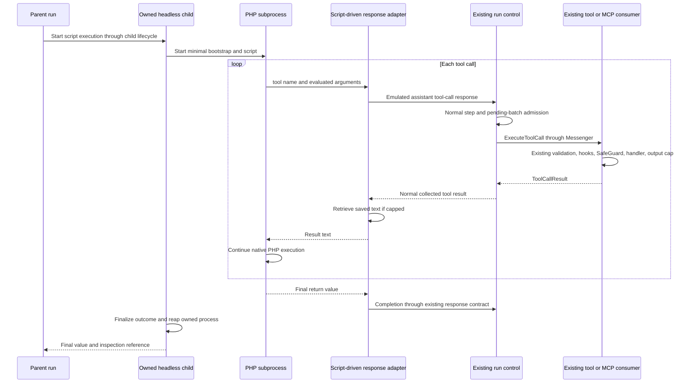
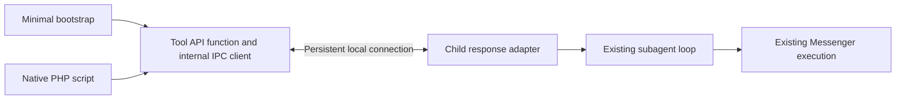
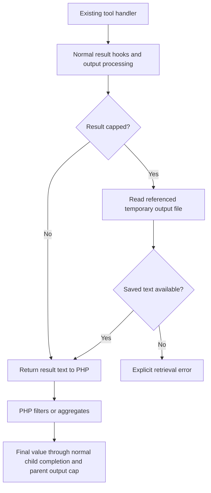
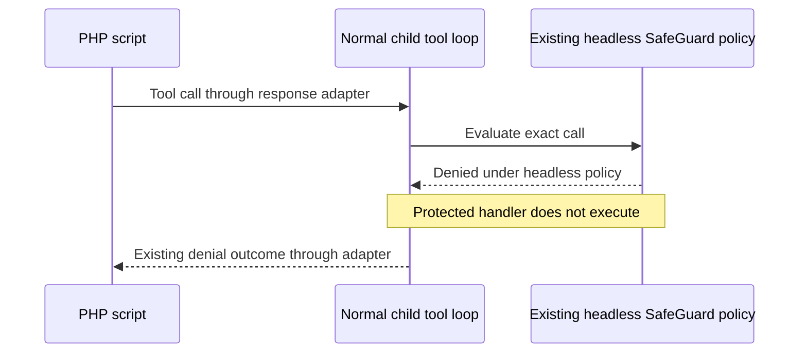

# PHP code mode

[Architecture map](README.md) · [Tools and MCP](tools-and-mcp.md) · [Processes and queues](processes-and-queues.md)

Code mode is a subagent driven programmatically by PHP instead of an LLM. The
parent supplies a script. PHP calls existing tools, processes their results locally,
and returns a final value. Intermediate results stay in the child session rather
than entering the parent's model history.

This is a discovery proposal, not an implemented feature or finalized public API.
Source references describe baseline `0175446eca68f3db6aa6f3e07f9d3123524c0d19`.
The proposed design incorporates the user's later decisions to reuse the subagent
loop, headless SafeGuard policy, and existing capped text output.

## Reuse the subagent loop

Launch an owned headless child Hatfield instance through the existing child
lifecycle. Its disposable session runs the normal tool loop. An adapter supplies
the tool-call response normally produced by an LLM step, then delivers the tool
result to the waiting PHP script. Disposable means no user-managed session, not
immediate deletion of partial results needed for inspection.

This supersedes the earlier proposal for separate PHP-specific admission and
continuation paths. Reusing the assistant response format is intentional. It must
not issue real provider requests or invent provider token usage.

`ToolCallResultHandler` expects an active step and pending batch.
`AdvanceRunHandler` normally advances toward `ExecuteLlmStep`. The adapter should
fit that existing cycle instead of bypassing it with raw tool messages. The exact
injection point, result delivery, and completion representation still need source
investigation. A small adapter is the goal, not a proven implementation size.

Disable compaction for this execution mode. No model needs the child's accumulated
conversation. This does not require a new user-facing setting. Model configuration,
turn limits, prompt construction, provider accounting, and recovery assumptions
must also be checked before claiming that the ordinary loop works unchanged.

Sources: [child lifecycle](../src/CodingAgent/Agent/Execution/ChildRun/Lifecycle/ChildRunBatchLaunchService.php),
[AdvanceRunHandler](../src/AgentCore/Application/Pipeline/AdvanceRunHandler.php),
[ToolCallResultHandler](../src/AgentCore/Application/Pipeline/ToolCallResultHandler.php),
[ExecuteToolCallWorker](../src/AgentCore/Application/Handler/ExecuteToolCallWorker.php).

## Minimal Tool API

The script receives `tool(string $name, array $arguments)` through a minimal Tool
API bootstrap. Like Extension API, this keeps application internals out of the
supported interface. It does not need extension registration or a separately
published Composer package.

PSR-4 does not autoload functions. Load the function file explicitly or through a
minimal Composer `autoload.files` entry. Do not load the application's full
`vendor/autoload.php`, container, registry, or provider clients into the script.

The IPC client sends the tool name and arguments, waits for a correlated response,
and returns its value. Hatfield owns execution IDs, access policy, and Messenger
configuration. The script does not publish `ExecuteToolCall` directly.

Keep the connection separate from stdout and stderr so PHP output cannot corrupt
messages. A dedicated local socket is a candidate, not a finalized transport.
Launching Hatfield CLI for every call would repeat process startup and still need
run attachment, correlation, and cancellation. One persistent connection avoids
that duplication.

PHP itself evaluates loops, branches, functions, and arguments. It waits inside
`tool()` with its variables and call stack alive. No AST interpreter, persisted
program counter, or script replay is needed. An AST alone cannot resolve calls
whose arguments depend on earlier results.

The input remains one script-source string. Native `return` supplies the final
value. File-path execution and dependency installation are outside v1. Exact final
value encoding and IPC fields remain to be specified. Bound IPC frames, nesting,
and diagnostic output. Stdout and stderr are not a second return channel.

## Keep existing output handling

Use the normal tool-result pipeline, including output capping. When a result was
capped, the adapter retrieves the complete saved text from the existing temporary
output file and returns that text to PHP. The implementation must identify the cap
reference from its owning contract, not infer it from arbitrary output prose.

Missing, expired, or unreadable files must not silently become truncated success.
Keep retrieval within execution and memory limits. The exact reference available
at the adapter boundary and file lifetime need verification.

This replaces the earlier prerequisite for a new pre-presentation typed-result
path. V1 consumes existing text output. Scripts decode JSON or TOON explicitly when
they know the tool's format. Whether to bundle a standalone TOON decoder remains
open.

Retrieving a cap file restores saved text, not data discarded earlier.
`McpSdkClientAdapter` omits `structuredContent`; `McpResultMapper` joins text and
substitutes placeholders for binary content. Restoring structured MCP values or
binary payloads is not required for this minimal design. Existing denial and
failure metadata must remain distinguishable from application data. Do not scan
ordinary text for words such as `error` to classify outcomes.

Sources: [ToolExecutor](../src/AgentCore/Application/Handler/ToolExecutor.php),
[output-cap processor](../src/CodingAgent/Tool/OutputCapToolResultProcessor.php),
[OutputCap](../src/CodingAgent/Tool/OutputCap.php),
[MCP SDK adapter](../src/CodingAgent/Mcp/Client/McpSdkClientAdapter.php),
[MCP result mapper](../src/CodingAgent/Mcp/Tool/McpResultMapper.php).

## Reuse headless SafeGuard policy

Use the existing headless policy to deny operations that would require SafeGuard
approval. SafeGuard still evaluates calls before handlers execute. Code mode adds
no approval prompt, wait/resume protocol, new denial implementation, or setting.

The existing hook has an `auto_deny_in_noninteractive` policy with configuration
and category-specific rules. Wire this child through the existing denial policy;
do not assume that every possible noninteractive configuration is identical.

There is no approval answer that restarts the script. Explicit interactive human
input is not a supported code-mode composition path. Whether PHP can handle a
failed or denied call and continue, or must terminate, remains an outcome-contract
question. The earlier mandatory stop-at-first-failure recommendation is not a
finalized requirement and must not introduce a separate policy by accident.

Sources: [SafeGuardToolCallHook](../src/CodingAgent/Extension/Builtin/SafeGuard/SafeGuardToolCallHook.php),
[extension hook outcomes](../src/CodingAgent/Extension/ExtensionToolHookEventSubscriber.php).

## Trust and ownership

PHP has the same arbitrary-code trust as bash. A separate process protects worker
lifecycle and state; it is not an OS sandbox. No new filesystem or network security
policy is required.

The supplied bridge excludes `subagent`, `fork`, `agent_resume`, recursive code
mode, and supported aliases or wrappers exposing agent launch or continuation.
Hatfield's internal child does not expose orchestration to the script. These
restrictions do not promise to prevent deliberate workarounds through unrestricted
PHP, bash, remote MCP internals, or manually loading application files.

Use existing tool visibility, argument validation, rewrite hooks, and allowlist
checks. Child policy must not widen the parent's available tool set, including MCP
availability restrictions. Rewritten calls must remain subject to policy.

MCP calls go through the existing MCP consumer and its session connection lifecycle.
Do not create a second invoker path in the adapter. Verify which connection the
child session owns. The process waiting for PHP must not occupy the only consumer
needed to execute PHP's next tool call. Reuse child supervision rather than add
workers to hide a deadlock.

Cancellation stops admission and reaches the owned child and PHP process through
the existing lifecycle. The owner reaps its processes and closes its connection.
Never signal unrelated, root-owned, or active-session workers. Native PHP retains
bash-equivalent process permissions, not a guarantee against deliberate detachment.

A script crash or lost connection ends the execution without automatic replay.
Previously completed calls may have side effects. Recorded-result reuse does not
prove exactly-once execution under crashes or duplicate delivery. Verify that child
launch and recovery cannot automatically restart the script after ambiguous work.

The baseline MCP client does not propagate per-call cancellation or deadlines to
the SDK. Stopping PHP does not prove remote work stopped. Coordinate with
`add-proper-mcp-tool-call-cancellation`, or explicitly document unknown remote
outcomes. Killing a shared worker is not a substitute.

Sources: [tool registry and toolbox](../src/CodingAgent/Tool/RegistryBackedToolbox.php),
[child tool policy](../src/CodingAgent/Agent/Execution/SubagentToolSetResolver.php),
[parent MCP visibility](../src/CodingAgent/Mcp/Tool/McpParentAvailabilityToolSetResolver.php),
[MCP routing](../src/CodingAgent/Mcp/Messenger/McpExecuteToolCallRoutingMiddleware.php),
[McpToolInvoker](../src/CodingAgent/Mcp/Tool/McpToolInvoker.php),
[tool-failure work](https://github.com/ineersa/agent-core/pull/483).

## Inspection and parent output

Reuse child events and artifacts for call history, IDs, statuses, and operation
references. The child's assistant/tool messages are internal execution records for
the emulated loop. They are not copied into the parent's model history.

Only the final value and bounded status or inspection reference return to the
parent. Existing output capping still applies there. No parallel operation ledger
or separate result database is proposed.

`OutputCap` storage has 24-hour stale cleanup and is not durable session history.
Preserve inspection access according to existing retention rules, and report
expired data as unavailable. Logs carry correlation IDs and bounded sanitized
causes, not script source, raw arguments, outputs, credentials, or stack dumps.
Local artifacts may contain secrets and require owned storage and bounded retention.

Sources: [OutputCap](../src/CodingAgent/Tool/OutputCap.php),
[result projection](../src/AgentCore/Application/Pipeline/ToolCallResultHandler.php),
[logging privacy](../docs/datadog.md#principles).

## Implementation investigation

The next investigation should locate the smallest existing LLM-step integration
point that can accept a script-backed response source. Do not assume a new provider
package or run-control branch is necessary.

Then verify result delivery and final completion, disabled compaction, headless
policy, MCP ownership, and recovery behavior. Resource ceilings, retention, the
optional TOON decoder, and failure handling still need concrete decisions. Reuse
existing budgets before proposing settings.

The intended implementation consists of the bootstrap, internal Tool API connection,
and script-driven response adapter, plus only the lifecycle changes those require.
There is no custom interpreter, separate tool dispatcher, new approval system, or
structured-result overhaul. Module placement must follow [Deptrac](../depfile.yaml).

## Validation requirements

This update changes documentation only. No runtime implementation or runtime proof
is claimed. The eventual implementation must demonstrate:

- Native PHP executes conditional calls from earlier results and retains locals.
- Emulated responses use ordinary pending-call admission and Messenger consumers,
  without provider requests, invented usage, or compaction.
- Existing headless SafeGuard denies protected handlers without opening approval.
- Capped text is restored exactly; missing files produce explicit errors.
- Child tool access and orchestration exclusions survive rewrites.
- Child completion returns only the selected result to the parent.
- Cancellation, crashes, and duplicate delivery cannot silently replay side effects.
- Single-consumer execution does not deadlock and MCP uses the owning connection.

Follow the testing skill and `tests/AGENTS.md` before designing or running runtime
proof. Use the lowest correct layer, deterministic barriers rather than sleeps,
and explicit resource teardown. Normal cases must finish within ten seconds.

`castor docs:validate` checks the built-in catalog, not this architecture report's
Mermaid syntax. Parse every diagram separately through Castor before treating the
report as validated. The later CODE-REVIEW transition owns the full `castor check`.
