# PHP code mode

[Architecture map](README.md) · [Tools and MCP](tools-and-mcp.md) · [Processes and queues](processes-and-queues.md)

Code mode lets the model write one PHP script that calls existing tools, processes
intermediate results, and returns selected data. The intermediate results stay out
of model history but remain available for inspection.

This is a discovery proposal, not an implemented feature or a finalized public API.
Source references describe `0175446eca68f3db6aa6f3e07f9d3123524c0d19`. The trust
model incorporates the user's clarification after the initial discovery report.

## What changes for the model

Today, each round of tool calls returns results to the model before the model can
choose the next computation. Code mode moves that computation into PHP.

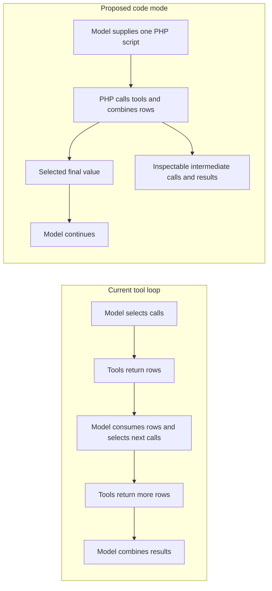

For example, a script could call two available MCP data tools, join their rows,
calculate totals, and return CSV. The model would receive the CSV and a compact
execution summary, not both source datasets. This does not require new database or
export tools.

The proposed v1 has one script input, one `tool(name, arguments)` bridge, serial
calls, and one final return value. It has no workflow definitions, automatic
retries, saved program state, script-controlled child-agent orchestration, or
cross-session execution. Hatfield owns one PHP-driven child run internally; that
does not expose subagent or fork launch to the script.

## Where existing execution can be reused

Built-ins, extensions, and MCP tools converge on `ToolRegistry`. They differ in
registration and argument handling, but code mode should not call their handlers
directly.

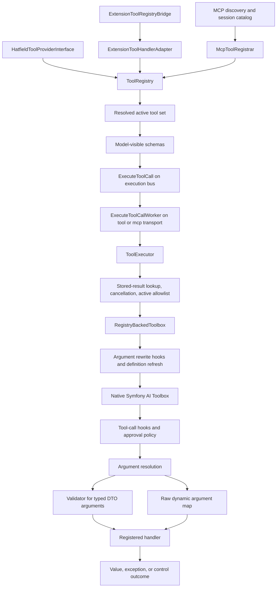

This is the current path, abbreviated to show the reusable parts. A hook can block,
replace a result, or require approval before the handler executes.

`ToolExecutor` provides execution context, cancellation checks, result reuse, and
allowlist enforcement. Its allowlist check is skipped when `tools_ref` is absent.
A code-mode request therefore needs host-supplied run identity and an active tool
reference. Script arguments must not supply either field.

`RegistryBackedToolbox` applies rewrites and native Symfony argument resolution.
Typed built-ins use DTO validation. Raw extension and MCP handlers receive their
argument maps; their schemas do not imply the same host-side validation.

The bridge should use this execution path while adding nested-call identity and an
internal result destination. Calling `ToolExecutor` alone does not provide those
features. Calling a registry handler directly would skip policy and context.

Sources: [ToolRegistry](../src/CodingAgent/Tool/ToolRegistry.php),
[RegistryBackedToolbox](../src/CodingAgent/Tool/RegistryBackedToolbox.php),
[ToolExecutor](../src/AgentCore/Application/Handler/ToolExecutor.php),
[extension registration](../src/CodingAgent/Extension/ExtensionToolRegistryBridge.php),
[extension handler adapter](../src/CodingAgent/Extension/ExtensionToolHandlerAdapter.php).

## Proposed process and call flow

The proposed execution owner is a PHP-driven child run. It reuses run identity,
pending tool calls, result collection, and child lifecycle instead of building a
second tool-execution service. PHP supplies the next action where an ordinary
agent would ask an LLM. This integration is not implemented yet.

PHP runs in a separate process for cancellation, resource limits, and crash
isolation. Its minimal Tool API supplies `tool()` and an internal IPC client,
without the application container, registry, or provider clients. The host bridge
connects that client to the child run. It does not execute tools itself.

This sequence shows proposed successful completion. Existing Messenger message
names identify the intended reuse; admitting PHP-driven steps and delivering their
results still need run-control changes.

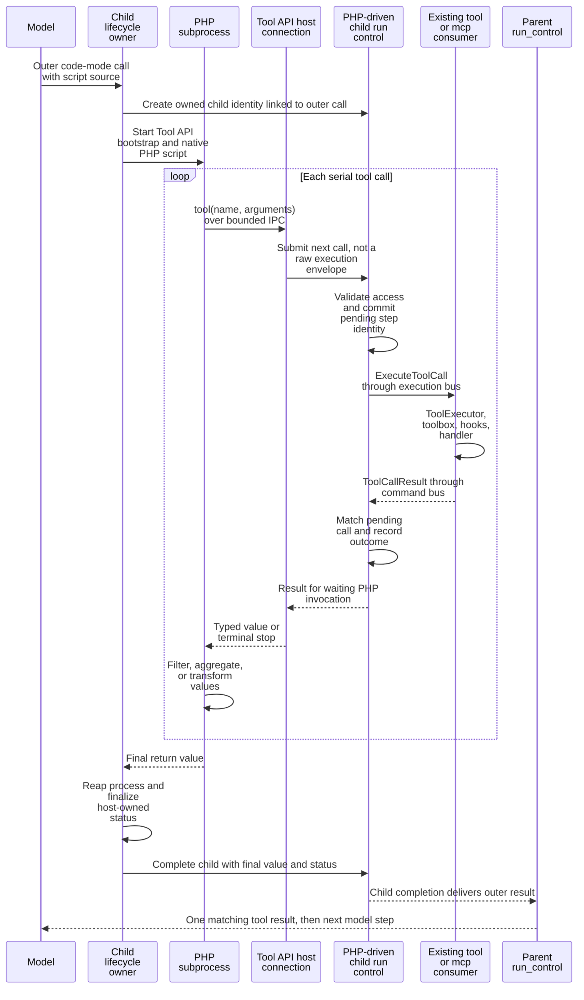

The script must not publish `ExecuteToolCall` directly. That would require application
message classes, transport configuration, and run identity inside the script. It
would also skip admission of the pending call that run control expects to complete.

`ToolCallResultHandler` checks the active step and batch. `AdvanceRunHandler` normally
continues toward `ExecuteLlmStep`. A PHP-driven child therefore needs a way to admit
script-supplied calls and return results to PHP instead of advancing an LLM turn.
No fake assistant responses or LLM calls should be needed to drive this run.

Child lifecycle is the reuse target, not proof that ordinary subagent defaults fit.
Model configuration, compaction, prompt history, tool inheritance, approval policy,
and completion handling must be checked before selecting the exact integration.
The child's tool set must not widen the parent's available tools.

MCP calls must still reach the MCP consumer that owns the connections. A direct
invoker call from another worker would bypass routing and could reconnect through
a second client. The design must establish which existing session-scoped connection
the new child uses rather than assume a parent client is available under its ID.
The script owner also cannot occupy the only tool worker while waiting for that
worker to execute a call. Existing child supervision is the first place to resolve
this ownership. Increasing worker counts is not a deadlock fix.

Sources: [ExecuteToolCallWorker](../src/AgentCore/Application/Handler/ExecuteToolCallWorker.php),
[ToolCallResultHandler](../src/AgentCore/Application/Pipeline/ToolCallResultHandler.php),
[AdvanceRunHandler](../src/AgentCore/Application/Pipeline/AdvanceRunHandler.php),
[child lifecycle](../src/CodingAgent/Agent/Execution/ChildRun/Lifecycle/ChildRunBatchLaunchService.php),
[MCP routing middleware](../src/CodingAgent/Mcp/Messenger/McpExecuteToolCallRoutingMiddleware.php),
[Messenger routes](../config/packages/messenger.yaml),
[McpToolInvoker](../src/CodingAgent/Mcp/Tool/McpToolInvoker.php).

## Minimal Tool API and persistent connection

The Tool API follows the Extension API's dependency direction: scripts use a small
supported interface, not Hatfield internals. It does not need extension registration
or lifecycle methods, or a separately published package for v1.

PHP does not autoload functions through PSR-4. The bootstrap must explicitly load
the file defining `tool()`, or use a minimal loader with a Composer `autoload.files`
entry. That loader may load the small IPC implementation. It must not load the
application's full `vendor/autoload.php`.

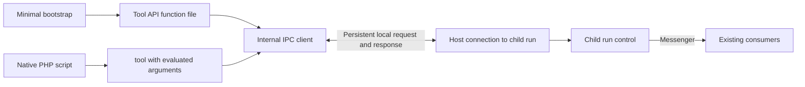

The client encodes a request, waits for the correlated reply, and decodes the result.
Hatfield supplies run IDs, tool-call IDs, policy context, and transport configuration.
Those are not script parameters. The client has no registry or MCP logic.

One local connection lasts for the script's lifetime. A dedicated socket is a
candidate transport, separate from stdout and stderr so `echo` and PHP warnings
cannot corrupt requests. The exact transport and message fields remain internal
design choices. A closed connection reports interrupted delivery without resending
the call, because the operation may already have caused side effects.

Launching a Hatfield CLI process for every call would still need child identity,
pending-call admission, response correlation, and cancellation. It would also repeat
process startup and application bootstrap. The persistent connection avoids that
cost while Messenger remains the execution transport. No new tool consumer is
required merely to receive the script's local requests.

### Native PHP provides the execution state

There is no custom AST interpreter. PHP evaluates variables, branches, loops, and
arguments, then waits inside `tool()` until Hatfield returns a result. Its live call
stack holds the script state. An AST alone cannot determine calls that depend on
earlier tool results.

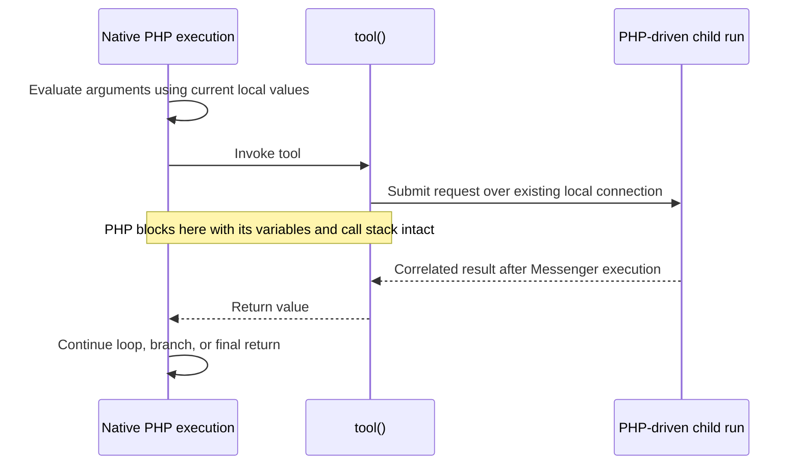

The PHP process must stay alive while waiting. If it dies, the child records the
partial outcome and ends. Neither reconnect nor child-run recovery restarts the
script automatically.

## Values must separate from model presentation

The current path loses information before a script could consume it. Native
Symfony tool results can contain PHP values, but `ToolExecutor::toDomainResult()`
also renders text and runs output processors. Output capping can remove
`details.raw_result` and retain only a reference to rendered text.

MCP loses structure earlier. `McpSdkClientAdapter::callTool()` explicitly omits
`structuredContent`. `McpResultMapper` joins text blocks and replaces binary content
with placeholders. Some built-ins, such as `SettingsTool` and `BgStatusTool`, already
return TOON strings.

```mermaid
flowchart TB
    subgraph Current[Current result path]
        SDK[MCP SDK result] --> Drop[Adapter retains content and isError only]
        Drop --> Mapper[Mapper joins text and substitutes binary placeholders]
        Native[Native handler value] --> Convert[ToolExecutor renders content and stores raw_result]
        Mapper --> Convert
        Convert --> Cap[Output cap may remove raw_result]
        Cap --> Projection[ToolCallResultHandler appends model message]
    end
    subgraph Proposed[Proposed nested result path]
        Value[Native value or preserved MCP result] --> Outcome[Policy and terminal-outcome classification]
        Outcome --> Codec[Bounded data normalization and IPC encoding]
        Codec --> PHP[PHP value or explicit omitted-result reference]
        Outcome --> Artifact[Owned inspection artifact]
        PHP --> Selected[Script selects final value]
        Selected --> Presentation[Existing final presentation and output cap]
        Presentation --> Outer[Outer model tool result only]
    end
```

The proposed split happens before model formatting, not before policy. Result hooks,
denials, and failure classification still apply. It cannot be implemented by reading
`raw_result` after all current processors have finished.

### Script input and output

The recommended input is one required script-source string, executed as a PHP body.
Local variables hold intermediate values, and `return` supplies the final value.
File-path execution and dependency installation are not part of v1.

`tool(string $name, array $arguments)` takes the existing runtime tool name and flat
argument map. A successful call returns a small envelope that distinguishes
structured data, text, and an omitted value. Exact field names remain unapproved.

Structured data supports scalars, lists, and objects as data. A structured null is
different from no structured value. Supported DTOs use Symfony Serializer
normalization on the host. Executable PHP objects, resources, cyclic values,
non-finite numbers, and invalid text encodings produce bounded diagnostics.

A separate process requires serialization. A framed, bounded JSON-compatible IPC
format is sufficient; a model-facing TOON round trip is not. The codec must preserve
list versus object identity and define integer range behavior. It must bound frame
size, nesting depth, and total bytes rather than allocate an arbitrary payload first.

### Different result kinds need different handling

| Result | Proposed PHP behavior | Required change or limit |
|---|---|---|
| Native structured value | Receive data without model-text conversion | Separate data normalization from presentation |
| MCP structured result | Receive `structuredContent`, with content blocks retained separately | Extend the internal SDK adapter and mapper path |
| Text-only result | Receive a string | Decode JSON or TOON explicitly only when the script knows the format |
| Binary content | Receive metadata and an inspection reference | Retain permitted bytes in owned storage, not base64 in model history |
| Oversized intermediate value | Receive an explicit omitted-result reference | Never present truncated data as complete; bounded text inspection can use `read` |
| Failure, denial, approval, or deferred completion | Receive a control outcome, not application data | Classify at the owning boundary; do not infer status from arbitrary text |

Some existing hook denials are arrays or TOON strings containing `denied`, rather
than `isError=true`. The typed outcome work must address that inconsistency at the
hook boundary. Scanning ordinary output for words such as `error` is not a substitute.

The final return value uses the same supported data types. Stdout and stderr are
bounded diagnostics, not an implicit second return channel. The outer result includes
the selected value, execution status, completed-call count, and inspection reference.
Existing output capping limits final model presentation. A separate aggregate
artifact budget prevents capping from causing unlimited disk growth.

Sources: [ToolExecutor conversion](../src/AgentCore/Application/Handler/ToolExecutor.php),
[MCP SDK adapter](../src/CodingAgent/Mcp/Client/McpSdkClientAdapter.php),
[MCP result mapper](../src/CodingAgent/Mcp/Tool/McpResultMapper.php),
[output-cap processor](../src/CodingAgent/Tool/OutputCapToolResultProcessor.php),
[tool-result projection](../src/AgentCore/Application/Pipeline/ToolCallResultHandler.php),
[hook outcomes](../src/CodingAgent/Extension/ExtensionToolHookEventSubscriber.php).

## Trust matches bash; bridge calls retain tool policy

The user confirmed arbitrary PHP execution under the same trust model as bash.
Code mode does not require an OS sandbox or a new filesystem or network deny policy.
The subprocess boundary protects worker lifecycle and state, not against hostile code.

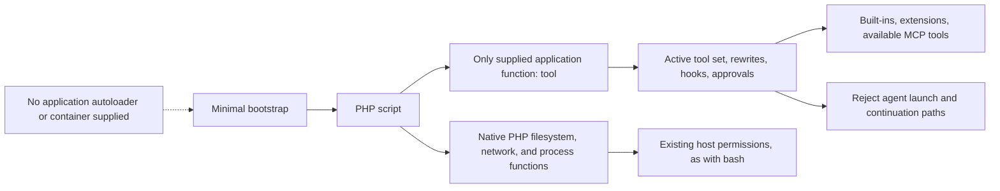

The bridge rejects `subagent`, `fork`, and `agent_resume`, including aliases,
rewrites, and supported wrappers that expose the same launch or continuation.
Recursive code mode and deferred-agent completion are not composition paths.
The script receives no extension `agent()` or job-dispatch object.

These restrictions concern the provided bridge. They do not require banning bash,
auditing remote MCP servers for internal agent use, or preventing PHP from
deliberately loading application files or invoking a CLI. That would impose a
stronger restriction than the existing arbitrary-code tools.

The host assigns execution identity and checks the current resolved tool set on
each bridge call. Checks must also cover rewritten calls before handler invocation.
An earlier snapshot must not preserve a revoked capability. Parent code mode cannot
import MCP tools hidden behind `availability: specific` or child-only selectors.

Sources: [parent MCP visibility](../src/CodingAgent/Mcp/Tool/McpParentAvailabilityToolSetResolver.php),
[child tool policy](../src/CodingAgent/Agent/Execution/SubagentToolSetResolver.php),
[extension host API bridge](../src/CodingAgent/Extension/ExtensionToolRegistryBridge.php),
[existing process execution](../src/CodingAgent/Extension/ExtensionExecBridge.php).

## Approval cannot restart the whole script

Current approval suspends an exact tool call before its handler executes. Run control
stores the request, and the answer requeues that call with typed correlation. This
is safe for one unstarted handler. It is not safe for an outer script that has
already performed writes.

The sequence abbreviates the local connection and Messenger delivery. The child
run owns admission and recorded outcomes, as in the full execution sequence above.

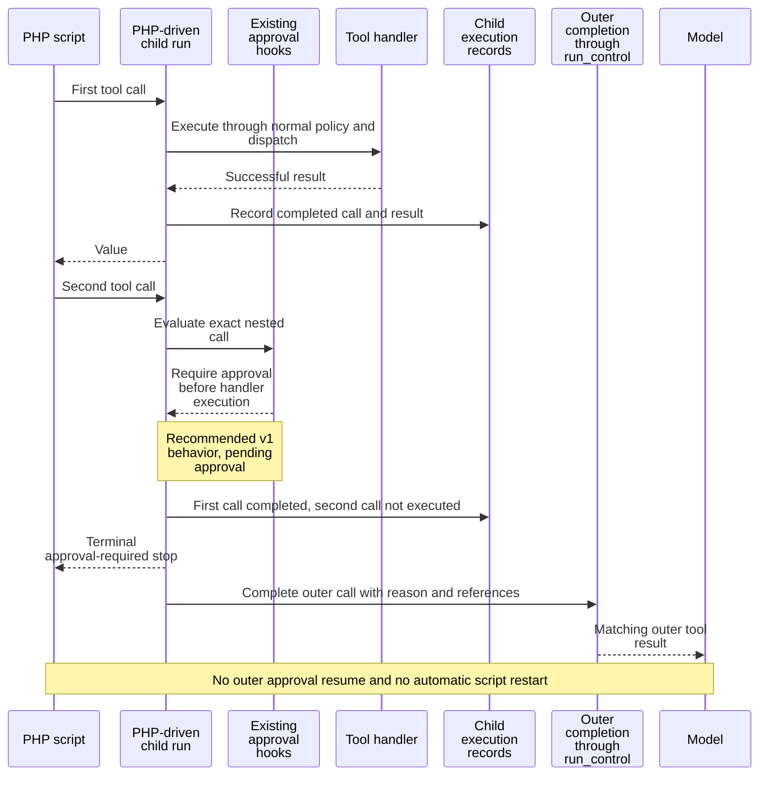

The recommendation is to stop v1 scripts when a nested call needs human input.
The protected handler does not run. The result explains which earlier calls completed
and identifies the approval-required call. An outer approval never authorizes later
nested calls. Explicit `ask_human` is also excluded under this recommendation.

This remains a product decision because it restricts composition of otherwise
available tools. The alternative is to keep the owned PHP process alive, paused on
the exact nested response while the user answers. That needs live-process ownership,
correlated approval delivery, and a deadline. A crash still ends the script.
Persisting PHP locals or replaying earlier calls would introduce workflow recovery
that is outside scope.

The child-run design makes existing per-call approval continuation worth evaluating
again: the child could resume only its waiting tool call while PHP remains blocked.
Whether that works without normal subagent approval restrictions remains an open
integration question. This report does not treat the earlier stop recommendation
as a finalized requirement.

Sources: [approval suspension and answer handling](../src/CodingAgent/Extension/ExtensionToolHookEventSubscriber.php),
[run-control continuation](../src/AgentCore/Application/Pipeline/ApplyCommandHandler.php),
[SafeGuard approval decisions](../src/CodingAgent/Extension/Builtin/SafeGuard/SafeGuardToolCallHook.php).

## Failure and cancellation preserve partial outcomes

The host owns terminal status. The recommendation is to stop at the first failed
nested call and close admission to further calls, even if PHP catches a bridge
exception. A script return value cannot overwrite a recorded failure or cancellation.

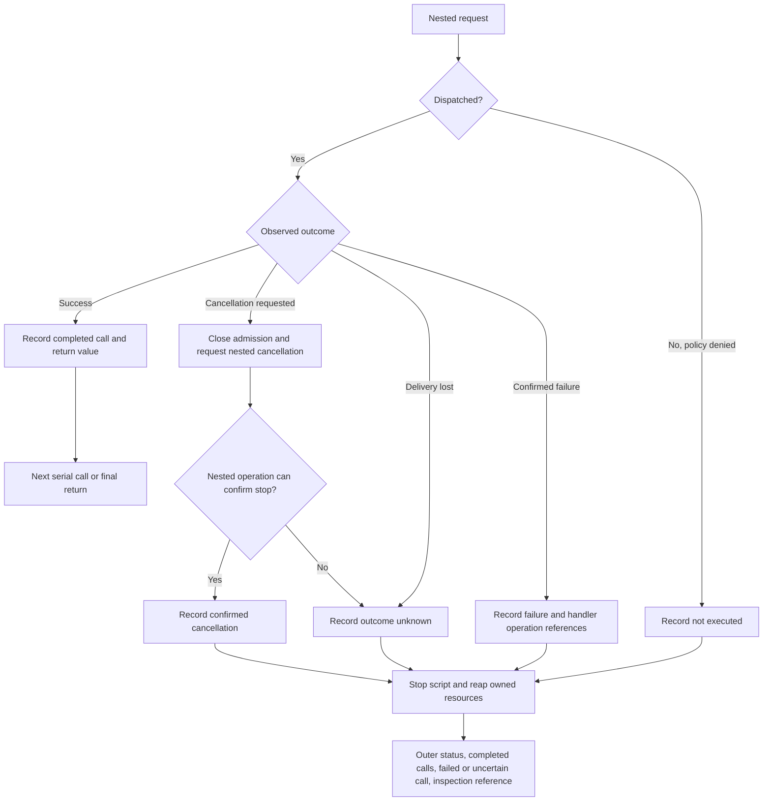

A failed call may itself have partial effects. Its existing operation and log
references remain useful, so the outer result retains them. A lost response after
dispatch means unknown outcome, not proof that execution failed or never started.
This follows the [tool-failure work in PR 483](https://github.com/ineersa/agent-core/pull/483).

The script owner owns its subprocess, pipes, scratch directory, and pending requests.
Cancellation stops new calls, requests cancellation of the active nested operation,
and reaps owned processes. It must not signal unrelated, root-owned, or active-session
workers. Code mode offers no background execution. Native PHP process creation still
has the bash-equivalent trust model, not a security guarantee against deliberate detachment.

MCP is a known limit. The current invoker and connection manager do not pass per-call
cancellation or deadlines to the SDK. Stopping PHP cannot prove remote work stopped.
The implementation must either depend on tracked task
`add-proper-mcp-tool-call-cancellation` or report the uncertain remote outcome under
an approved limitation. Killing a shared MCP worker is not a substitute.

No automatic retries, rollback, script resume, or exactly-once guarantee is proposed.
Stored-result reuse covers recorded outcomes, not concurrent execution or a crash
before recording. The host must reserve the outer attempt before side effects and
refuse automatic re-entry on duplicate or ambiguous delivery. That requires limited
attempt evidence, not a stored PHP program counter or a new operation database.

Sources: [executor outcome reuse](../src/AgentCore/Application/Handler/ToolExecutor.php),
[MCP invocation limits](../src/CodingAgent/Mcp/Tool/McpToolInvoker.php),
[MCP connection manager](../src/CodingAgent/Mcp/Client/McpConnectionManager.php),
[run cancellation token](../src/AgentCore/Infrastructure/SymfonyAi/RunCancellationToken.php).

## Inspection stays separate from model history

Each script tool call gets a host-generated ID in the PHP-driven child run, with
correlation to the parent's outer tool-call ID. Existing child events and artifacts
are the first choice for inspectable call history, not a parallel operation ledger.
Records include dispatch and terminal status, duration, and any handler-provided
operation reference. Payload retention follows the approved privacy and storage limits.

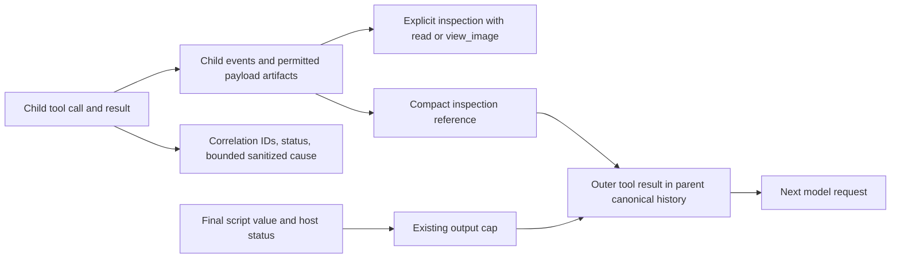

`OutputCap` already provides run-hashed temporary text storage, locks, path checks,
and cleanup. It does not provide a structured call ledger or binary retention.
Its 24-hour stale cleanup also means an inspection reference is not durable session
history. Expired or quota-omitted data must be identified as unavailable.

Existing bounded `read` can inspect the ledger and text, and `view_image` can inspect
supported images. Returning a reference does not mount data into PHP or grant new
permissions. Direct PHP file access still follows host permissions.

Logs exclude script source, raw arguments, raw outputs, credentials, and stack dumps.
Only the final value and compact status references enter parent model history by default.
The child needs inspectable execution records, not a fabricated model conversation.
Local artifacts can still contain secrets. The recommendation is owner-only access,
short retention, and metadata-only records where payload retention is prohibited.
Pattern-based error redaction is not proof that arbitrary data is non-sensitive.

Sources: [OutputCap](../src/CodingAgent/Tool/OutputCap.php),
[model result projection](../src/AgentCore/Application/Pipeline/ToolCallResultHandler.php),
[diagnostic sanitizer](../src/AgentCore/Contract/Tool/DiagnosticMessageSanitizer.php),
[logging privacy](../docs/datadog.md#principles).

## Remaining decisions and implementation order

The trust model is settled. A separate PHP process with one supplied application
bridge fits the existing bash permissions. In-process execution would share worker
state and complicate cancellation. A sandbox or subset interpreter would add a
security model the user has rejected for this task.

Four product decisions remain:

| Decision | Recommendation |
|---|---|
| Nested approval | Stop before the protected handler in v1; no automatic restart |
| Resource and artifact limits | Explicit execution and storage budgets, private short-lived artifacts; numeric limits still need approval |
| TOON decoding | Decide whether to bundle a standalone decoder without the application autoloader |
| MCP cancellation | Require cancellation work or explicitly approve unknown-remote-outcome reporting |

The child-run approach is the preferred integration to investigate, not an existing
LLM-free execution mode. The first slice must resolve pending-step admission,
PHP continuation, child tool policy, and MCP session ownership before implementation
can rely on it. Current subagent approval defaults must not decide code-mode behavior
implicitly.

The implementation can then proceed in this order:

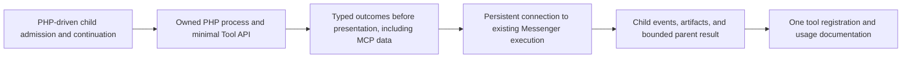

Process work includes crash handling and teardown in supported packaged runtimes.
Routing work must preserve MCP connection ownership and avoid worker self-deadlock.
The bridge retains current access policy and excludes script-controlled agent
orchestration. No AST interpreter, per-call CLI bootstrap, or new tool consumer is
part of the proposed design.

CodingAgent owns concrete process, tool, MCP, and extension adapters. AgentCore gets
only neutral contracts that genuinely belong to shared execution. The
[Deptrac rules](../depfile.yaml) remain authoritative. No new public ExtensionApi
contract is justified solely to support this internal bridge.

## Deterministic proof plan

This discovery changes documentation only. The scenarios below describe required
proof for an approved implementation, not tests already written or run. The testing
skill and `tests/AGENTS.md` were loaded before test investigation.

| Scenario | Required observation | Lowest useful layer |
|---|---|---|
| Two data tools, join, sum, and CSV | Exact final CSV; source rows absent from model history and present in permitted artifacts | Container tests for values; one controller replay for projection |
| Structured null, list, object, text, and TOON | Distinctions survive IPC; text is decoded only explicitly | Codec and adapter tests |
| Denied write after a completed call | Denied handler never runs; earlier result remains inspectable; no later dispatch | Hook and bridge tests |
| Approval, hook failure, or excluded launch wrapper | Exact control outcome; no handler or child execution | Hook and bridge tests |
| Failure after a side effect | Bounded cause and operation reference; no retry or repeated side effect | Bridge and delivery tests |
| Lost response and duplicate outer delivery | Unknown outcome remains unknown; duplicate does not re-enter script | Deterministic delivery barriers |
| Cancellation during a nested request | Admission closes; owned process exits; nested cancellation or explicit unknown remote outcome | Process test with pipe or socket barrier |
| Oversized structured, text, binary, and stdout output | Transport and storage limits hold; inspectable references or explicit omission; no raw payload in logs or model details | Codec, artifact, and projection tests |
| Minimal bootstrap and owner crash | Bridge works without application autoload; internal service access is unavailable; owned resources are reaped | Real subprocess test |
| PHP-driven child continuation | Results match admitted steps and return to PHP without an LLM call or automatic script restart | Run-control and controller replay tests |
| Conditional tool calls | Native PHP chooses the next call from the prior result while preserving local variables | Real subprocess with deterministic tool responses |
| Shared consumer reuse | One available tool worker does not deadlock; MCP calls reach the owning session connection; parent cancellation reaches the child | Controller replay with deterministic barriers |

Existing entry points include `ToolExecutorTest`, `ExtensionToolHookEventSubscriberTest`,
`McpResultMapperTest`, and `OutputCapToolResultProcessorContractTest`. DB-touching
cases use the isolated kernel test container. Tests should extend the owning contract
rather than duplicate it across layers.

Every normal case must finish within 10 seconds and own its temporary resources.
Synchronization uses explicit barriers, not arbitrary sleeps or timeout increases.
Direct PHP filesystem, network, and process operations are not expected to fail under
a sandbox policy. Live LLM proof is reserved for the eventual tool schema, not data
aggregation or process ownership.

Focused validation goes through Castor. The eventual CODE-REVIEW transition owns
`castor check`. For this report, `castor docs:validate` checks the existing built-in
document catalog; this repository-only proposal is outside that catalog. Source,
link, and diagram review must therefore also cover the report itself.
