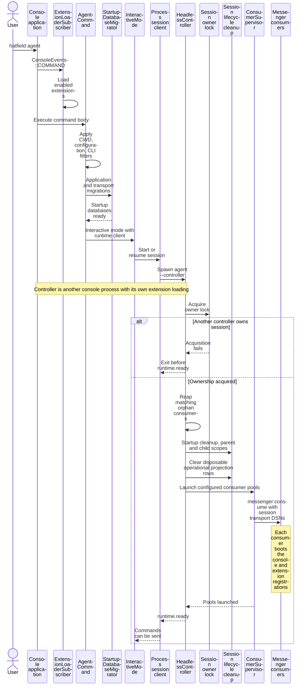
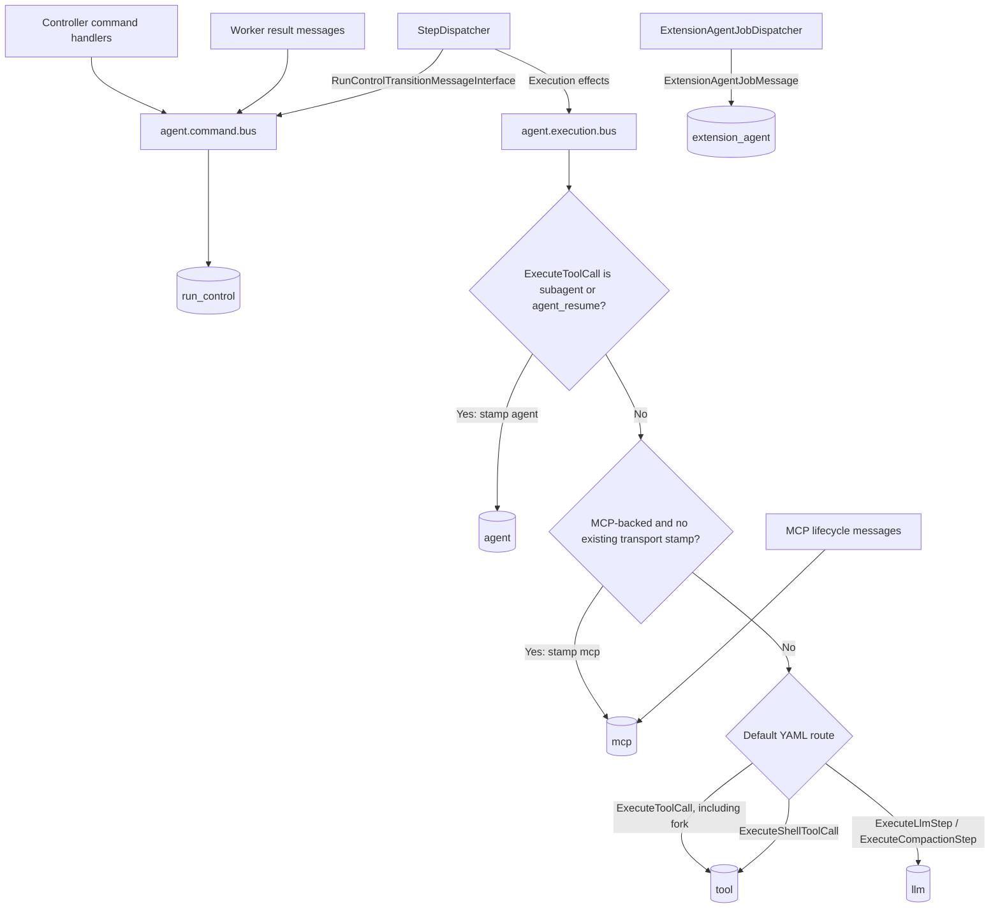
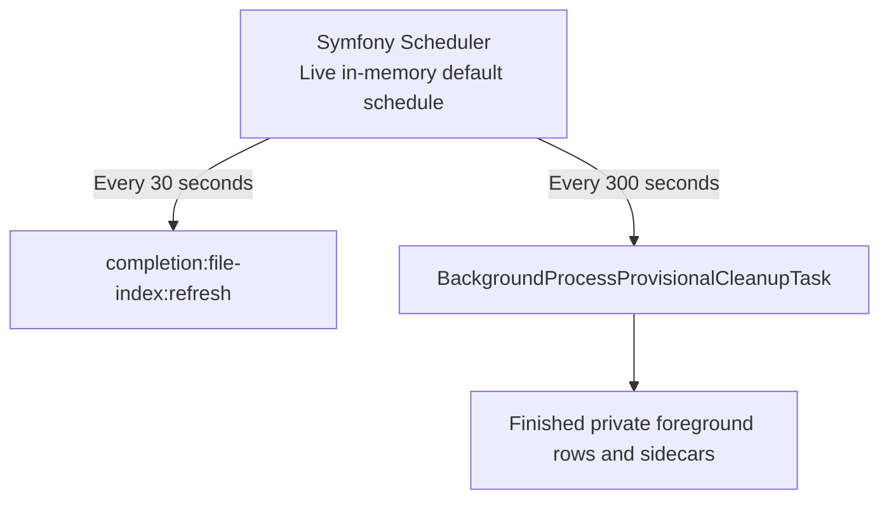
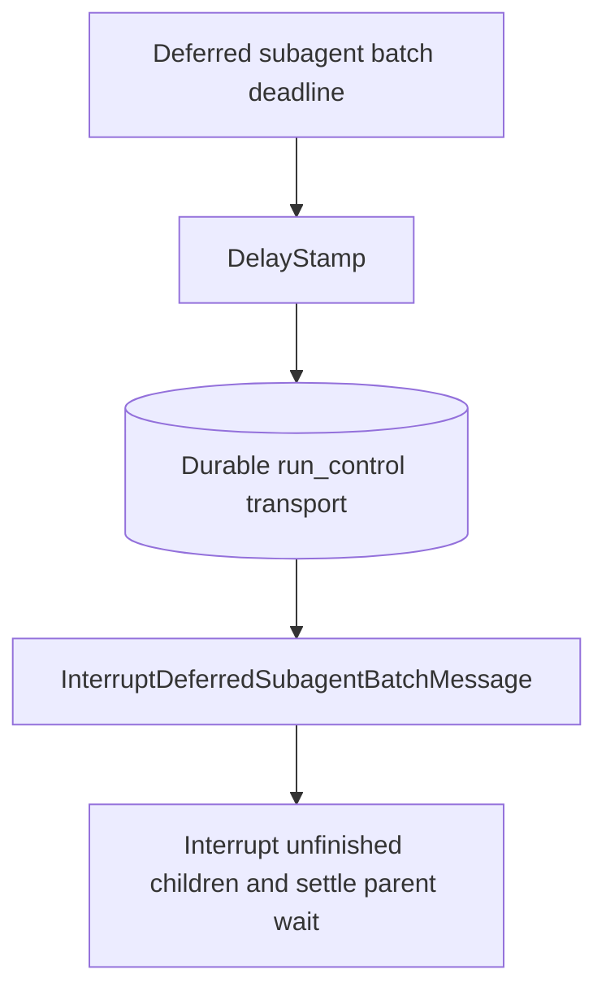
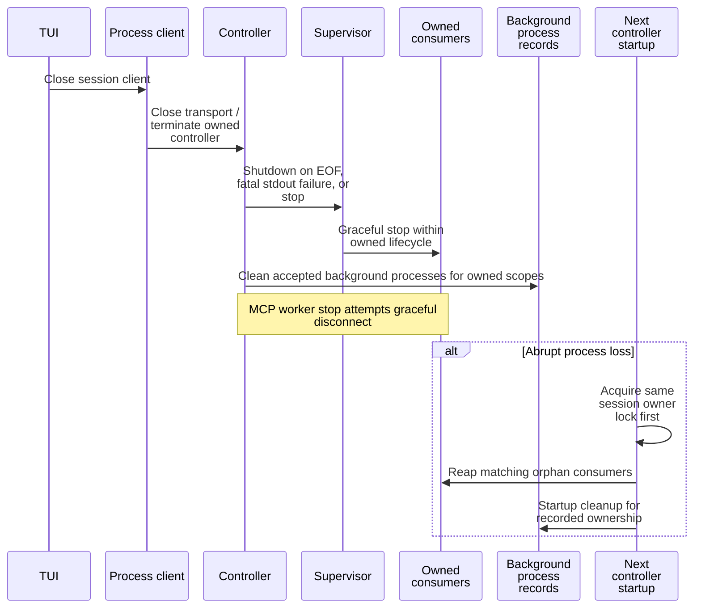

# Processes and queues

[Architecture map](README.md) · [Request lifecycle](request-lifecycle.md)

## Startup and ownership

`ExtensionLoaderSubscriber` runs on `ConsoleEvents::COMMAND`, before the command
body. It also runs in consumer console processes. It does not wait for migrations
inside `AgentCommand`.

Launching pools is not proof that a provider request or extension job will succeed.
The controller owns the lock and process lifecycle; run control owns transitions.

## Bus routing

The subagent middleware runs before MCP routing. MCP middleware preserves an
existing `TransportNamesStamp`. Extension job dispatch is separate from
`StepDispatcher`'s transition-versus-execution choice.

## Exact YAML route inventory

All 22 explicitly routed message classes from `config/packages/messenger.yaml`
are listed here by short class name. Dynamic `ExecuteToolCall` overrides are above.

| Transport | Messages |
|---|---|
| `run_control` | `StartRun`, `ApplyCommand`, `ApplyShellCommand`, `InvalidateRunContext` |
| `run_control` | `LlmStepResult`, `ToolCallResult`, `CompactionStepResult` |
| `run_control` | `AdvanceRun`, `CompactRun`, `CompleteDeferredToolCall` |
| `run_control` | `ObserveDeferredSubagentBatchChildTurnMessage`, `DeliverDeferredSubagentBatchLifecycleMessage` |
| `run_control` | `InterruptDeferredSubagentBatchMessage`, `RecoverDeferredSubagentBatchLifecycleMessage` |
| `llm` | `ExecuteLlmStep`, `ExecuteCompactionStep` |
| `tool` | `ExecuteToolCall`, `ExecuteShellToolCall` |
| `mcp` | `McpInitializeSessionCommand`, `McpRefreshCatalogCommand`, `McpDisconnectSessionCommand` |
| `extension_agent` | `ExtensionAgentJobMessage` |

| Consumer | Count | Responsibility |
|---|---|---|
| `run_control` | 1 | Commands, results, state transitions, canonical commits |
| `llm` | 1–8, default 4 | Model and compaction execution |
| `tool` | `tools.execution.max_parallelism` | Generic tools, shell, fork |
| `agent` | 1 | Subagent and resume tool execution |
| `mcp` | 1 | MCP tools and connection lifecycle |
| `extension_agent` | 1 | Extension-owned agent jobs |
| `scheduler_default` | 1 | Generated recurring schedule messages |

## Scheduled work is not delayed run control

The scheduler is not the durable deadline store. Accepted background processes are
not the provisional cleanup task's target.

## Shutdown and crashes

Consumer restarts are bounded to 3 per key within 60 seconds. A crash can leave a
claimed transport row unavailable. Restart is not automatic repair of the current
effect. [State and recovery](state-and-recovery.md) explains explicit repair.
Never signal root-owned workers or active processes tagged with `HATFIELD_SESSION_ID`.

Sources: [messenger.yaml](../config/packages/messenger.yaml),
[HeadlessController](../src/CodingAgent/Runtime/Controller/HeadlessController.php),
[StepDispatcher](../src/AgentCore/Application/Handler/StepDispatcher.php),
[runtime reference](../docs/async-runtime-architecture.md).
