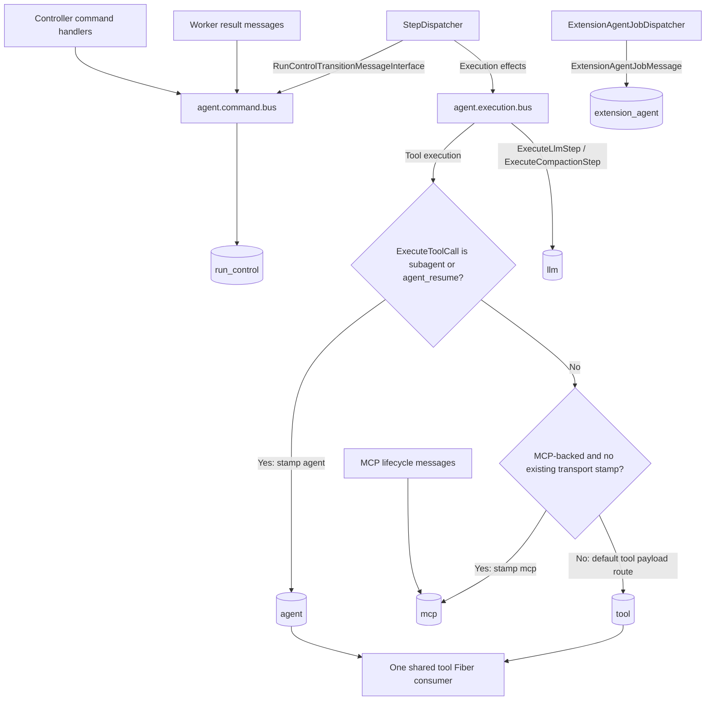
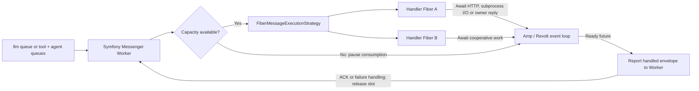
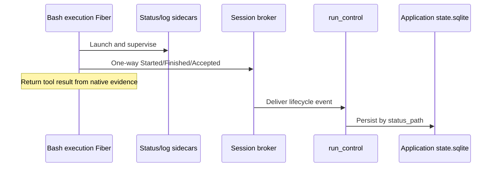
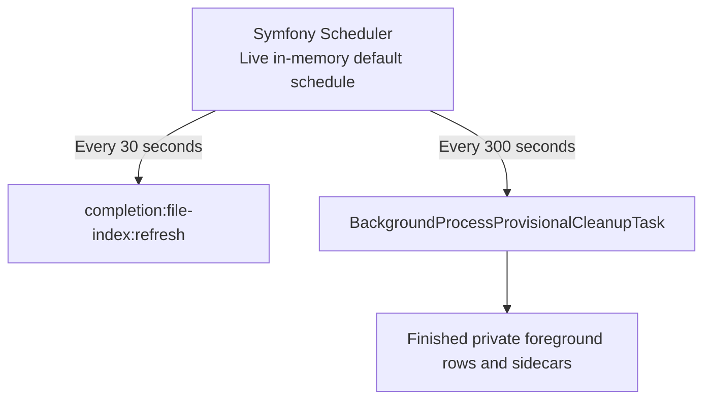
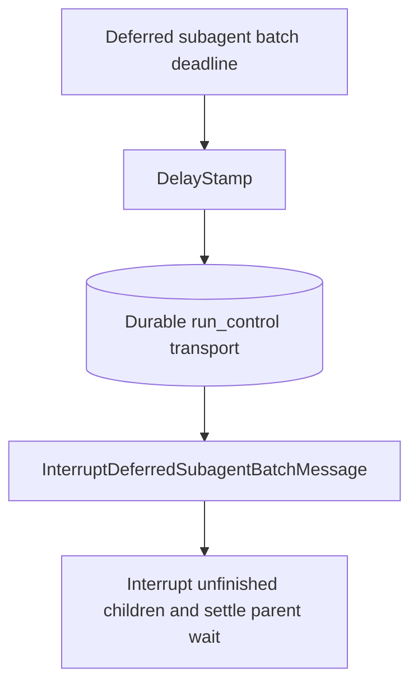

# Processes and queues

[Architecture map](README.md) · [Request lifecycle](request-lifecycle.md)

## Startup and ownership

`ExtensionLoaderSubscriber` runs on `ConsoleEvents::COMMAND`, before the command
body. It also runs in consumer console processes. It does not wait for migrations
inside `AgentCommand`.

```mermaid
%%{init: {"sequence": {"wrap": true, "width": 60, "actorMargin": 10, "diagramMarginX": 10, "messageMargin": 30}}}%%
sequenceDiagram
    actor User
    participant Console as Console application
    participant Ext as ExtensionLoaderSubscriber
    participant Command as AgentCommand
    participant Migrate as StartupDatabaseMigrator
    participant TUI as InteractiveMode
    participant Client as Process session client
    participant Controller as HeadlessController
    participant Lock as Session owner lock
    participant Lifecycle as Session lifecycle cleanup
    participant Broker as Session broker supervisor
    participant Supervisor as ConsumerSupervisor
    participant Consumers as Messenger consumers

    User->>Console: hatfield agent
    Console->>Ext: ConsoleEvents::COMMAND
    Ext->>Ext: Load enabled extensions
    Console->>Command: Execute command body
    Command->>Command: Apply CWD, configuration, CLI filters
    Command->>Migrate: Application and transport migrations
    Migrate-->>Command: Startup databases ready
    Command->>TUI: Interactive mode with runtime client
    TUI->>Client: Start or resume session
    Client->>Controller: Spawn agent --controller
    Note over Console,Controller: Controller is another console process with its own extension loading
    Controller->>Lock: Acquire owner lock
    alt Another controller owns session
        Lock-->>Controller: Acquisition fails
        Controller-->>Client: Exit before runtime.ready
    else Ownership acquired
        Controller->>Controller: Reap matching orphan consumers
        Controller->>Broker: Start broker and its SQLite helper
        Controller->>Lifecycle: Startup cleanup, parent and child scopes
        Controller->>Lifecycle: Clear disposable operational projection rows
        Controller->>Supervisor: Launch consumer roles with session transport DSNs
        Supervisor->>Consumers: Fiber command for llm/tool; messenger:consume for other roles
        Note over Consumers: Each consumer boots the console and extension registrations
        Supervisor-->>Controller: Consumers launched
        Controller-->>Client: runtime.ready
        Client-->>TUI: Commands can be sent
    end
```

Launching consumers is not proof that a provider request or extension job will succeed.
The controller owns the lock and process lifecycle; run control owns transitions.

The controller omits `extension_agent` when console extension loading registered
no agent-job handlers. Extension setup and activation require the existing
restart workflow; an empty queue does not determine worker capability.

## Bus routing

```mermaid
flowchart TB
    Handlers[Controller command handlers] --> CB[agent.command.bus]
    Results[Worker result messages] --> CB
    Step[StepDispatcher] -->|RunControlTransitionMessageInterface| CB
    Step -->|Execution effects| EB[agent.execution.bus]
    CB --> RC[(run_control)]
    EB -->|Tool execution| Sub{ExecuteToolCall is subagent or agent_resume?}
    Sub -->|Yes: stamp agent| Agent[(agent)]
    Sub -->|No| MCP{MCP-backed and no existing transport stamp?}
    MCP -->|Yes: stamp mcp| MQ[(mcp)]
    MCP -->|No: default tool payload route| Tool[(tool)]
    EB -->|ExecuteLlmStep / ExecuteCompactionStep| LLM[(llm)]
    Agent --> Shared["One shared tool Fiber consumer"]
    Tool --> Shared
    Jobs[ExtensionAgentJobDispatcher] -->|ExtensionAgentJobMessage| EQ[(extension_agent)]
    Life[MCP lifecycle messages] --> MQ
```

The subagent middleware runs before MCP routing. MCP middleware preserves an
existing `TransportNamesStamp`. Extension job dispatch is separate from
`StepDispatcher`'s transition-versus-execution choice. `ToolPayloadMiddleware`
stores tool bodies and sends bounded references: execution defaults to `tool`,
results to `run_control`, and existing agent/MCP routing stamps are preserved.
The `agent` and `tool` transports are distinct queues consumed by the same process.

## Consumer roles and concurrency

| Role | Processes per controller | Admission and responsibility |
|---|---|---|
| `run_control` | 1 | Serialized commands, results, state transitions, canonical commits and lifecycle metadata mutations |
| `llm` | 1 | `runtime.llm_concurrency`, default **10** overlapping model or compaction handlers |
| `tool` + `agent` | 1 shared | `runtime.tool_concurrency`, default **16** overlapping generic-tool, shell, fork, subagent and resume handlers |
| `mcp` | 1 | Serialized MCP tools and connection lifecycle |
| `extension_agent` | 0 or 1 | Extension-owned jobs; omitted when no handlers are registered |
| `scheduler_default` | 1 | Symfony Scheduler recurring messages; not a durable broker queue |

The controller also owns one sqlite-queue broker process and its async SQLite
helper. The queue database is separate from the Doctrine application connection
to `.hatfield/state.sqlite`. Consolidating execution does not combine those owners.

The two execution roles use `hatfield:messenger:consume-llm --transport=llm|tool`.
Despite its name, `LlmFiberConsumeCommand` serves both roles. It constructs a
Symfony Messenger `Worker` with `FiberMessageExecutionStrategy`, which dispatches
handlers through Amp futures in the same PHP runtime. Stock Messenger parallel
execution uses child processes instead and is not this topology.

```mermaid
flowchart LR
    Queue["llm queue or tool + agent queues"] --> Worker[Symfony Messenger Worker]
    Worker --> Capacity{Capacity available?}
    Capacity -->|Yes| Strategy[FiberMessageExecutionStrategy]
    Strategy --> A[Handler Fiber A]
    Strategy --> B[Handler Fiber B]
    A -->|Await HTTP, subprocess I/O or owner reply| Loop[Amp / Revolt event loop]
    B -->|Await cooperative work| Loop
    Capacity -->|No: pause consumption| Loop
    Loop -->|Ready future| Settle[Report handled envelope to Worker]
    Settle -->|ACK or failure handling; release slot| Worker
```

Capacity counts in-flight handlers, not all active child runs. A deferred child
launch returns before the child finishes, releasing its tool slot. The child's
later LLM and tool messages use the same workers. `tools.execution.max_parallelism`
still limits admission within each tool batch, independently of worker capacity.
HTTP connection limits also remain separate from LLM handler capacity.

Amp HTTP and retry waits yield; Bash and code-mode supervision also yield while
their subprocesses run. Fibers do not provide CPU parallelism or make synchronous
filesystem/database calls non-blocking. A blocking extension or CPU-heavy handler
can stall peers, replies and lease renewal in that process.

## Shared-service isolation

Per-message service reset is disabled in the Fiber consumers: resetting shared
services when one handler finishes would invalidate suspended siblings. Instead:

- `StackToolExecutionContextAccessor` keeps nested tool scopes in a per-Fiber
  `WeakMap`, with a separate stack for synchronous callers.
- `RunLockManager` attributes reentrant ownership to the current Fiber, not the
  process. Contending Fibers yield rather than entering another Fiber's lock.
- Log and trace scopes are Fiber-local; LLM stream state is scoped by run and step.
- Runtime lifecycle reads return scalar snapshots. Managed ORM state must not
  escape an owner transaction into a suspended execution handler.

A Revolt timer renews transport leases every five seconds while handlers yield.
It replaces SIGALRM-based keepalive, which cannot reliably run while Amp HTTP is
suspended. Idle consumption uses the broker's cooperative WAIT integration.
The normal 256 MiB worker memory limit remains; there is no 256-message recycle
boundary. Memory-limit recycling is not a substitute for correct scope cleanup.

## Lifecycle persistence ownership

`run_control` owns durable Bash, code-mode and child-invocation mutations.
This is a lifecycle boundary, not a ban on Doctrine or a claim that every database
write in the application goes through run control. TUI session metadata and other
independent stores retain their existing ownership.

Bash foreground completion is migrating off request/reply metadata waits:
the tool consumer launches and supervises natively, then publishes one-way
`BashProcessStarted` / `BashProcessFinished` / `BashProcessAccepted` events.
Code-mode deferred registration is prepared by `ToolPayloadMiddleware` on the
owner before ExecuteToolCall dispatch. Socket-ready reports are one-way
`ReadyCodeModeInvocationDTO` commands; the host does not await a reply.
Child-invocation still uses the older reply client in this revision.
Controller/scheduler accepted-job
`decide()` RPCs remain an incomplete intermediate checkpoint for Bash.

```mermaid
sequenceDiagram
    participant Tool as Bash execution Fiber
    participant Native as Status/log sidecars
    participant Broker as Session broker
    participant Owner as run_control
    participant DB as Application state.sqlite

    Tool->>Native: Launch and supervise
    Tool->>Broker: One-way Started/Finished/Accepted
    Note over Tool: Return tool result from native evidence
    Broker->>Owner: Deliver lifecycle event
    Owner->>DB: Persist by status_path
```

`BashRegistrationClient` remains for child metadata RPCs and residual
controller/scheduler Bash `decide()` paths. It is not on the BashTool completion
path anymore. Code-mode registration and readiness no longer use that client.

| Domain | Serialized lifecycle operations | Work left in execution paths |
|---|---|---|
| Bash | One-way started/finished/accepted persistence; background request intent; residual controller decide/stop/timeout writes | Launch, local status/log supervision, signals, grace supervision |
| Code mode | Owner-prepared deferred registration before dispatch; one-way readiness; terminal acceptance/classification on owner receipt | Isolated PHP subprocess, IPC and result artifacts |
| Child invocation | Batch reservation, launch-success/failure metadata and deferred registration | Artifact preparation and runner `start()`/`followUp()` |

Queries are observations, not write authority. Owner operations recheck identity
and current state instead of writing back stale snapshots. Metadata redelivery
does not repeat native child launch. Bash no longer depends on registration
receipts for foreground completion; obsolete receipt/ownership tables remain
until callers are gone and a generated final migration ships. This does not imply
exactly-once process signalling or universal crash recovery.

Resume rejects same-child duplicates by immutable registered tool-batch order,
resolving artifact and run handles to the same child. Different children may
proceed concurrently. After awaiting reservation, launch and resume read fresh
interruption intent before starting child work. No child claim-settlement or
reservation-refusal table is used.

The authoritative route inventory is [messenger.yaml](../config/packages/messenger.yaml)
together with [ToolPayloadMiddleware](../src/CodingAgent/Runtime/Messenger/ToolPayloadMiddleware.php).
Lifecycle DTOs route through `agent.command.bus` to `run_control`; native execution
uses `agent.execution.bus`. The common transport does not move CodingAgent policy
into AgentCore.

## Scheduled work is not delayed run control

```mermaid
flowchart TB
    Clock["Symfony Scheduler<br/>Live in-memory default schedule"]
    Clock -->|Every 30 seconds| Index[completion:file-index:refresh]
    Clock -->|Every 300 seconds| Cleanup[BackgroundProcessProvisionalCleanupTask]
    Cleanup --> Private[Finished private foreground rows and sidecars]
```

```mermaid
flowchart TB
    Batch[Deferred subagent batch deadline] --> Delay[DelayStamp]
    Delay --> Queue[(Durable run_control transport)]
    Queue --> Interrupt[InterruptDeferredSubagentBatchMessage]
    Interrupt --> Children[Interrupt unfinished children and settle parent wait]
```

The scheduler is not the durable deadline store. Accepted background processes are
not the provisional cleanup task's target.

## Shutdown and crashes

```mermaid
%%{init: {"sequence": {"wrap": true, "width": 110, "actorMargin": 20, "diagramMarginX": 10, "messageMargin": 30}}}%%
sequenceDiagram
    participant TUI
    participant Client as Process client
    participant Controller
    participant Supervisor
    participant Workers as Owned consumers
    participant Broker as Session broker supervisor
    participant BG as Background process records
    participant Next as Next controller startup

    TUI->>Client: Close session client
    Client->>Controller: Close transport / terminate owned controller
    Controller->>Supervisor: Shutdown on EOF, fatal stdout failure, or stop
    Supervisor->>Workers: Stop execution consumers; retain run_control
    Controller->>BG: Clean accepted background processes for owned scopes
    Note over Controller,BG: Owner and broker remain available for cleanup metadata
    Controller->>Supervisor: Stop run_control
    Controller->>Broker: Stop broker and helper
    Note over Controller,Workers: MCP worker stop attempts graceful disconnect
    alt Abrupt process loss
        Next->>Next: Acquire same session owner lock first
        Next->>Workers: Reap matching orphan consumers
        Next->>BG: Startup cleanup for recorded ownership
    end
```

Accepted background Bash jobs belong to the session, not the worker that launched
them. Worker recycling leaves them running; session shutdown or restart cleans
them up. Code-mode scripts remain separate subprocesses, not in-process Fibers.

Consumer restarts are bounded to 3 per key within 60 seconds. A crash can leave a
claimed transport row unavailable. Restart is not automatic repair of the current
effect. [State and recovery](state-and-recovery.md) explains explicit repair.
Never signal root-owned workers or active processes tagged with `HATFIELD_SESSION_ID`.

Sources: [messenger.yaml](../config/packages/messenger.yaml),
[HeadlessController](../src/CodingAgent/Runtime/Controller/HeadlessController.php),
[Fiber consumer command](../src/CodingAgent/Runtime/Messenger/LlmFiberConsumeCommand.php),
[Fiber execution strategy](../src/CodingAgent/Runtime/Messenger/FiberMessageExecutionStrategy.php),
[lifecycle reply client](../src/CodingAgent/Application/BackgroundProcess/BashRegistrationClient.php),
[runtime settings](../docs/settings.md),
[StepDispatcher](../src/AgentCore/Application/Handler/StepDispatcher.php),
[runtime reference](../docs/async-runtime-architecture.md).
