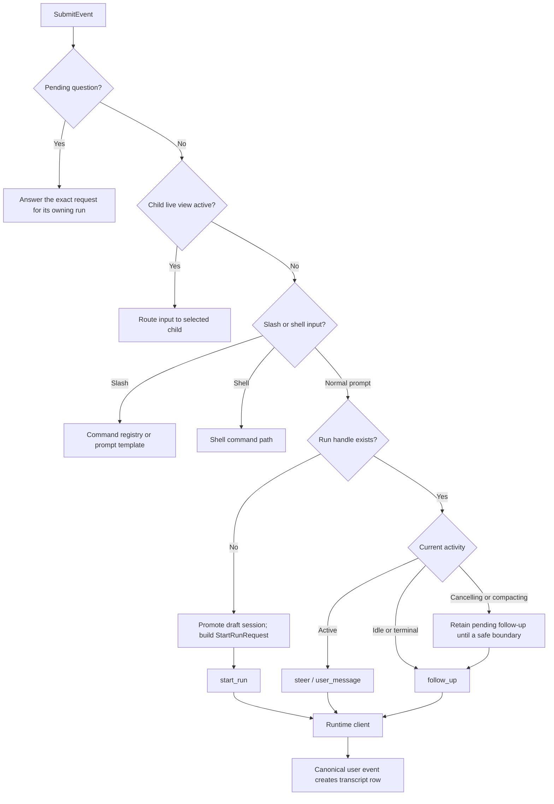
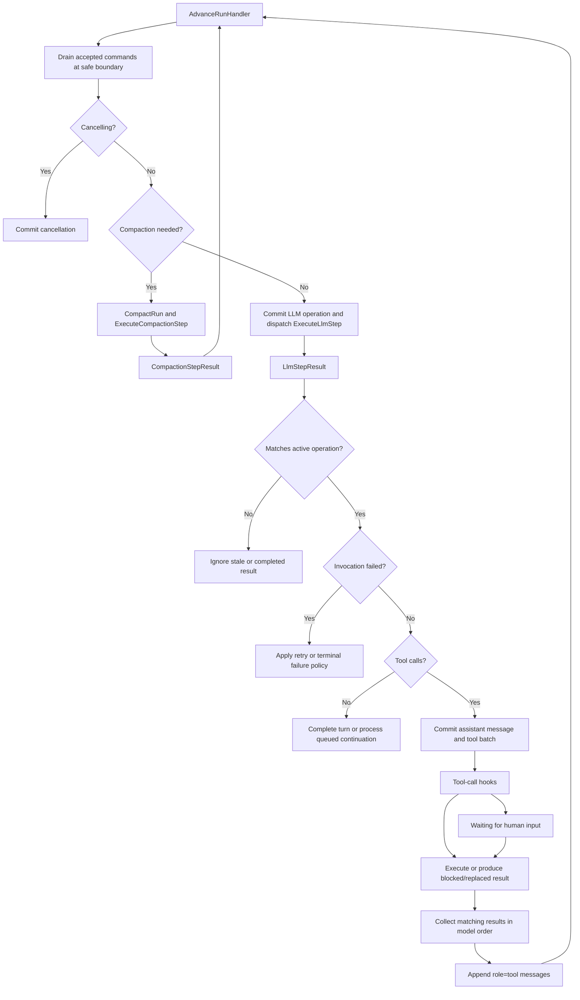

# Request lifecycle

[Architecture map](README.md) · [Processes](processes-and-queues.md) · [State](state-and-recovery.md)

## Prompt to final response

The sequence follows the normal process transport. ACK confirms command admission,
not execution success. Every worker result returns through run control before it
changes the conversation.

```mermaid
%%{init: {"sequence": {"wrap": true, "width": 60, "actorMargin": 10, "diagramMarginX": 10, "messageMargin": 30}}}%%
sequenceDiagram
    actor User
    participant Screen as PromptEditor / ChatScreen
    participant Submit as SubmitListener
    participant Client as JsonlProcessAgentSessionClient
    participant Controller as HeadlessController
    participant RC as run_control consumer
    participant Core as RunMessageProcessor / handlers
    participant Commit as RunCommit
    participant Log as events.jsonl
    participant LLM as ExecuteLlmStepWorker
    participant Adapter as LlmPlatformAdapter
    participant Provider as Symfony AI / provider
    participant Tool as tool / agent / mcp worker
    participant Poller as RuntimeEventPoller
    participant Projector as TranscriptProjector

    User->>Screen: Submit prompt
    Screen->>Submit: SubmitEvent
    Submit->>Submit: Route question, child view, slash, shell, or normal input
    alt First prompt
        Submit->>Client: start(StartRunRequest)
        Client->>Controller: start_run JSONL
    else Idle or completed run
        Submit->>Client: send(follow_up)
        Client->>Controller: follow_up JSONL
    else Active run
        Submit->>Client: send(steer)
        Client->>Controller: user_message JSONL
    end
    Controller-->>Client: command.ack, status accepted
    Controller->>RC: StartRun or ApplyCommand through command bus
    Note over Controller,RC: Dispatch can still reject after ACK
    RC->>Core: RunOrchestrator routes the message
    Core->>Core: Lock run, load/replay state, validate operation identity
    Core->>Commit: Next state, canonical events, effects
    Commit->>Log: Append events first
    Commit->>Commit: Persist operational projection, replace memory state
    Commit->>RC: AdvanceRun through command bus
    RC->>Core: AdvanceRunHandler
    Core->>Core: Drain mailbox, check compaction, select next step
    Core->>Commit: Commit next LLM operation
    Commit->>LLM: ExecuteLlmStep through execution bus
    LLM->>Adapter: invoke(ModelInvocationRequest)
    Adapter->>Adapter: Load context, transform hooks, validate history, resolve tools
    Adapter->>Provider: Platform invocation with streaming
    loop Provider stream
        Provider-->>Adapter: Text, reasoning, tool-call deltas
        Adapter-->>Controller: Worker stdout, transient events, seq 0
        Controller-->>Client: RuntimeEvent JSONL
        Client-->>Poller: events(runId)
        Poller->>Projector: Apply through TuiRuntimeEventApplier
        Projector-->>Screen: Incremental transcript changes
    end
    Provider-->>Adapter: Stream ends
    Adapter-->>LLM: PlatformInvocationResult
    LLM->>RC: LlmStepResult through command bus
    RC->>Core: LlmStepResultHandler
    alt Assistant requests tools
        Core->>Commit: Assistant message and pending tool batch
        Commit->>Tool: ExecuteToolCall, routed by tool identity
        Tool->>Tool: ToolExecutor and registered handler
        Tool->>RC: ToolCallResult
        RC->>Core: Collect batch, preserve assistant tool-call order
        Core->>Commit: Tool messages and continuation effects
        Commit->>RC: AdvanceRun
        Note over RC,Provider: Repeat with assistant tool_calls followed by matching tool results
    else Final answer, no pending continuation
        Core->>Commit: LLM completion and run completion
        Commit->>Log: Persist canonical completion
        Note over Commit,Controller: Committed RunEvents are mapped to protocol events before delivery
        Commit-->>Controller: Worker stdout, mapped committed events
        Controller-->>Client: assistant.message_completed and run.completed
        Client-->>Poller: Runtime events
        Poller->>Projector: Finalize assistant blocks
        Projector-->>Screen: Final answer, clear Working status
    end
```

The committed-event arrows abbreviate the event-store publication and mapper path.
`RunCommit` does not call the controller directly. Live stdout is delivery, not a
second history store. [Context and projection](context-and-projection.md) separates
streaming from committed projection.

## Input routing before a model call

Normal prompt submission does not optimistically add a duplicate user transcript row.
Questions and child navigation take precedence over parent prompt handling.

## Core loop and failure exits

Compaction error and cancellation branches are expanded in
[state and recovery](state-and-recovery.md). Tool errors can become model-visible
results without ending the entire run. Transport failure and provider failure are
not equivalent to an ordinary tool error.

## Owning source

- [SubmitListener](../src/Tui/Listener/SubmitListener.php)
- [Process client](../src/CodingAgent/Runtime/Process/JsonlProcessAgentSessionClient.php)
- [HeadlessController](../src/CodingAgent/Runtime/Controller/HeadlessController.php)
- [RunMessageProcessor](../src/AgentCore/Application/Pipeline/RunMessageProcessor.php)
- [RunCommit](../src/AgentCore/Application/Pipeline/RunCommit.php)
- [LlmPlatformAdapter](../src/AgentCore/Infrastructure/SymfonyAi/LlmPlatformAdapter.php)
- [Tool execution reference](../docs/tool-execution.md)
