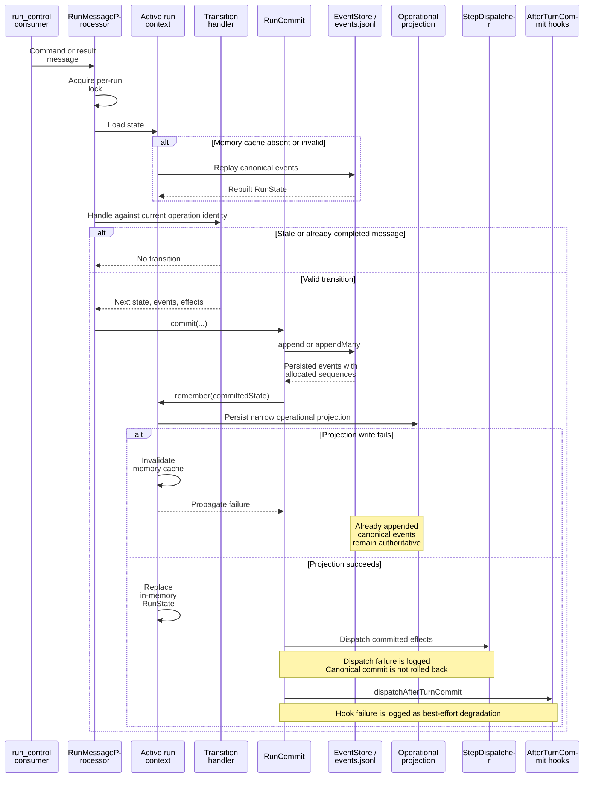
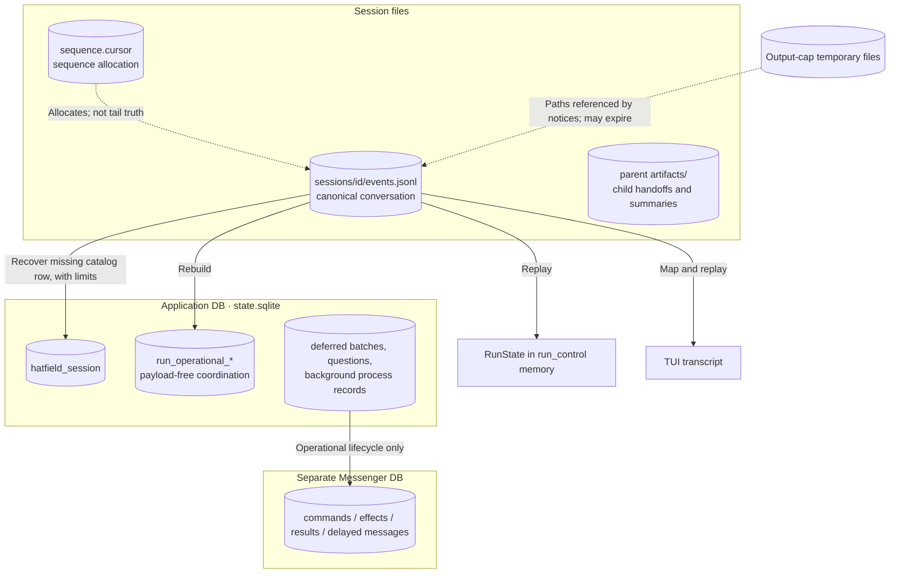
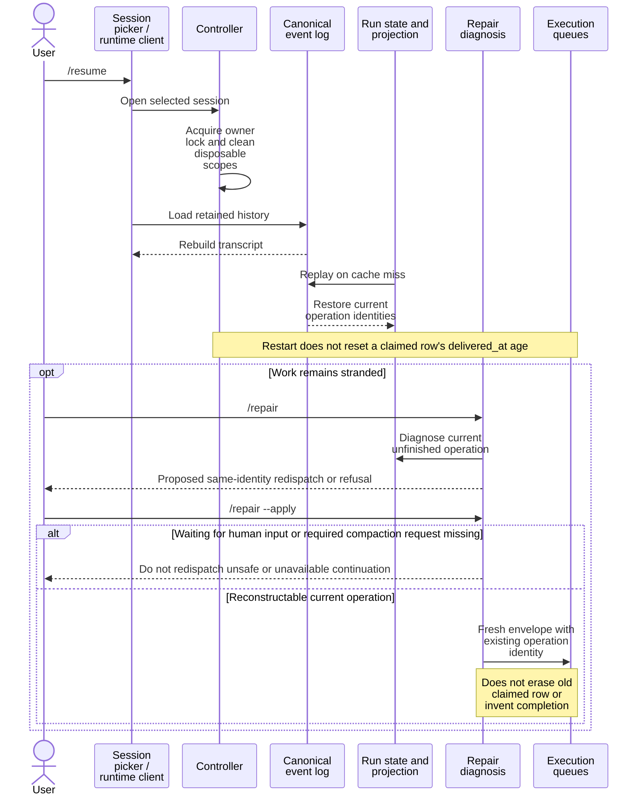
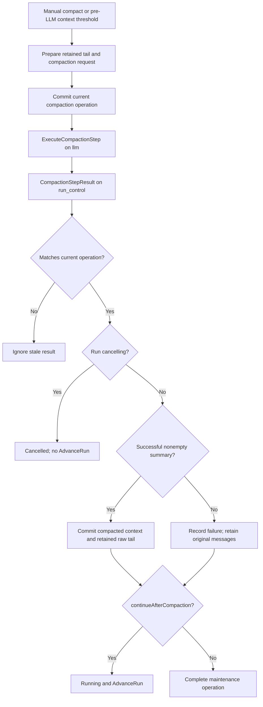
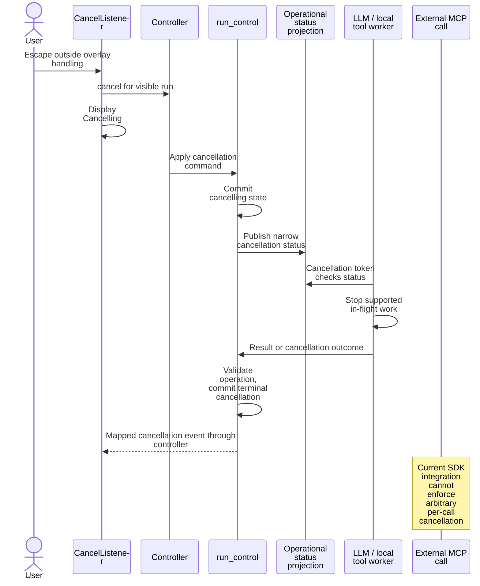

# State and recovery

[Architecture map](README.md) · [Request lifecycle](request-lifecycle.md)

## A transition commits before effects execute

There is no `state.json` authority and no CAS state-file commit. Canonical append
precedes projection replacement. Projection failure invalidates the in-memory state.

## What persists where

A session's `session_id` equals its `run_id`. Child sessions have their own identity.
Event logs do not recover all SQLite-only data. Renames, pending questions, deferred
batches, queues, and background records have different recovery limits.

## Resume versus explicit repair

Stored result reuse reduces repeated execution after a completed result is recorded.
It is not concurrent exclusion or an exactly-once guarantee. Check external effects
before repair. See the [transition identity matrix](../docs/session-runtime-internals.md#transition-validity).

## Compaction outcomes

## Cancellation is a request, not rollback

Escape in a child live view targets the child. Completed filesystem writes and
external side effects remain. Exiting the TUI instead invokes process shutdown.

Sources: [RunCommit](../src/AgentCore/Application/Pipeline/RunCommit.php),
[RunMessageProcessor](../src/AgentCore/Application/Pipeline/RunMessageProcessor.php),
[sessions](../docs/session-storage.md), [compaction](../docs/compaction.md),
[CancelListener](../src/Tui/Listener/CancelListener.php).
