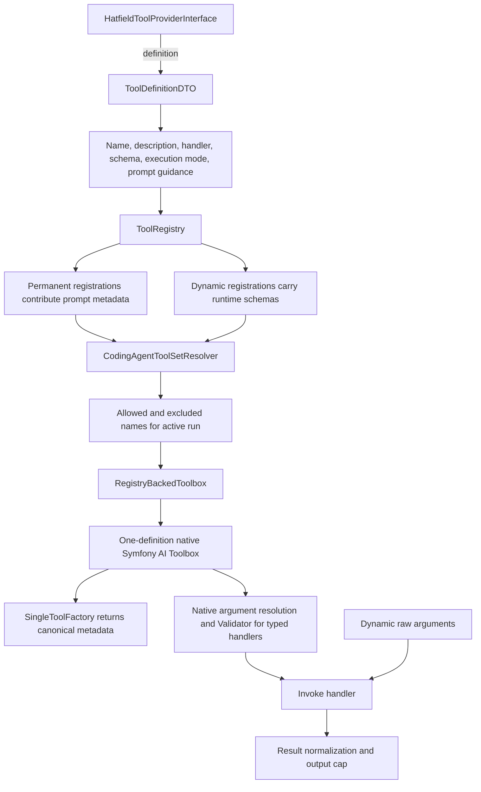
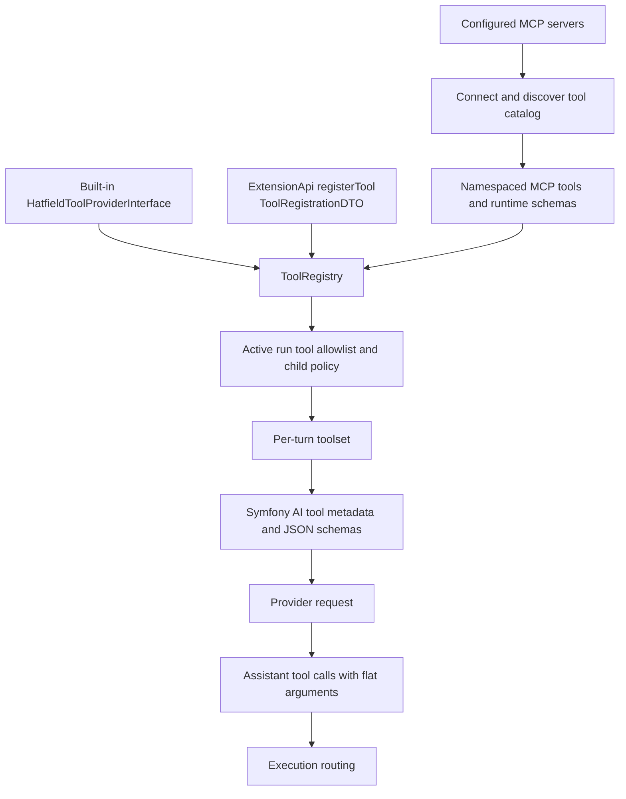
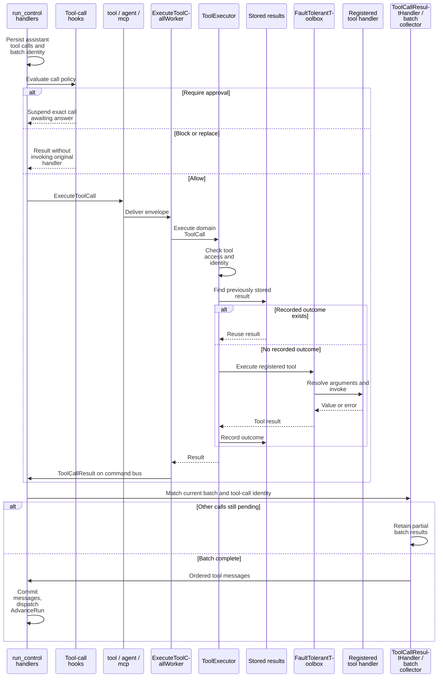
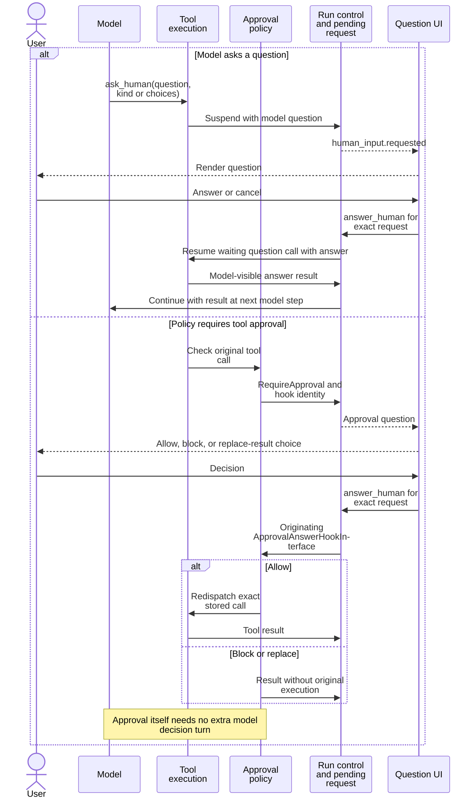
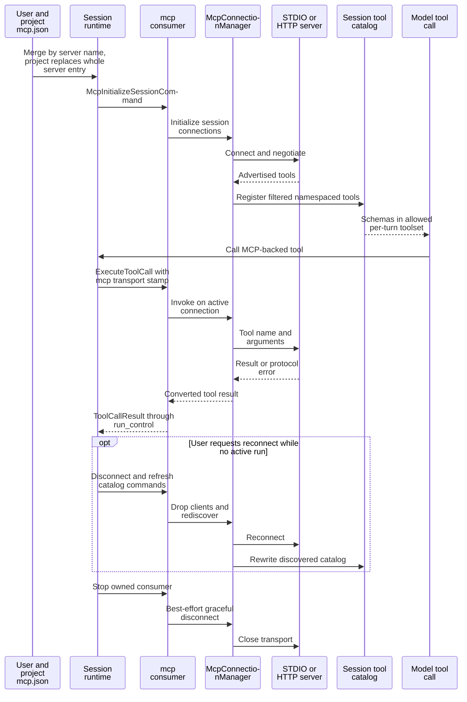

# Tools and MCP

[Architecture map](README.md) · [Child agents](extensions-and-agents.md)

## Tool catalog and owning implementations

The [bundled tool reference](../docs/tools.md) describes user-visible purpose and
limits. These are host-owned registrations, not a promise that every run exposes
every tool. MCP and enabled extensions contribute additional registrations.

| Names | Owning source |
|---|---|
| `read`, `write`, `edit`, `view_image` | `ReadFileTool`, `WriteFileTool`, `EditFileTool`, `ViewImageTool` under `src/CodingAgent/Tool` |
| `bash`, `bg_status` | `BashTool`, `BgStatusTool`, `BackgroundProcessManager` |
| `ask_human` | `AskHumanTool` and runtime human-input continuation |
| `settings`, `hatfield_docs` | `SettingsTool`, `HatfieldDocsTool` |
| `subagent`, `agent_resume`, `agent_retrieve`, `fork` | `src/CodingAgent/Agent/Tool` handlers and providers |
| Task-board operations | task-workflow extension registrations |
| `recall` | observational-memory extension registration |
| Server-advertised names, including IDE tools | MCP catalog and `McpToolRegistrar` |

## Design from definition to invocation

Registration owns execution mode; file mutation tools are sequential. Tool scheduling,
Messenger transport choice, and process cancellation are separate concerns. AgentCore
owns batch transitions through its contracts, while CodingAgent owns concrete tool
registration and framework integration. A provider schema is not an authorization rule.

## Registration becomes model-visible schemas

Typed built-ins use DTO field schemas and validation. Dynamic MCP arguments follow
the server's runtime schema rather than the built-in DTO validation path.

## Built-in argument ownership (inventory)

| Tool | Argument owner | Input constraints | Kept in handler |
|---|---|---|---|
| `read` | `ReadFileArgumentsDTO` + `ReadFileTarget` | path/offset/limit; target policy | I/O read failures |
| `write` | `WriteFileArgumentsDTO` | path/content | write I/O failures |
| `edit` | `EditFileArgumentsDTO` + `EditFileTarget` | path/patch; target exists | patch apply / lock failures |
| `view_image` | `ViewImageArgumentsDTO` (path only) | path shape | single handler inspection owns vision/size/MIME/dimensions + metadata |
| `bash` | `BashArgumentsDTO` + `BashTimeoutMax` | command; timeout bounds | process lifecycle, cancel, exit failures |
| `bg_status` | `BgStatusArgumentsDTO` | action; conditional pid | process lookup / stop / log failures |
| `ask_human` | `AskHumanArgumentsDTO` | question/kind/choices exclusivity | none (interrupt payload only) |
| `settings` | raw `$arguments` + local denormalize/validate into `SettingsArgumentsDTO` + `SettingsPath`; explicit flat `parametersJsonSchema` | operation/path; conditional scope/value; omitted `value` via uninitialized property | writer/resolver failures |
| `hatfield_docs` | `HatfieldDocsArgumentsDTO` | operation; conditional id | catalog/unknown-id / doc load failures |
| `subagent` / `agent_resume` / `agent_retrieve` / `fork` | respective Arguments DTOs (+ task schema providers where needed) | typed launch/resume/retrieve fields | active parent run context / locator wiring |
| MCP / extension raw tools | runtime `parametersJsonSchema` + `raw_arguments` | server/extension schema | handler or remote server |

Justified non-DTO path: only tools whose schema is defined at runtime (MCP and
public extension adapters), plus Settings: it keeps the historical flat
provider schema on the raw-array path and validates through a local
Serializer/Validator denormalization into `SettingsArgumentsDTO`. `value`
presence uses an uninitialized property (Serializer), not a legal-JSON
sentinel. Input errors use Symfony validation messages instead of
`ToolCallException` with a separate hint.

## Execute a batch, then continue the model

Result hooks and output capping can transform the returned presentation. Large
outputs become bounded text plus a temporary-file inspection notice. A stored result
lookup does not prevent two concurrent workers from starting the same side effect.

## Two human continuations

A cancelled model question returns `Cancelled by user`; it is not an answer to
invent or an approval. Parent and child requests must retain their owning run ID.

## MCP connection and invocation lifecycle

Connection construction timeouts and in-flight tool deadlines are different.
Hatfield cannot enforce arbitrary per-call MCP timeout or cancellation through the
current SDK integration. Unmanaged grandchildren of STDIO servers can escape graceful
shutdown; do not interpret disconnect as a sandbox guarantee.

Sources: [tool execution](../docs/tool-execution.md), [MCP](../docs/mcp.md),
[approvals](../docs/approvals.md), [human input](../docs/human-input.md),
[Messenger routing](../config/packages/messenger.yaml).
